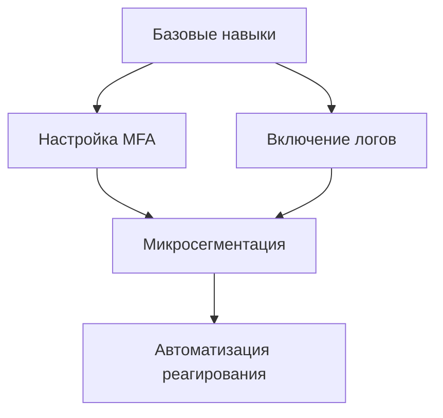

### **Карта компетенций для урока "Cloud Layered In-depth Security Defense"**

#### **1. Цели урока**
- **Знаниевые:**  
  - Понимание принципов Defense in Depth в облаках  
  - Знание ключевых сервисов безопасности AWS/Azure/GCP/Yandex Cloud  
- **Практические:**  
  - Умение проектировать многоуровневую защиту  
  - Навыки настройки мониторинга и автоматического реагирования  

---

#### **2. Базовые компетенции (Before Lesson)**
| **Компетенция**          | **Минимальный уровень**                | **Как проверить?**                     |
|--------------------------|--------------------------------------|----------------------------------------|
| Облачные сервисы         | Знание IAM, VPC, KMS                 | Тест: "Разграничьте доступ к S3 через IAM" |
| Основы безопасности      | Понимание CIA-триады                 | Опрос: "Как шифрование защищает данные?" |
| CLI/API                  | Базовые команды AWS CLI/Yandex CLI    | Практика: "Создайте Security Group"    |

---

#### **3. Целевые компетенции (After Lesson)**
**A. Технические навыки**  
| **Уровень**      | **Компетенции**                                                                 | **Инструменты проверки**                     |
|------------------|-------------------------------------------------------------------------------|---------------------------------------------|
| **Начальный**    | - Настройка MFA - Включение CloudTrail/Audit Logs                          | Лабораторная: "Активируйте мониторинг в Yandex Cloud" |
| **Продвинутый**  | - Микросегментация сети - Настройка WAF + DDoS-защиты                      | Кейс: "Защитите API от SQL-инъекций"        |
| **Экспертный**   | - Автоматическое исправление уязвимостей - Project-based access control    | Челлендж: "Создайте auto-remediation для утечек S3" |

**B. Архитектурное мышление**  
- Умение выбирать инструменты под бюджет/требования (CIS vs. Dome9)  
- Понимание trade-off между безопасностью и производительностью  

**C. Soft Skills**  
- Объяснение безопасности нетехническим стейкхолдерам  
- Работа с инцидентами (playbooks)  

---

#### **4. Методы оценки**
| **Этап урока**       | **Метод оценки**                          | **Критерии**                              |
|----------------------|------------------------------------------|------------------------------------------|
| **Введение**         | Опрос: "Назовите 3 слоя защиты в облаке" | Полнота ответа                           |
| **Практика**         | Лабораторная в Yandex Cloud Console      | - Точность настройки - Скорость выполнения |
| **Итог**            | Разбор кейса (например, утечка данных)   | Глубина анализа угроз и решений          |

---

#### **5. Инструменты и ресурсы**
**Для преподавателя:**  
- Чек-листы CIS Benchmark  
- Terraform-шаблоны для безопасной инфраструктуры  
- Симулятор атак (например, Stratus Red Team)  

**Для студентов:**  
- Песочницы AWS/GCP/Yandex Cloud  
- Open-source инструменты: OpenPolicyAgent, Falco  

---

#### **6. Шкала оценивания**
| **Балл** | **Уровень**          | **Критерии**                                                                 |
|----------|----------------------|-----------------------------------------------------------------------------|
| 0-50     | Неудовлетворительно | Не может назвать базовые слои защиты                                        |
| 51-70    | Удовлетворительно   | Настраивает MFA/WAF, но с ошибками                                          |
| 71-85    | Хорошо              | Реализует Defense in Depth, но без автоматизации                           |
| 86-100   | Отлично             | Полный цикл: проектирование → внедрение → мониторинг → auto-remediation    |

---

#### **7. Интеграция с курсом**
- **Связь с предыдущими темами:**  
  "Cloud Networking" → Сегментация VPC  
  "IAM Basics" → Роли и политики  

- **Подготовка к следующим темам:**  
  "Disaster Recovery" → Резервное копирование с шифрованием  
  "DevSecOps" → Security as Code  

---

#### **8. Глоссарий**
- **Defense in Depth**: Стратегия с независимыми уровнями защиты  
- **PDP (Policy Decision Point)**: Ядро системы контроля доступа  
- **Auto-Remediation**: Автоматическое исправление уязвимостей  

**Итог:** Урок формирует компетенции от базовой настройки до архитектурного проектирования безопасности, готовя к реальным задачам cloud security engineer.
