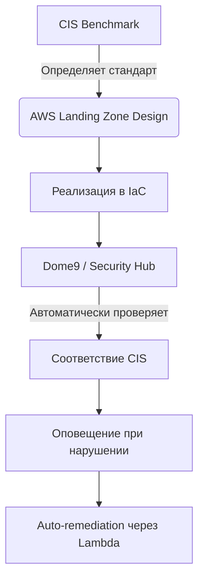

Ниже — **подробное сравнение AWS CIS Benchmark и Dome9 AWS Best Practices**, включая их назначение, структуру, применение, сходства и различия. Этот материал подходит для слайда презентации, аудита или обучающего курса по облачной безопасности.

---

## 🔍 **Сравнение: AWS CIS Benchmark vs Dome9 Best Practices**

| Критерий                    | **AWS CIS Benchmark**                                                       | **Dome9 Best Practices**                                                              |
| --------------------------- | --------------------------------------------------------------------------- | ------------------------------------------------------------------------------------- |
| **Тип документа / решения** | Отраслевой стандарт (framework)                                             | Коммерческий инструмент с набором правил                                              |
| **Разработчик**             | Center for Internet Security (CIS) — независимая некоммерческая организация | Dome9 (приобретён AWS, теперь часть **AWS Security Hub**)                             |
| **Доступность**             | Бесплатно (на [cisecurity.org](https://www.cisecurity.org))                 | Доступен через AWS Security Hub (бесплатно), расширенные функции — в рамках платформы |
| **Назначение**              | Унифицированный стандарт безопасности для облака                            | Инструмент для автоматизированного сканирования и мониторинга соответствия            |
| **Формат**                  | PDF, Excel, YAML, JSON                                                      | API, UI, интеграция с AWS Config, CloudTrail, Lambda                                  |
| **Автоматизация**           | Только рекомендации (ручная проверка)                                       | Полная автоматизация: сканирование, оповещения, auto-remediation                      |
| **Реальное время**          | Нет                                                                         | Да — непрерывный мониторинг                                                           |
| **Обновления**              | Периодические (например, v1.4, v2.0)                                        | Частые обновления, включая новые правила и уязвимости                                 |
| **Интеграция с AWS**        | Требует ручной настройки проверок                                           | Глубокая интеграция: Security Hub, Config, EventBridge, Lambda                        |
| **Compliance-поддержка**    | Поддерживает PCI DSS, HIPAA, SOC 2, ISO 27001, NIST                         | Генерирует отчёты по CIS, PCI, и другим стандартам                                    |
| **Язык проверок**           | Описательный (человекочитаемый)                                             | Декларативный (на основе политик AWS Config)                                          |
| **Пример правила**          | *"Ensure MFA is enabled for the root user"*                                 | Правило в Security Hub: `Root account usage without MFA`                              |
| **Роль в архитектуре**      | **Что проверять?** — основа политики безопасности                           | **Как проверять и реагировать?** — исполнение и автоматизация                         |

---

### 🔄 **Как они связаны?**

> **Dome9 Best Practices = CIS Benchmark + Автоматизация + Расширения**

- Dome9 изначально **реализовал CIS Benchmark** как один из своих основных наборов правил.
- Позже он **дополнил** его собственными проверками (например, по сетевой безопасности, утечкам данных).
- После интеграции в **AWS Security Hub**, Dome9 стал **основой для автоматического соответствия CIS** в AWS.

> ✅ **Сегодня:**  
> Когда вы включаете **CIS AWS Foundations Benchmark** в AWS Security Hub — вы используете **ядро CIS + механизм Dome9**.

---

### 🧩 Пример: Проверка шифрования EBS

| Аспект | CIS Benchmark | Dome9 / Security Hub |
|-------|----------------|------------------------|
| Формулировка | *"Ensure EBS encryption is enabled by default"* |
| Проверка | Ручная или через скрипт | Автоматическое сканирование всех регионов |
| Реакция | Администратор вручную включает | Lambda-функция автоматически включает |
| Уведомление | Нет | SNS, Slack, EventBridge |

---

### ✅ **Сходства**

| Признак | Описание |
|--------|---------|
| **Цель** | Обеспечение безопасности и соответствия в AWS |
| **Покрытие** | IAM, Logging, Networking, Data Protection, Account Settings |
| **Поддержка compliance** | Используются при аудите (PCI, HIPAA, SOC 2) |
| **Рекомендации по MFA, CloudTrail, шифрованию** | Совпадают на 90% |
| **Поддержка многоаккаунтной среды** | Да — через Organizations и делегированные аккаунты |

---

### ⚖️ **Различия**

| Аспект | CIS Benchmark | Dome9 / Security Hub |
|-------|----------------|------------------------|
| **Природа** | Стандарт | Инструмент |
| **Автоматизация** | ❌ Нет | ✅ Да |
| **Масштабирование** | Сложно | Легко (через Security Hub) |
| **Реакция на нарушения** | Требует ручного вмешательства | Автоматическая (auto-remediation) |
| **Динамичность** | Статичный (версии) | Динамичный (обновления в реальном времени) |
| **Доступность** | Только рекомендации | UI, API, интеграции, отчёты |

---

### 🎯 **Практическое применение: Как использовать вместе**

#### 🔧 Шаги для архитектора:
1. **Спроектируйте архитектуру по CIS Benchmark**.
2. **Реализуйте через Terraform / CloudFormation**.
3. **Включите AWS Security Hub** и активируйте **CIS Standards**.
4. **Настройте auto-remediation** для критических нарушений.
5. **Генерируйте отчёты** для аудита.

---

### 📌 **Вывод: Кто что делает?**

| Роль | Что использовать |
|------|------------------|
| **Архитектор** | CIS Benchmark — как основу проектирования |
| **Безопасник** | Security Hub (Dome9) — для мониторинга и реагирования |
| **DevOps** | Интегрировать проверки в CI/CD |
| **Аудитор** | Отчёты из Security Hub с привязкой к CIS |

> 💡 **Главное понимание:**  
> - **CIS Benchmark** — это **"медицинский стандарт"** (каким должно быть давление).  
> - **Dome9 / Security Hub** — это **"тонометр + аларм"**, который измеряет и предупреждает.

---

## 📎 Рекомендации

1. **Всегда начинайте с CIS Benchmark** — он нейтрален и признан глобально.
2. **Используйте AWS Security Hub** как платформу для автоматизации.
3. **Не полагайтесь только на CIS** — добавьте кастомные правила (например, запрет публичных Lambda).
4. **Внедрите auto-remediation** — чтобы безопасность "самовосстанавливалась".

---

## 📥 Готовые материалы (по запросу)

Могу подготовить:
- **Презентацию PowerPoint** с этим сравнением
- **Чек-лист "CIS Compliance in AWS"**
- **Шаблон auto-remediation для CloudTrail, S3, EBS**
- **PDF-версию сравнения** для печати

Скажите, в каком формате вам удобнее получить!