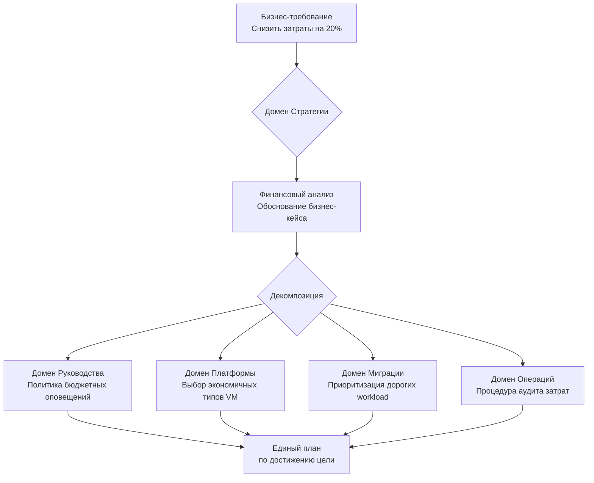

Вот пошаговая инструкция, как это сделать.

### Шаг 1: Четкая фиксация бизнес-требований

Сначала убедитесь, что требования сформулированы по принципу **SMART** (Конкретные, Измеримые, Достижимые, Релевантные, Ограниченные по времени).

*   **Плохо:** "Сделать систему быстрее."
*   **Хорошо:** "Уменьшить время отклика основного customer-facing приложения на 30% в течение 6 месяцев после миграции в облако для повышения конверсии."

**Примеры бизнес-требований:**
1.  **Снижение TCO:** "Сократить затраты на IT-инфраструктуру на 20% в год."
2.  **Гибкость и масштабируемость:** "Обеспечить возможность обработки пиковых нагрузок (в 5 раз выше среднего) во время сезонных распродаж."
3.  **Безопасность и соответствие:** "Гарантировать хранение персональных данных клиентов только в юрисдикции РФ и обеспечить соответствие 152-ФЗ."
4.  **Устойчивость:** "Обеспечить бесперебойную работу критичных сервисов (RTO < 15 мин, RPO < 5 мин)."
5.  **Инновации:** "Внедрить AI-сервис для рекомендаций товаров в течение 9 месяцев."

---

### Шаг 2: Преобразование требований в стратегические цели CAF (Домен "Стратегия")

Здесь вы переводите бизнес-требования на язык облачной стратегии.

| Бизнес-требование | Вопрос для домена "Стратегия" | Результат (Фиксация в CAF) |
| :--- | :--- | :--- |
| **"Сократить затраты на 20%."** | Какие финансовые модели облака (OPEX, pay-as-you-go) помогут этого достичь? Какие workloads самые дорогие и будут давать наибольшую экономию? | **Обоснование бизнес-case:** "Миграция X серверов в управляемые сервисы (например, Azure SQL DB) позволит сэкономить Y рублей в год за счет отказа от лицензий и обслуживания." |
| **"Обработка пиковых нагрузок."** | Как облако позволяет реализовать эластичное масштабирование? Какие сервисы для этого нужны? | **Техническое обоснование:** "Использование Auto-Scaling Groups в AWS или Scale Sets в Azure для пула веб-серверов." |
| **"Соответствие 152-ФЗ."** | Есть ли у провайдера регионы в РФ? Какие сертификаты соответствия у него есть? | **Выбор провайдера/региона:** "Использовать только регион Яндекс Облака/MCS в Москве, так как он обеспечивает физическое хранение данных в РФ и имеет сертификаты ФСТЭК." |

**Итог шага:** Формируется документ **Cloud Strategy** или **Business Case**, который одобряется руководством. Это — "библия" для всего дальнейшего процесса.

---

### Шаг 3: Декомпозиция требований в другие домены CAF

Это самый важный шаг. Вы берете каждое требование и смотрите, как оно отражается в политиках, архитектуре и планах.

| Бизнес-требование | Домен "Руководство" (Governance) | Домен "Платформа" (Platform) | Домен "Миграция" (Migration) | Домен "Операции" (Operations) |
| :--- | :--- | :--- | :--- | :--- |
| **"Сократить затраты на 20%."** | **Политика учета затрат:** • Требовать использование тегов (tags) для всех ресурсов. • Установить бюджетные оповещения (budget alerts). • Внедрить политику "shutdown non-prod env after hours". | **Архитектура:** • Выбор экономичных типов VM (Spot Instances, Preemptible VMs). • Использование managed services (например, БД как сервис) для снижения TCO. | **План миграции:** • Приоритизация миграции самых дорогих в содержании workloads. | **Процедуры:** • Регулярные аудиты затрат и выявление неиспользуемых ресурсов. |
| **"Соответствие 152-ФЗ."** | **Политика безопасности:** • Все данные должны храниться в указанном регионе. • Обязательное шифрование всех дисков и данных. • Требование MFA для всех пользователей. | **Архитектура Landing Zone:** • Развертывание всего в российском регионе. • Настройка шифрования (KMS). • Настройка брандмауэров и групп безопасности. | **Оценка приложений:** • Проверка, не передают ли приложения данные в неразрешенные юрисдикции. | **Мониторинг и аудит:** • Включение логов аудита (Cloud Audit Logs). • Настройка оповещений о подозрительной активности. |
| **"Устойчивость (RTO < 15 мин)."** | **Политика устойчивости:** • Все критические сервисы должны быть развернуты как минимум в 2+ зонах доступности. | **Архитектура:** • Проектирование Multi-AZ архитектуры для критичных компонентов. • Настройка Load Balancer'ов. | **Стратегия миграции:** • Для критичных приложений выбирается стратегия Replatform или Refactor, а не простой Rehost (Lift-and-Shift). | **DR-процедуры:** • Регулярные учения по отработке восстановления (DR Drills). • Настройка мониторинга здоровья. |

---

### Визуализация процесса

### Ключевые выводы:

1.  **Не бывает чисто бизнес-требований.** Каждое из них должно быть преобразовано в конкретные действия в нескольких доменах CAF.
2.  **Домен "Стратегия" — это переводчик** между бизнесом и IT. Его главный output — обоснованное решение, *зачем* мы идем в облако.
3.  **Домен "Руководство" (Governance) — это "правила дорожного движения".** Он гарантирует, что технические решения (Платформа) и процессы (Операции) будут соответствовать изначальным бизнес-требованиям на протяжении всего жизненного цикла.
4.  **Без этой декомпозиции** миграция превращается в хаотичный перенос виртуальных машин, который не приносит бизнесу заявленной пользы и порождает новые риски.