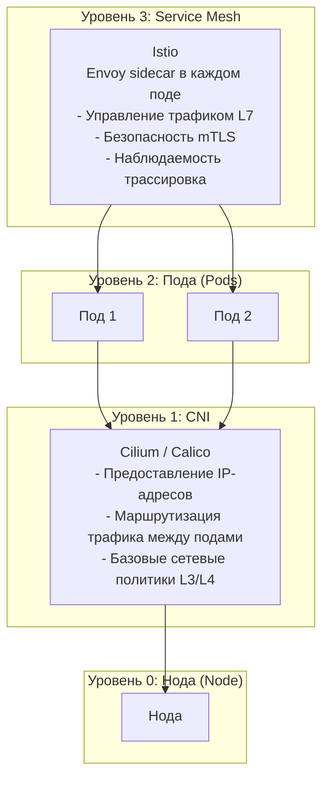

**1. Визуальный ряд**
*   Таблица сравнения:

| Инструмент    | Уровень | Основное назначение                                       | Преимущества                                                      | Недостатки                                               |
|:------------- |:------- |:--------------------------------------------------------- |:----------------------------------------------------------------- |:-------------------------------------------------------- |
| `ksniff`      | Под     | Анализ сетевого трафика на уровне одного пода             | Простота, интеграция с Wireshark, работает везде                  | Требует повышенных привилегий, анализ только одного пода |
| Istio         | Сервис  | Управление трафиком и наблюдаемость на уровне сервисов    | Глубокая интеграция, трассировка запросов, политики безопасности  | Сложность внедрения, накладные расходы                   |
| Cilium Hubble | Кластер | Наблюдаемость и диагностика сети на уровне всего кластера | Использует eBPF, низкие накладные расходы, визуализация топологии | Требует Cilium CNI, сложность настройки                  |

```
+-----------------------------------------------------+
|                   Уровень 3: Service Mesh           |
|                                                     |
|  +------------------------------------------------+ |
|  |                   Istio                        | |
|  |  (Envoy sidecar в каждом поде)                 | |
|  |  - Управление трафиком (L7)                    | |
|  |  - Безопасность (mTLS)                         | |
|  |  - Наблюдаемость (трассировка)                 | |
|  +------------------------------------------------+ |
+-----------------------------------------------------+
|                                                     |
|                   Уровень 2: Пода (Pods)            |
|                                                     |
|  +----------------+     +----------------+          |
|  |    Под 1       |     |    Под 2       |          |
|  |                |     |                |          |
|  |  [ksniff]      |     |                |          |
|  +----------------+     +----------------+          |
|        |                        |                   |
|        +------------------------+                   |
|                 |                                   |
|         Захват трафика (L3/L4)                      |
|                                                     |
+-----------------------------------------------------+
|                                                     |
|                   Уровень 1: CNI                    |
|                                                     |
|  +------------------------------------------------+ |
|  |                   Cilium / Calico              | |
|  |  - Предоставление IP-адресов                   | |
|  |  - Маршрутизация трафика между подами          | |
|  |  - Базовые сетевые политики (L3/L4)            | |
|  +------------------------------------------------+ |
|                                                     |
|                    Уровень 0: Нода (Node)           |
+-----------------------------------------------------+
```

*   Логотипы `ksniff`, `Istio`, `Cilium Hubble`.

**2. Демо-сценарий (если уместен)**
*   Нет.

**3. Ключевые тезисы**
*   `ksniff` — это инструмент для детального анализа трафика одного пода.
*   Istio — это платформа для управления трафиком между сервисами.
*   Cilium Hubble — это инструмент для наблюдаемости сети на уровне всего кластера.

**4. Описание (для выступающего)**
*   **Цель слайда:** Помочь слушателям понять, когда и какой инструмент использовать для диагностики сетевых проблем.
*   **Ключевое сообщение:** Выбор инструмента зависит от уровня и масштаба проблемы.
*   **Основные тезисы:**
    *   **`ksniff`:** Это **специализированный инструмент** для отладки. Он позволяет захватить и проанализировать сетевой трафик из одного конкретного пода с помощью Wireshark. Его сила — в простоте и глубине анализа на уровне пакетов. Идеален для поиска проблем с DNS, TCP-соединениями или анализом тела HTTP-запросов.
    *   **`Istio`:** Это **платформа** для Service Mesh. Он работает на уровне сервисов и позволяет не только наблюдать за трафиком, но и управлять им (снижение нагрузки, отключение сервисов, A/B тестирование). Он предоставляет детальную трассировку запросов по всей цепочке микросервисов. Однако его внедрение значительно усложняет архитектуру.
    *   **`Cilium Hubble`:** Это **инструмент для наблюдаемости** на уровне всего кластера. Он использует eBPF для сбора данных и предоставляет визуализацию всех сетевых соединений между подами, сервисами и внешними узлами. Он идеален для диагностики проблем с сетевыми политиками, обнаружения неожиданного трафика и получения общей картины взаимодействия сервисов.
*   **Связь с источниками:** Тезисы основаны на анализе современных практик и инструментов, не представленных в материалах 2019 года.

**5. Связь с прошлыми материалами**
*   **Из чата 2019:** "сергей волчков : с енвоем истио взлетит? " *(Указывает на интерес аудитории к Service Mesh и Envoy)*.
*   **Из PDF 2019, слайд 6.1:** "ksniff" — базовый инструмент для анализа трафика.
*   **Из субтитров 2019:** "Ну и, соответственно, дальше поговорим немножечко об инструментах, которые позволяют оценить состояние кластера, на наличие уязвимости, на соответствии с беспрактицами и так далее.".

**6. Типовые вопросы и ответы (Q&A)**
*   **В:** Какой инструмент лучше: `Istio` или `Cilium Hubble`?
    *   **О:** Это разные инструменты для разных задач. `Hubble` — для наблюдаемости, `Istio` — для управления трафиком. Они могут дополнять друг друга.
*   **В:** Можно ли использовать `ksniff` вместо `Istio`?
    *   **О:** Нет. `ksniff` не может заменить функциональность Service Mesh. Он решает узкую задачу анализа трафика одного пода.
*   **В:** Нужно ли использовать все три инструмента?
    *   **О:** Нет. Выберите тот, который лучше всего подходит для вашей проблемы. `ksniff` для детальной отладки, `Hubble` для диагностики кластера, `Istio` для сложного управления трафиком.

**7. Примеры использования / Типовые сценарии**
*   **Диагностика `CrashLoopBackOff`:** Использование `ksniff` для анализа сетевого трафика и выявления проблем с подключением к базе данных.
*   **Анализ производительности:** Использование `Istio` для выявления сервиса, вызывающего высокую задержку в цепочке вызовов.
*   **Диагностика сетевых проблем:** Использование `Cilium Hubble` для обнаружения неожиданного трафика между сервисами.

**8. Предложения по дополнительному контенту слайда**
*   Добавить скриншот графа сервисов из Hubble UI.
*   Подчеркнуть, что `ksniff`, `Istio` и `Hubble` решают разные задачи и могут быть частью единого арсенала инструментов.

Вот код для схемы взаимодействия систем по уровням работы, написанный на языке Mermaid:

