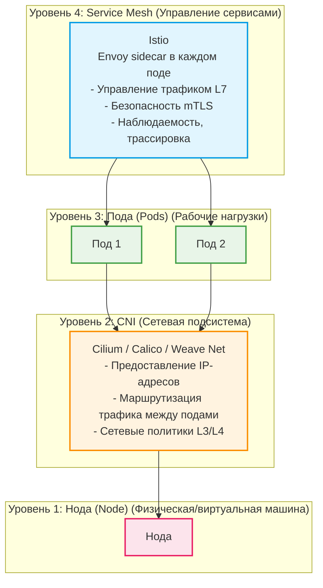

Отлично! На основе анализа всех предоставленных материалов, вот **схема в Mermaid**, **сравнительная таблица** и **предложение по названию**.

---

### **Название схемы**

**"Архитектура Kubernetes: Взаимодействие сетевых уровней (от ноды до Service Mesh)"**

Это название точно отражает содержание, показывая иерархию и взаимосвязь между слоями.

---

### **Схема в Mermaid**

---

### **Таблица: Инструменты и уровни работы в Kubernetes**

| Уровень архитектуры                      | Описание                                                                                                                                                                        | Ключевые инструменты                                                              | Функции                                                                                                                                                                    |
|:---------------------------------------- |:------------------------------------------------------------------------------------------------------------------------------------------------------------------------------- |:--------------------------------------------------------------------------------- |:-------------------------------------------------------------------------------------------------------------------------------------------------------------------------- |
| **4. Service Mesh**                      | Уровень управления взаимодействием между сервисами. Обеспечивает продвинутые функции безопасности, наблюдаемости и управления трафиком на уровне приложения (L7).               | **Istio**, **Linkerd**, **Consul**                                                | Управление трафиком (Canary, Blue/Green), mTLS-шифрование, трассировка запросов (tracing), сбор метрик на уровне сервисов, политики отказоустойчивости (circuit breaking). |
| **3. Пода (Pods)**                       | Уровень рабочих нагрузок. Самая маленькая развертываемая единица в Kubernetes. Содержит один или несколько контейнеров, которые разделяют сеть и хранилище.                     | **`kubectl`**, **`k9s`**, **`Lens`**, **`kubectl debug`**, **`inspektor-gadget`** | Управление жизненным циклом подов, просмотр логов и событий, интерактивная отладка (`exec`, `debug`), глубокая диагностика с помощью eBPF.                                 |
| **2. CNI (Container Network Interface)** | Уровень сетевой подсистемы. Обеспечивает подключение контейнеров к сети, IP-адресацию, маршрутизацию трафика между подами и базовую сетевую политику. Работает на уровне хоста. | **Cilium**, **Calico**, **Weave Net**, **Antrea**                                 | Предоставление IP-адресов подам, маршрутизация трафика между узлами, реализация `NetworkPolicy` для изоляции подов.                                                        |
| **1. Нода (Node)**                       | Физическая или виртуальная машина, на которой запущены компоненты Kubernetes (kubelet, kube-proxy) и рабочие нагрузки (поды).                                                   | **`kubelet`**, **`kube-proxy`**, **`containerd`**, **`kubectl`**                  | Запуск и мониторинг подов, реализация сервисов (через `kube-proxy`), управление контейнерами (через `containerd`), обеспечение связи с control plane.                      |

---

