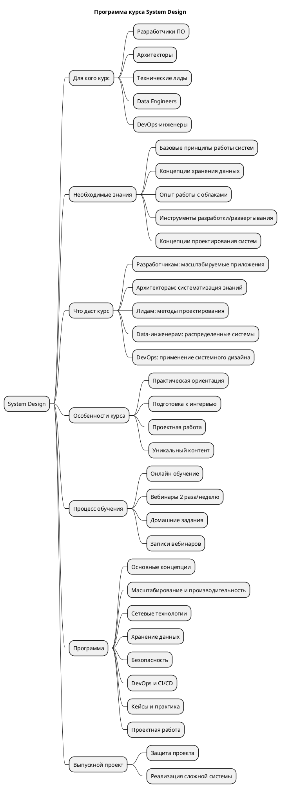

```plantuml
@startmindmap
title Программа курса System Design

* System Design
** Для кого курс
*** Разработчики ПО
*** Архитекторы
*** Технические лиды
*** Data Engineers
*** DevOps-инженеры

** Необходимые знания
*** Базовые принципы работы систем
*** Концепции хранения данных
*** Опыт работы с облаками
*** Инструменты разработки/развертывания
*** Концепции проектирования систем

** Что даст курс
*** Разработчикам: масштабируемые приложения
*** Архитекторам: систематизация знаний
*** Лидам: методы проектирования
*** Data-инженерам: распределенные системы
*** DevOps: применение системного дизайна

** Особенности курса
*** Практическая ориентация
*** Подготовка к интервью
*** Проектная работа
*** Уникальный контент

** Процесс обучения
*** Онлайн обучение
*** Вебинары 2 раза/неделю
*** Домашние задания
*** Записи вебинаров

** Программа
*** Основные концепции
*** Масштабирование и производительность
*** Сетевые технологии
*** Хранение данных
*** Безопасность
*** DevOps и CI/CD
*** Кейсы и практика
*** Проектная работа

** Выпускной проект
*** Защита проекта
*** Реализация сложной системы

@endmindmap
```