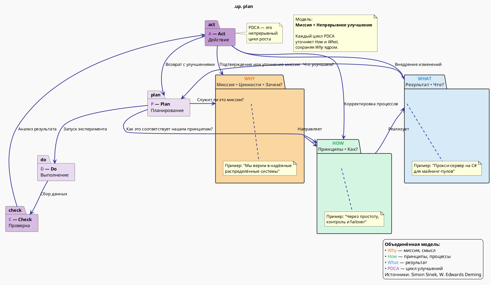

Ниже — **диаграмма на PlantUML**, которая визуализирует **объединение Золотого круга Саймона Синека** и **Цикла Деминга (PDCA)** в единую модель непрерывного развития с фокусом на миссии.

Диаграмма построена в стиле **C4 Context + стрелочная логика**, чтобы показать, как **"Почему" направляет процесс**, а **PDCA обеспечивает его реализацию и улучшение**.

---

### 🧩 PlantUML — Объединение "Золотого круга" и "Цикла Деминга"



---

### 🖼 Как выглядит схема (описание):

```
        [ WHY ] — миссия
          ↓
        [ HOW ] — принципы
          ↓
        [ WHAT ] — продукт
          ↓
┌───────────────────────────────────┐
│ P → D → C → A (PDCA цикл)         │
│ Каждый этап связан с Why/How/What │
└───────────────────────────────────┘
```

- **Центр**: Золотой круг (Why → How → What) — **стратегия и смысл**.
- **Вокруг**: Цикл PDCA — **операционная реализация и улучшение**.
- **Обратная связь**: Act влияет обратно на What, How и даже Why (если миссия уточняется).

---

### ✅ Как использовать:
1. Скопируй код в [PlantUML Live](https://www.plantuml.com/plantuml)
2. Убедись, что интернет есть (для корректного отображения цветов и стилей)
3. Получишь визуальную модель, которую можно использовать:
   - В презентациях
   - Для командного обсуждения
   - В документации процессов

---

### 💡 Где применять:
- Управление продуктом
- Развитие стартапа
- Личная эффективность
- DevOps-культура и CI/CD
- Agile и Lean

---

Хочешь — могу сделать **мини-версию** для слайда, или **адаптировать под конкретный проект** (например, твой прокси-сервер для майнинга).