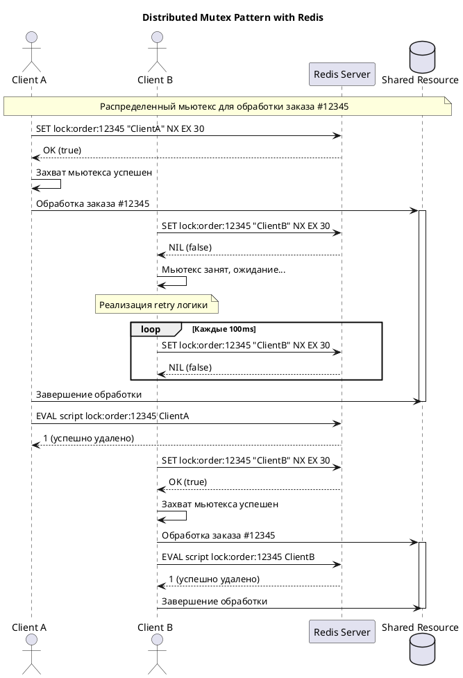
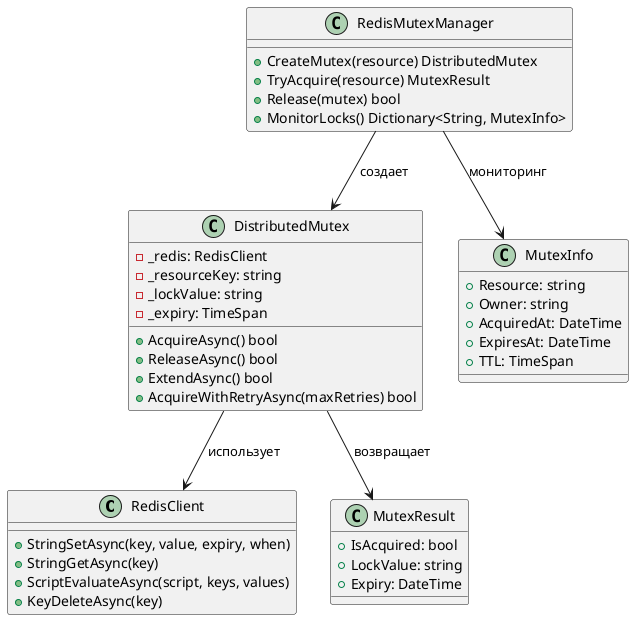
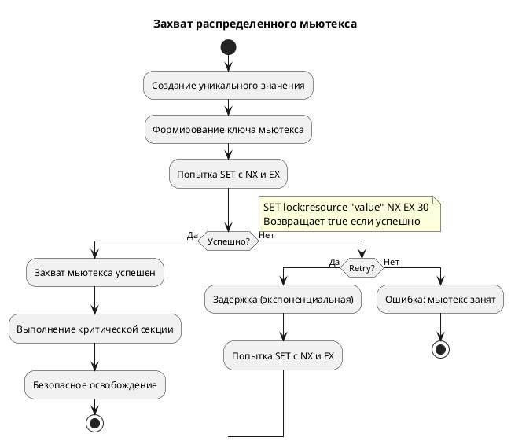
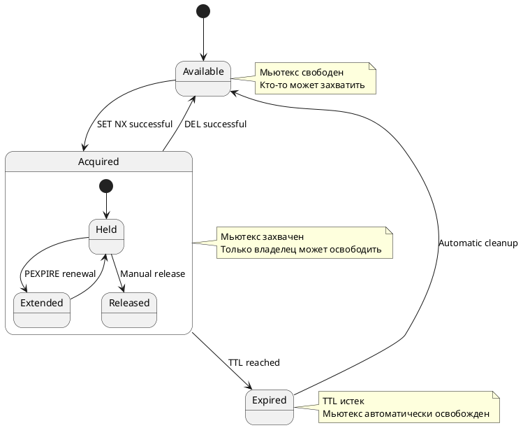

## 🎯 **1. Sequence Diagram (Диаграмма последовательности)**



## 🏗️ **2. Class Diagram (Диаграмма классов)**



## 🔄 **3. Activity Diagram (Диаграмма деятельности)**



## 📊 **4. Component Diagram (Диаграмма компонентов)**

```plantuml
@startuml
package "Клиентские приложения" {
    [Микросервис 1] as MS1
    [Микросервис 2] as MS2
    [Микросервис N] as MSN
}

package "Redis Cluster" {
    [Redis Master] as Master
    [Redis Slave 1] as Slave1
    [Redis Slave 2] as Slave2
    [Redis Sentinel] as Sentinel
}

package "Мониторинг" {
    [Metrics Collector] as Metrics
    [Alerting System] as Alerting
}

package "Утилиты" {
    [Mutex Manager] as Manager
    [Health Checker] as Health
}

MS1 --> Master : Захват/освобождение мьютекса
MS2 --> Master : Захват/освобождение мьютекса
MSN --> Master : Захват/освобождение мьютекса

Master --> Slave1 : Репликация
Master --> Slave2 : Репликация
Sentinel --> Master : Мониторинг
Sentinel --> Slave1 : Мониторинг
Sentinel --> Slave2 : Мониторинг

Manager --> Master : Управление мьютексами
Health --> Master : Проверка состояния
Metrics --> Master : Сбор метрик
Metrics --> Alerting : Уведомления

note top of Redis Cluster
    Redis Sentinel обеспечивает
    высокую доступность мьютексов
end note
@enduml
```

## 🎯 **5. State Machine Diagram (Диаграмма состояний)**



## 📝 **Инструкция по использованию в Obsidian:**

1. **Установите плагин PlantUML** в Obsidian
2. **Создайте новый файл** с расширением `.md`
3. **Вставьте код диаграммы** между тегами:
   ````
   ```plantuml
   @startuml
   // Код диаграммы здесь
   @enduml
   ```
   ````
4. **Сохраните файл** - диаграмма отобразится автоматически

## 🎯 **Рекомендации:**

- Используйте отдельные файлы для каждой диаграммы
- Добавьте поясняющие заголовки и описания
- Настройте тему PlantUML для лучшей читаемости
- Экспортируйте диаграммы в PNG/PDF для презентаций

Эти диаграммы готовы к использованию в Obsidian и наглядно демонстрируют все аспекты работы распределенного мьютекса в Redis!