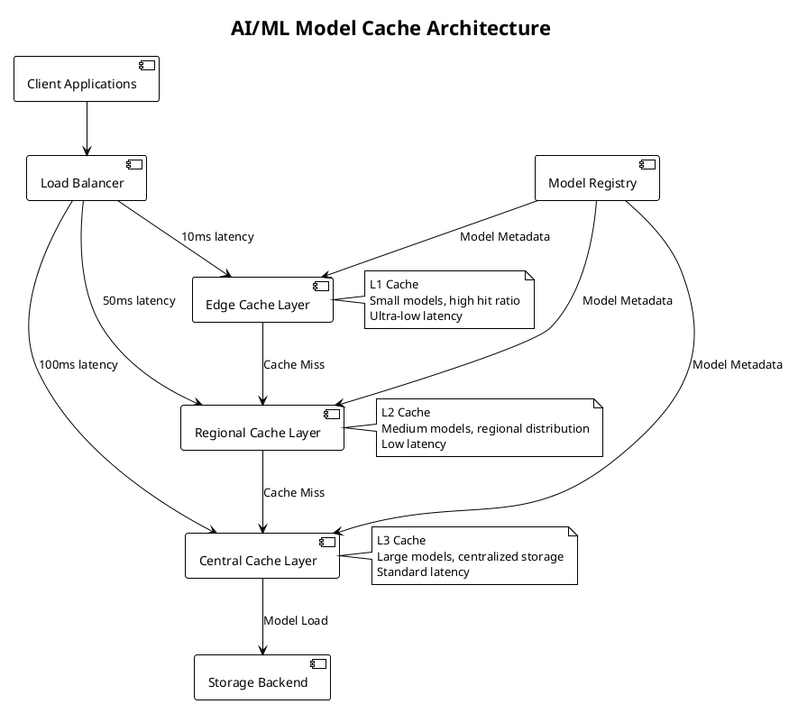

#### ✅ **Определение**
**AI/ML Model Cache** - Специализированная кэширующая система для хранения, управления и быстрого доступа к машиннообучающим моделям, их весам, промежуточным результатам и эмбеддингам с целью минимизации latency и оптимизации inference производительности.

---

#### 🎯 **Цель и суть**
**Цель:**  
Обеспечить высокую производительность ML inference систем за счёт эффективного кэширования моделей и результатов вычислений.

**Суть:**  
Минимизация времени загрузки моделей в память и ускорение доступа к frequently used моделям и данным через intelligent caching strategies для обеспечения low-latency inference в production средах.

---

#### 📚 **Описание**
AI/ML Model Cache представляет собой комплексную систему, которая решает ключевые проблемы производительности в ML serving инфраструктуре. Система кэширует различные компоненты ML pipeline: от самих моделей и их весов до промежуточных результатов вычислений и финальных предсказаний. Это позволяет существенно сократить время ответа системы, особенно при высокой нагрузке. Кэширующая система должна учитывать специфику ML workload: большие размеры моделей (до сотен гигабайт для LLM), частые обновления моделей, разнообразные типы данных (тензоры, эмбеддинги, текстовые представления) и сложные паттерны доступа. Современные реализации интегрируются с MLOps pipeline, автоматически управляют жизненным циклом моделей и адаптируют стратегии кэширования под конкретные use cases.

---

#### ⚖️ **Сравнение**

| Критерий | Аппаратные решения | Программные решения | Комбинированные решения |
|----------|-------------------|---------------------|------------------------|
| **Производительность** | Максимальная (низкая latency) | Средняя | Высокая |
| **Гибкость** | Низкая (специфичность) | Высокая | Средняя-Высокая |
| **Стоимость** | Высокая | Низкая-Средняя | Средняя |
| **Масштабируемость** | Ограниченная | Высокая | Высокая |
| **Сложность внедрения** | Высокая | Низкая | Средняя |
| **Управляемость** | Сложная | Простая | Средняя |
| **Энергоэффективность** | Высокая | Средняя | Высокая |

---

#### 🛠️ **Классификация решений**

##### **Аппаратные решения:**
- **NVIDIA Grace CPU** - высокопроизводительная память для AI workloads с оптимизированной пропускной способностью
- **Intel Optane DC Persistent Memory** - расширение памяти для моделей с сохранением данных при отключении питания
- **CXL-based Memory Expanders** - пулы общей памяти через Compute Express Link для распределённых систем
- **Specialized AI Chips** (Graphcore IPU, Cerebras) - on-chip model storage с минимальными задержками
- **HBM3E Integration** - high-bandwidth memory для тензоров с пропускной способностью до 1 TB/s

##### **Программные решения:**
- **RedisAI** - Redis модуль для кэширования моделей и тензоров с поддержкой различных фреймворков
- **NVIDIA Triton Inference Server** - model server с встроенным кэшированием и оптимизациями для GPU
- **KServe/ModelMesh** - Kubernetes-native model serving с распределённым кэшированием
- **HuggingFace + Redis** - кэширование трансформеров с интеграцией в экосистему transformers
- **FAISS + Redis** - векторные поисковые индексы с кэшированием для similarity search

##### **Комбинированные решения:**
- **NVIDIA DGX + Triton** - GPU hardware + software optimization для максимальной производительности
- **AWS Inferentia + SageMaker** - custom chips с managed caching и облачной интеграцией
- **Google TPU + Vertex AI** - специализированные чипы с cloud integration и автоматическим масштабированием
- **Intel + OpenVINO** - CPU optimization с software stack для edge inference
- **Hybrid Cloud Solutions** - комбинация on-premise и cloud caching с гибридной архитектурой

---

#### 📖 **Исторический контекст**

##### **Предпосылки (2010-2015):**
- Рост сложности deep learning моделей (AlexNet, VGG) привел к увеличению времени загрузки
- Появление первых model serving платформ требовало базовых механизмов кэширования
- Ограниченные ресурсы памяти в GPU делали кэширование критически важным

##### **Формирование направления (2016-2020):**
- Взрывной рост параметров моделей (BERT, GPT-2/3) до миллиардов параметров
- Появление MLOps и model registry систем создало потребность в управляемом кэшировании
- Увеличение inference нагрузки в production потребовало масштабируемых решений

##### **Развитие (2021-2024):**
- Массовое внедрение LLM и generative AI с моделями размером 100B+ параметров
- Появление специализированных caching решений для конкретных типов workload
- Интеграция с edge computing и distributed inference для глобальных систем

---

#### ⚠️ **Текущие проблемы требующие решения**

##### **Технические проблемы:**
- **Model Size Explosion** - LLM размером 100B+ параметров не помещаются в память одного устройства, требуют distributed caching
- **Cold Start Problem** - долгая загрузка моделей (до нескольких минут) при первом запросе, особенно для больших моделей
- **Version Management** - управление множеством версий моделей с автоматическим переключением и rollback
- **Cache Invalidation** - актуализация кэшированных моделей при обновлениях без downtime системы
- **Memory Fragmentation** - неэффективное использование памяти при dynamic loading моделей разных размеров

##### **Архитектурные проблемы:**
- **Multi-modal Models** - кэширование моделей с разными типами входных данных (текст, изображения, аудио) в единой системе
- **Real-time Updates** - динамическое обновление моделей без остановки сервиса и потери производительности
- **Cross-region Consistency** - согласованность кэшей в разных регионах при глобальном развертывании
- **Cost Optimization** - баланс между performance и infrastructure costs при масштабировании

##### **Эксплуатационные проблемы:**
- **Monitoring и Observability** - отслеживание cache hit/miss ratio моделей и метрик производительности
- **Auto-scaling** - динамическое масштабирование кэширующих систем под изменяющуюся нагрузку
- **Resource Contention** - конкуренция за память между моделями при limited resources
- **Predictive Loading** - предиктивная загрузка моделей по паттернам использования для минимизации cold starts

---

#### 📈 **Актуальные решения и тенденции 2025**
- **CXL-based Memory Disaggregation** - пулы памяти для AI кластеров с cache coherency через Compute Express Link
- **LLM KV Cache Optimization** - специализированное кэширование для transformers с оптимизацией key-value пар
- **Multi-modal Caching** - unified cache для текста, изображений, аудио с единым интерфейсом управления
- **Serverless Model Serving** - функции с интеллектуальным кэшированием и автоматическим масштабированием
- **Edge AI Caching** - распределённое кэширование на edge устройствах с ограниченными ресурсами

---

#### 🔮 **Ближайшие перспективы развития**
- **AutoML Cache Policies** - самонастраивающиеся стратегии кэширования на основе анализа паттернов использования
- **Federated Model Caching** - распределённые кэши для федеративного обучения с синхронизацией между узлами
- **Quantum-enhanced Caching** - квантовые алгоритмы для оптимизации размещения и поиска в кэше
- **Biometric Model Personalization** - персонализированные кэши под пользователей с адаптацией под поведение
- **Predictive Model Loading** - ML-based предиктивная загрузка моделей с учетом сезонности и трендов

---

#### 🧠 **Резюме и выводы**
AI/ML Model Cache становится критически важным компонентом для production ML систем, обеспечивая баланс между производительностью, стоимостью и масштабируемостью. Существуют три основных типа решений: hardware (максимальная производительность), software (гибкость и доступность), hybrid (оптимальный баланс). История развития отражает рост сложности ML моделей и потребность в специализированных решениях. Текущие проблемы требуют комплексного подхода с интеграцией современных технологий. Будущее - в автоматизированных, адаптивных системах с интеллектуальной оптимизацией, способных предсказывать потребности и адаптироваться к изменяющимся условиям.

---

#### ❓ **Проверочные вопросы (основные)**

**Вопрос 1:**  
Какой тип решения обеспечивает максимальную производительность для кэширования large language models размером 100B+ параметров?

A) Чисто программное решение (Redis)  
B) Аппаратное решение (специализированные чипы с HBM)  
C) Облачное решение (SageMaker)  
D) Локальное кэширование в каждом инстансе  
E) CDN для статических моделей  
F) Распределённое программное кэширование  

✅ **Правильный ответ: B) Аппаратное решение (специализированные чипы с HBM)**

**Объяснение:** Аппаратные решения обеспечивают максимальную производительность для очень больших моделей за счёт специализированной памяти (HBM) и минимальных задержек в доступе к данным. LLM размером 100B+ параметров требуют специализированного hardware с высокой пропускной способностью памяти, которую не могут обеспечить чисто программные решения. Специализированные чипы (TPU, IPU) с интегрированной памятью и оптимизированными путями данных обеспечивают наилучшую производительность для таких масштабов.

**Почему другие варианты неверны:**
- A) Чисто программные решения ограничены пропускной способностью стандартной памяти
- C) Облачные решения добавляют сетевые задержки
- D) Локальное кэширование не решает проблему размера моделей
- E) CDN не подходит для динамических ML моделей
- F) Распределённое кэширование добавляет сложность и задержки

**Вопрос 2:**  
Какая проблема является наиболее критичной для современных AI/ML model cache систем в production?

A) Увеличение размеров моделей  
B) Управление версиями моделей  
C) Cold start проблема  
D) Все вышеперечисленные  
E) Cache invalidation  
F) Memory fragmentation  

✅ **Правильный ответ: D) Все вышеперечисленные**

**Объяснение:** В production средах все перечисленные проблемы являются критичными и взаимосвязанными. Увеличение размеров моделей создает проблемы с хранением и загрузкой. Управление версиями необходимо для безопасного развертывания обновлений. Cold start напрямую влияет на user experience и SLA. Cache invalidation критична для обеспечения актуальности результатов. Memory fragmentation снижает эффективность использования ресурсов. Современные production системы должны решать все эти проблемы комплексно, так как каждая из них может стать bottleneck в разных сценариях использования.

**Почему другие варианты неверны:**
Хотя каждый из вариантов A-F представляет реальную проблему, в production среде они все критичны и требуют комплексного решения, а не изолированного подхода.

---

#### ❓ **Расширенные проверочные вопросы**

**Вопрос 1 (Design Question):**  
Как спроектировать систему AI/ML model cache для глобального сервиса с требованиями: 99.99% availability, latency < 10ms, 1M+ RPS?

A) Централизованный кэш в одном регионе с репликацией
B) Распределённый кэш с edge locations и intelligent routing
C) Только облачное решение с auto-scaling
D) Локальное кэширование на каждом сервере
E) Гибридная архитектура с multi-tier caching и geo-distribution

✅ **Правильный ответ: E) Гибридная архитектура с multi-tier caching и geo-distribution**

**Объяснение:** Для глобального сервиса с такими требованиями нужна гибридная архитектура, которая сочетает преимущества разных подходов. Multi-tier caching включает L1 кэш (на edge), L2 кэш (в регионах) и L3 кэш (в центральных дата-центрах). Geo-distribution обеспечивает низкую latency за счёт близости к пользователям. Такая архитектура обеспечивает высокую availability через redundancy, масштабируется по нагрузке и может адаптироваться под различные типы моделей и паттерны использования. Централизованные решения не обеспечивают нужную latency, распределённые без иерархии сложны в управлении, облачные могут быть дорогими, локальные не масштабируются.

**Вопрос 2 (Trade-off Question):**  
При выборе между производительностью и стоимостью для AI/ML model cache, какой подход обеспечит оптимальный баланс?

A) Только аппаратные решения для максимальной производительности
B) Только программные решения для минимальной стоимости
C) Гибридный подход с динамическим распределением нагрузки
D) Использование только облачных managed services
E) Кэширование только самых популярных моделей

✅ **Правильный ответ: C) Гибридный подход с динамическим распределением нагрузки**

**Объяснение:** Гибридный подход позволяет оптимизировать cost/performance ratio за счёт динамического распределения нагрузки. Часто используемые и критически важные модели размещаются на высокопроизводительном hardware, менее востребованные - на более экономичных решениях. Динамическое распределение позволяет адаптироваться к изменяющимся паттернам использования, обеспечивая высокую производительность там, где она критична, и экономя ресурсы в других случаях. Чисто аппаратные решения дороги, программные могут не обеспечить нужную производительность, облачные не всегда оптимальны по cost, кэширование только части моделей снижает общую эффективность системы.

---

#### 🔗 **Интеграция с другими темами курса**

**Связи с предыдущими модулями курса:**
- **Кэширование и хранение данных** - расширение концепций кэширования на специфические ML use cases
- **Безопасность систем** - интеграция security measures в model caching (model protection, access control)
- **Производительность и масштабирование** - применение scaling patterns к ML workloads

**Подготовка к комплексным проектам:**
- Интеграция с MLOps pipeline для автоматического управления кэшем
- Реализация monitoring и alerting для ML cache систем
- Проектирование fault-tolerant caching architectures

**Место темы в общей архитектуре системы:**
- AI/ML Model Cache как критический компонент inference layer
- Интеграция с CDN, distributed caching и object storage
- Влияние на overall system architecture и performance characteristics

**Как тема влияет на другие аспекты System Design:**
- Требует пересмотра подходов к memory management и resource allocation
- Влияет на network architecture и data flow patterns
- Определяет требования к monitoring и observability систем

---

#### 📊 **Визуальные элементы**

---

## 📚 **Перечень используемых терминов**

#### **AI/ML Model Cache** - Специализированная кэширующая система для хранения, управления и быстрого доступа к машиннообучающим моделям, их весам, промежуточным результатам и эмбеддингам с целью минимизации latency и оптимизации inference производительности.
Система, которая решает ключевые проблемы производительности в ML serving инфраструктуре, кэшируя различные компоненты ML pipeline: от самих моделей и их весов до промежуточных результатов вычислений и финальных предсказаний. Это позволяет существенно сократить время ответа системы, особенно при высокой нагрузке, и минимизировать cold start проблему для больших моделей.

#### **Large Language Models (LLM)** - Крупномасштабные языковые модели с миллиардами параметров для обработки естественного языка.
Современные языковые модели, такие как GPT, Claude или Llama, содержащие десятки или сотни миллиардов параметров. Эти модели требуют специальных подходов к кэшированию из-за своего огромного размера (до сотен гигабайт) и сложности загрузки в память. Особенность LLM в том, что они часто используют KV cache для хранения промежуточных результатов attention механизмов.

#### **KV Cache (Key-Value Cache)** - Кэш пар ключ-значение, используемый в transformer моделях для хранения промежуточных результатов attention механизмов.
Специализированный кэш, используемый в transformer моделях для хранения промежуточных результатов attention механизмов, что позволяет избежать повторных вычислений при генерации последовательностей. Особенно важен для автогрессивных моделей, где каждый новый токен требует пересчета attention для всех предыдущих токенов.

#### **Multi-tier Caching** - Архитектурный подход, при котором кэши организованы в несколько уровней с разными характеристиками.
Подход к организации кэширующей системы, при котором используются несколько уровней кэша с разными характеристиками по скорости, размеру и стоимости. Обычно включает L1 кэш (самый быстрый, маленький), L2 кэш (средняя скорость и размер) и L3 кэш (медленнее, но большой объем). В контексте AI/ML позволяет оптимизировать cost/performance ratio.

#### **Cold Start Problem** - Проблема долгой загрузки модели при первом обращении к ней из-за отсутствия в кэше.
Ситуация, когда ML модель не находится в кэше и требует полной загрузки из долговременного хранилища, что может занять несколько секунд или даже минут для больших моделей. Особенно критична для LLM размером 100B+ параметров, где загрузка может занимать минуты. Решается через proactive caching и predictive loading.

#### **Model Registry** - Система управления версиями, метаданными и артефактами ML моделей.
Централизованное хранилище, где хранятся все версии моделей, их метаданные, метрики качества и другая информация, необходимая для управления и отслеживания моделей в production. Интегрируется с кэширующими системами для автоматического управления жизненным циклом моделей и их версиями.

#### **Edge Computing** - Распределённая вычислительная парадигма, переносящая обработку данных ближе к источнику.
Архитектурный подход, при котором вычисления выполняются на устройствах, близких к пользователю (например, мобильных устройствах или локальных серверах), для снижения latency и экономии сетевых ресурсов. В контексте AI/ML caching позволяет размещать модели ближе к пользователям для уменьшения времени отклика.

#### **HBM (High Bandwidth Memory)** - Тип памяти с высокой пропускной способностью, используемый в GPU и специализированных чипах.
Специализированная память, установленная очень близко к процессору, обеспечивающая очень высокую пропускную способность для обработки больших объемов данных. Критически важна для кэширования больших ML моделей, где стандартная память не обеспечивает достаточной скорости доступа к параметрам модели.

#### **CXL (Compute Express Link)** - Открытый стандарт высокоскоростной интерконнектной технологии для кэш-согласованности.
Современный стандарт подключения устройств, позволяющий CPU и ускорителям совместно использовать память с сохранением кэш-согласованности. Позволяет создавать пулы общей памяти для AI workloads, что особенно важно для распределённых систем кэширования больших моделей между множественными устройствами.

#### **Federated Learning** - Подход к машинному обучению, при котором модели обучаются на распределённых данных.
Метод обучения моделей, при котором данные остаются на локальных устройствах, а обучение происходит централизованно. Требует специальных подходов к кэшированию и синхронизации моделей между узлами, особенно при частых обновлениях и необходимости поддержания согласованности в распределённой среде.