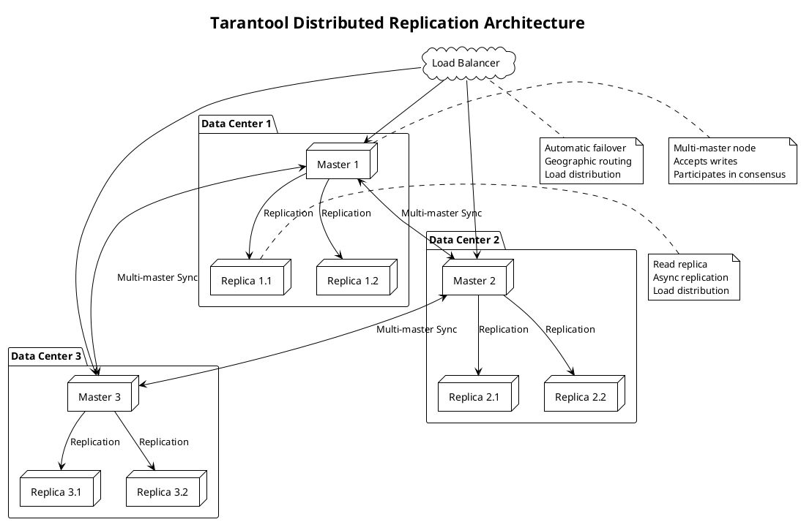

**Tarantool** - Высокопроизводительная in-memory NoSQL база данных с поддержкой SQL, Lua-скриптов и распределенной репликации, разработанная российской компанией VK Team (бывшая Mail.Ru Group).

---

#### 🎯 **Цель и суть**
**Цель:**  
Обеспечить ultra-low latency (менее 1 миллисекунды) и высокую пропускную способность для OLTP (Online Transaction Processing) приложений с требованиями к консистентности данных.

**Суть:**  
Tarantool сочетает in-memory хранение данных с персистентностью через WAL (Write-Ahead Log), поддержку ACID транзакций и встроенный application server для выполнения бизнес-логики прямо в базе данных.

---

#### 📚 **Описание**
Tarantool представляет собой уникальную гибридную систему, которая объединяет преимущества in-memory баз данных и традиционных SQL СУБД. Архитектура включает несколько ключевых компонентов: in-memory engine для сверхбыстрого доступа к данным, WAL для обеспечения durability, Lua-движок для выполнения бизнес-логики, SQL интерфейс для совместимости с реляционными системами. База данных поддерживает горизонтальное масштабирование через шардинг и распределенную репликацию. Особенностью является встроенный application server, позволяющий выполнять сложную бизнес-логику прямо на уровне базы данных, что минимизирует network round-trips и обеспечивает максимальную производительность. Tarantool широко используется в high-load приложениях, особенно в финансовой сфере, мессенджерах и реалтайм системах.

---

#### ⚖️ **Сравнение**

| Критерий | Tarantool | Redis | PostgreSQL | MongoDB |
|----------|-----------|-------|------------|---------|
| **Тип хранения** | In-memory + WAL | In-memory | Disk-based | Disk-based + memory |
| **Язык запросов** | Lua/SQL | Commands | SQL | MongoDB Query |
| **ACID транзакции** | Полная поддержка | Ограничена | Полная | Ограничена |
| **Репликация** | Многомастерная | Master-slave | Master-slave/multi-master | Replica sets |
| **Производительность** | < 1ms latency | < 1ms latency | 1-10ms | 1-5ms |
| **Персистентность** | WAL + snapshots | RDB/AOF | WAL | WiredTiger |
| **Сложность бизнес-логики** | Встроенная Lua | Ограничена | PL/pgSQL | Aggregation pipelines |
| **Шардинг** | Встроенный | Через proxy | Расширения | Встроенный |

---

#### 🛠️ **Классификация решений**

##### **Аппаратные решения:**
- **Высокопроизводительные серверы с большим объемом RAM** - для in-memory хранения данных
- **NVMe SSD** - для быстрой персистентности WAL и snapshots
- **Высокоскоростные сети (10/25/100 GbE)** - для распределенной репликации и шардинга

##### **Программные решения:**
- **Tarantool Community Edition** - open-source версия с базовыми функциями
- **Tarantool Enterprise Edition** - расширенная версия с enterprise features
- **Tarantool Cartridge** - framework для создания кластеров и шардинга
- **Tarantool Operator для Kubernetes** - оркестрация в контейнеризированной среде

##### **Комбинированные решения:**
- **Tarantool + Kafka** - для event-driven архитектур с распределенной репликацией
- **Tarantool + Prometheus** - мониторинг распределенных кластеров
- **Tarantool + Consul** - service discovery для динамической конфигурации репликации
- **Cloud-native deployment** - комбинация облачной инфраструктуры и Tarantool кластеров

---

#### 📖 **Исторический контекст**

##### **Предпосылки (2008-2010):**
- Необходимость ultra-low latency для веб-приложений Mail.Ru
- Ограничения существующих NoSQL решений в плане ACID и сложной логики
- Требования к высокой доступности и масштабируемости мессенджеров

##### **Разработка и первые версии (2011-2013):**
- Первая публичная версия Tarantool в 2011 году
- Открытие исходного кода в 2012 году
- Внедрение в ключевые сервисы Mail.Ru Group

##### **Развитие и enterprise версия (2014-2018):**
- Создание Tarantool Enterprise для корпоративных клиентов
- Добавление SQL интерфейса и улучшенной репликации
- Расширение на международный рынок

##### **Современный этап (2019-2024):**
- Переход под эгиду VK Team
- Развитие экосистемы (Cartridge, Kubernetes operator)
- Интеграция с современными cloud-native технологиями

---

#### ⚠️ **Текущие проблемы требующие решения**

##### **Технические проблемы:**
- **Ограниченный объем памяти** - необходимость эффективного использования RAM для больших датасетов
- **Сложность управления большими кластерами** - администрирование распределенной репликации при сотнях узлов
- **Конфликты при многомастерной репликации** - разрешение конфликтов в распределенных транзакциях
- **Персистентность и восстановление** - обеспечение durability при высокой нагрузке

##### **Архитектурные проблемы:**
- **Шардинг и распределение данных** - эффективное распределение данных по узлам кластера
- **Горизонтальное масштабирование** - динамическое добавление/удаление узлов без downtime
- **Географическое распределение** - репликация между дата-центрами с учетом latency
- **Интеграция с существующими системами** - совместимость с legacy архитектурами

##### **Эксплуатационные проблемы:**
- **Мониторинг распределенных кластеров** - observability в сложных реплицированных средах
- **Backup и disaster recovery** - стратегии резервного копирования распределенных данных
- **Обновление без downtime** - rolling upgrades в production кластерах
- **Cost optimization** - баланс между производительностью и стоимостью hardware

---

#### 📈 **Актуальные решения и тенденции 2025**
- **Tarantool Cartridge 3.0** - улучшенная поддержка распределенной репликации и шардинга
- **Multi-datacenter replication** - расширенные возможности географической репликации
- **Kubernetes-native deployment** - операторы для cloud-native оркестрации
- **AI/ML интеграция** - встроенные функции для real-time аналитики
- **Enhanced security features** - расширенные механизмы аутентификации и авторизации

---

#### 🔮 **Ближайшие перспективы развития**
- **Автоматическая оптимизация кластеров** - self-tuning для распределенной репликации
- **Квантовые алгоритмы согласованности** - применение квантовых вычислений для consensus
- **Edge computing интеграция** - распределенная репликация на edge устройствах
- **Serverless Tarantool** - функции как сервис с in-memory хранением
- **Гибридные cloud deployment** - seamless репликация между облаками

---

#### 🧠 **Резюме и выводы**
Tarantool DB представляет собой уникальное решение для high-performance OLTP приложений, сочетающее скорость in-memory систем с надежностью традиционных СУБД. Его ключевые преимущества - ultra-low latency, встроенный application server и мощная система распределенной репликации. Решение особенно эффективно в сценариях, требующих сложной бизнес-логики и высокой доступности. Распределенная репликация Tarantool обеспечивает гибкость в построении масштабируемых архитектур с поддержкой географического распределения. При правильной архитектуре Tarantool может стать основой для mission-critical систем с требованиями к миллисекундной latency.

---

#### ❓ **Проверочные вопросы (основные)**

**Вопрос 1:**  
Какая архитектурная особенность Tarantool делает его уникальным по сравнению с другими in-memory базами данных?

A) Поддержка SQL интерфейса  
B) Встроенный application server с Lua-скриптами  
C) Высокая скорость доступа к данным  
D) Поддержка ACID транзакций  
E) Распределенная репликация  
F) Персистентность через WAL  

✅ **Правильный ответ: B) Встроенный application server с Lua-скриптами**

**Объяснение:** Уникальной особенностью Tarantool является встроенный application server, который позволяет выполнять сложную бизнес-логику прямо в базе данных с использованием Lua-скриптов. Это минимизирует network round-trips между приложением и базой данных, что критично для достижения ultra-low latency (< 1ms). Хотя другие опции (SQL, скорость, ACID, репликация, WAL) также важны и присутствуют в Tarantool, именно встроенный application server с возможностью выполнения произвольной логики делает Tarantool уникальным. Это позволяет реализовывать сложные транзакции, бизнес-правила и обработку данных на уровне базы данных, что невозможно в большинстве других in-memory решений.

**Почему другие варианты неверны:**
- A) Поддержка SQL есть и в других СУБД
- C) Высокая скорость характерна для всех in-memory решений
- D) ACID транзакции поддерживаются многими СУБД
- E) Распределенная репликация есть в других системах
- F) WAL персистентность также используется другими БД

**Вопрос 2:**  
Какой механизм обеспечивает персистентность данных в Tarantool при его in-memory архитектуре?

A) Только snapshot'ы данных  
B) Только Write-Ahead Log (WAL)  
C) Комбинация WAL и периодических snapshot'ов  
D) Репликация на slave узлы  
E) Хранение в файловой системе  
F) Использование SSD накопителей  

✅ **Правильный ответ: C) Комбинация WAL и периодических snapshot'ов**

**Объяснение:** Tarantool использует комбинацию Write-Ahead Log (WAL) и периодических snapshot'ов для обеспечения персистентности данных в своей in-memory архитектуре. WAL записывает все изменения данных в лог перед применением в памяти, что обеспечивает durability при сбоях. Периодические snapshot'ы создают полные копии состояния памяти для ускорения восстановления и уменьшения размера WAL. При восстановлении Tarantool загружает последний snapshot и воспроизводит транзакции из WAL. Только WAL или только snapshot'ы не обеспечивают оптимальной персистентности - WAL может быть слишком большим для быстрого восстановления, а snapshot'ы не обеспечивают durability для последних изменений.

**Почему другие варианты неверны:**
- A) Только snapshot'ы не обеспечивают durability для последних изменений
- B) Только WAL не обеспечивает эффективного восстановления
- D) Репликация обеспечивает доступность, но не персистентность на одном узле
- E) Простое хранение в файловой системе противоречит in-memory архитектуре
- F) SSD ускоряют I/O, но не обеспечивают персистентности без WAL/snapshot

---

#### ❓ **Расширенные проверочные вопросы**

**Вопрос 1 (Design Question):**  
Как спроектировать распределенную систему на Tarantool для обеспечения 99.999% availability с географическим распределением?

A) Один кластер в одном дата-центре с репликами  
B) Несколько независимых кластеров без репликации  
C) Многомастерная репликация между 3+ дата-центрами  
D) Только локальные кластеры без междц репликации  
E) Использование только одного региона  

✅ **Правильный ответ: C) Многомастерная репликация между 3+ дата-центрами**

**Объяснение:** Для достижения 99.999% availability (менее 5 минут downtime в год) с географическим распределением необходима многомастерная репликация между 3 или более дата-центрами. Такая архитектура обеспечивает:
1. **Fault tolerance** - отказ одного или двух дата-центров не останавливает систему
2. **Low latency** - пользователи обслуживаются ближайшим дата-центром
3. **Disaster recovery** - данные реплицируются географически
4. **Load distribution** - нагрузка распределяется между регионами

Tarantool поддерживает многомастерную репликацию с разрешением конфликтов, что идеально подходит для такого сценария. Вариант A не обеспечивает географическое распределение, B не обеспечивает согласованность данных, D не обеспечивает fault tolerance, E не решает задачу географического распределения.

**Вопрос 2 (Scaling Question):**  
Как реализовать горизонтальное масштабирование Tarantool кластера с 10 до 100 узлов без downtime?

A) Последовательное добавление узлов с ручной переконфигурацией  
B) Использование Tarantool Cartridge с автоматическим шардингом  
C) Создание нового кластера и миграция данных  
D) Увеличение ресурсов существующих узлов (вертикальное масштабирование)  
E) Ручное перераспределение данных между узлами  

✅ **Правильный ответ: B) Использование Tarantool Cartridge с автоматическим шардингом**

**Объяснение:** Tarantool Cartridge - это framework для создания масштабируемых кластеров, который предоставляет встроенные механизмы для автоматического шардинга и горизонтального масштабирования без downtime. Cartridge обеспечивает:
1. **Automatic sharding** - автоматическое распределение данных по узлам
2. **Cluster orchestration** - управление жизненным циклом узлов
3. **Zero-downtime scaling** - добавление узлов без остановки сервиса
4. **Load balancing** - автоматическое распределение нагрузки
5. **Failover handling** - автоматическое восстановление при сбоях

Вариант A требует downtime и ручного управления, C требует downtime для миграции, D это вертикальное, а не горизонтальное масштабирование, E требует ручного вмешательства и может привести к downtime.

---

#### 🔗 **Интеграция с другими темами курса**

**Связи с предыдущими модулями курса:**
- **Кэширование и хранение данных** - Tarantool как гибрид кэша и базы данных с уникальной репликацией
- **Безопасность систем** - интеграция security features Tarantool с общими принципами безопасности
- **Производительность и масштабирование** - применение scaling patterns к распределенной репликации Tarantool

**Подготовка к комплексным проектам:**
- Интеграция Tarantool кластеров с MLOps pipeline для real-time scoring
- Реализация monitoring и alerting для распределенных Tarantool кластеров
- Проектирование disaster recovery архитектур с географической репликацией

**Место темы в общей архитектуре системы:**
- Tarantool как in-memory data layer с распределенной репликацией
- Интеграция с message queues для event-driven архитектур
- Влияние на overall system architecture и performance characteristics

**Как тема влияет на другие аспекты System Design:**
- Требует пересмотра подходов к data consistency и distributed transactions
- Влияет на network architecture и latency requirements
- Определяет требования к monitoring и fault tolerance систем

---

#### 📊 **Визуальные элементы**

---

## 📚 **Перечень используемых терминов**

#### **Tarantool DB** - Высокопроизводительная in-memory NoSQL база данных с поддержкой SQL, Lua-скриптов и распределенной репликации, разработанная российской компанией VK Team.
Уникальная гибридная система, сочетающая преимущества in-memory баз данных (ultra-low latency) и традиционных SQL СУБД (ACID транзакции, SQL интерфейс). Особенностью является встроенный application server с Lua-скриптами, позволяющий выполнять сложную бизнес-логику прямо в базе данных. Поддерживает распределенную репликацию и шардинг для горизонтального масштабирования. Широко используется в high-load приложениях, особенно в финансовой сфере и реалтайм системах.

#### **Multi-master Replication** - Механизм репликации, при котором несколько узлов могут принимать записи одновременно с последующей синхронизацией данных.
Архитектурный паттерн распределенных систем, при котором несколько узлов (мастеров) могут принимать write операции одновременно. В Tarantool реализован через gossip protocol и vector clocks для разрешения конфликтов. Обеспечивает высокую доступность и fault tolerance, но требует сложных механизмов согласованности данных. Критически важен для географически распределенных систем и обеспечивает low-latency доступ к данным для пользователей в разных регионах.

#### **Write-Ahead Log (WAL)** - Журнал предварительной записи, в который записываются все изменения данных перед их применением к основному хранилищу.
Механизм обеспечения персистентности и durability в базах данных. В Tarantool WAL записывает все транзакции в лог-файлы перед применением к in-memory данным. При сбое система может восстановиться, воспроизведя транзакции из WAL. Критически важен для in-memory систем, где данные находятся в оперативной памяти и могут быть потеряны при сбое питания. В распределенной репликации WAL также используется для передачи изменений между узлами.

#### **Gossip Protocol** - Децентрализованный протокол обмена информацией в распределенных системах, при котором узлы обмениваются информацией случайным образом.
Алгоритм, используемый в Tarantool для обнаружения узлов и распространения информации о состоянии кластера. Узлы периодически обмениваются информацией со случайными peer'ами, что обеспечивает быстрое распространение информации по всему кластеру без централизованного координатора. Используется для обнаружения сбоев, обмена метаданными и координации распределенной репликации. Обеспечивает fault tolerance и самоорганизацию кластера.

#### **Vector Clocks** - Механизм отслеживания причинно-следственных связей между событиями в распределенных системах с использованием векторов логических времени.
Алгоритм, используемый в Tarantool для разрешения конфликтов в многомастерной репликации. Каждый узел поддерживает вектор, где отслеживается количество операций на каждом узле кластера. При получении обновления система может определить, является ли оно причиной или следствием локальных изменений, что позволяет корректно разрешать конфликты и поддерживать согласованность данных в распределенной среде.

#### **Cartridge** - Framework для создания масштабируемых кластеров Tarantool с автоматическим шардингом и управлением.
Официальный framework от VK Team для развертывания и управления кластерами Tarantool. Предоставляет инструменты для автоматического шардинга, оркестрации узлов, мониторинга и масштабирования. Упрощает создание распределенных систем с географической репликацией и обеспечивает zero-downtime операции. Включает встроенные механизмы для управления жизненным циклом кластеров и автоматического восстановления при сбоях.

#### **Lua** - Легковесный скриптовый язык программирования, используемый в Tarantool для реализации бизнес-логики.
Встроенный в Tarantool скриптовый язык, который позволяет разработчикам реализовывать сложную бизнес-логику прямо в базе данных. Lua-скрипты выполняются в sandboxed окружении и имеют прямой доступ к данным, что минимизирует network round-trips и обеспечивает максимальную производительность. Используется для реализации сложных транзакций, триггеров, stored procedures и пользовательских функций в контексте распределенной репликации.

#### **Sharding** - Метод горизонтального разделения данных по нескольким узлам для масштабирования и распределения нагрузки.
Процесс разделения данных на логические части (шарды), которые распределяются по разным узлам кластера. В Tarantool реализован через встроенные механизмы в Cartridge framework. Позволяет масштабировать систему горизонтально, распределяя нагрузку между узлами и увеличивая общую пропускную способность. В контексте распределенной репликации каждый шард может иметь свою схему репликации и географическое распределение.

#### **Consensus Algorithm** - Алгоритм достижения согласия между узлами распределенной системы по поводу состояния данных или выполнения операций.
Алгоритмы, используемые в Tarantool для обеспечения согласованности данных в распределенной репликации. Включают реализации Raft-like протоколов для координации между мастер-узлами и разрешения конфликтов. Критически важны для обеспечения ACID свойств в многомастерной конфигурации и предотвращения split-brain ситуаций. Обеспечивают fault tolerance и корректность данных при сетевых разделениях.

#### **Split-brain** - Ситуация в распределенной системе, при которой два или более узла считают себя мастерами и принимают конфликтующие записи.
Критическая проблема в распределенной репликации, когда сетевое разделение приводит к тому, что несколько узлов принимают записи независимо, создавая конфликты данных. Tarantool использует механизмы quorum и heartbeat для предотвращения split-brain ситуаций. При обнаружении сетевого разделения система автоматически отключает часть узлов для предотвращения неконсистентных записей. Критически важно для обеспечения целостности данных в географически распределенных системах.