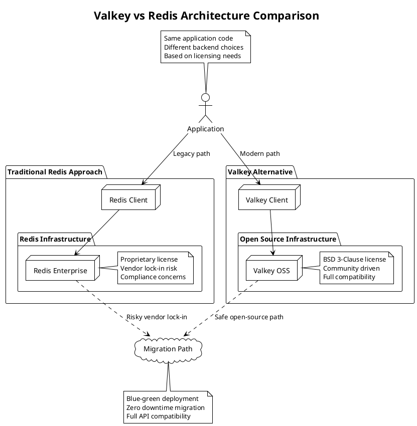

**Valkey** - Высокопроизводительная in-memory key-value база данных с открытым исходным кодом, созданная как ответвление (fork) Redis после перехода Redis к более ограничительной лицензии, обеспечивающая полную совместимость с Redis API и протоколом.

---

#### 🎯 **Цель и суть**
**Цель:**  
Обеспечить альтернативу Redis с открытым исходным кодом под свободной лицензией, сохраняя все функциональные возможности и производительность оригинального Redis для кэширования, сессионного хранения и real-time приложений.

**Суть:**  
Valkey представляет собой полностью совместимую с Redis реализацию in-memory key-value хранилища, которая развивается сообществом под OSI-совместимой лицензией, обеспечивая защиту от vendor lock-in и свободу использования в коммерческих проектах.

---

#### 📚 **Описание**
Valkey (произносится как "val-key") был создан в 2024 году как ответвление Redis Labs после перехода Redis к лицензии RSALv2 (Redis Source Available License), которая ограничивает использование Redis в облачных сервисах и коммерческих продуктах. Valkey поддерживает полную совместимость с Redis API, протоколом и большинством функций, включая структуры данных (strings, hashes, lists, sets, sorted sets, streams), persistence (RDB/AOF), replication, clustering и pub/sub. Проект развивается под лицензией BSD 3-Clause, что обеспечивает свободное использование, модификацию и распространение. Valkey сохраняет архитектурные особенности Redis: single-threaded event loop, in-memory хранение, атомарность операций, но с фокусом на сообщество и открытую разработку. Поддерживает те же клиентские библиотеки и инструменты, что делает миграцию с Redis тривиальной.

---

#### ⚖️ **Сравнение**

| Критерий | Valkey | Redis | Memcached | MongoDB |
|----------|--------|-------|-----------|---------|
| **Лицензия** | BSD 3-Clause (OSI-approved) | RSALv2 (ограничения) | BSD 3-Clause | SSPL (ограничения) |
| **Совместимость с Redis** | 100% API/протокол | Оригинал | Нет | Нет |
| **Тип хранения** | In-memory (с persistence) | In-memory (с persistence) | In-memory | Disk-based |
| **Структуры данных** | Полный набор Redis | Полный набор Redis | Простые key-value | Documents |
| **Persistence** | RDB + AOF | RDB + AOF | Ограниченная | Full |
| **Производительность** | Эквивалентна Redis | Очень высокая | Очень высокая | Высокая |
| **Масштабирование** | Cluster mode | Cluster mode | Client sharding | Sharding |
| **ACID транзакции** | Ограниченные | Ограниченные | Нет | Частичные |
| **Pub/Sub** | Встроенный | Встроенный | Нет | Change Streams |
| **Сообщество** | Растущее open-source | Коммерческое (Redis Ltd) | Стабильное | Enterprise |

---

#### 🛠️ **Классификация решений**

##### **Аппаратные решения:**
- **Высокопроизводительные серверы с большим объемом RAM** - для in-memory хранения данных
- **NVMe SSD накопители** - для быстрой persistence (AOF, RDB) и снижения latency
- **Высокоскоростные сети (25/100 GbE)** - для cluster replication и распределённых развертываний
- **NUMA-оптимизированные системы** - для эффективного использования многопроцессорных архитектур

##### **Программные решения:**
- **Valkey OSS** - базовая open-source версия с основными функциями Redis
- **Valkey Enterprise** - будущие коммерческие версии от различных вендоров
- **Managed services** - облачные решения от AWS, Google, Azure (ожидается)
- **Valkey Stack** - расширенная версия с модулями (ожидается)

##### **Комбинированные решения:**
- **Valkey + PostgreSQL** - гибридное решение: Valkey как кэш, PostgreSQL как основная БД
- **Valkey + Kafka** - для event-driven архитектур с real-time data streaming
- **Valkey + Elasticsearch** - для search и analytics поверх Valkey данных
- **Valkey + Kubernetes** - контейнеризированное развертывание с оркестрацией

---

#### 📖 **Исторический контекст**

##### **Предпосылки и создание (2024):**
- Анонс Redis Labs о переходе к RSALv2 лицензии в марте 2024
- Ограничения использования Redis в облачных сервисах и коммерческих продуктах
- Беспокойство сообщества по поводу открытости и свободы использования
- Необходимость альтернативы с открытым исходным кодом

##### **Раннее развитие (2024):**
- Создание проекта Valkey как fork Redis 7.2
- Формирование core team из бывших контрибьюторов Redis
- Адаптация под BSD 3-Clause лицензию
- Первые релизы с полной совместимостью

##### **Сообщественная адаптация (2024-2025):**
- Поддержка от major cloud провайдеров и технологических компаний
- Адаптация клиентских библиотек и инструментов
- Интеграция с существующими DevOps практиками
- Формирование экосистемы вокруг проекта

##### **Будущее развитие (2025+):**
- Расширение функциональности и оптимизация производительности
- Развитие экосистемы модулей и расширений
- Интеграция с современными cloud-native технологиями
- Установление себя как стандартной альтернативы Redis

---

#### ⚠️ **Текущие проблемы требующие решения**

##### **Технические проблемы:**
- **Feature parity с Redis** - необходимость догнать последние функции Redis
- **Performance optimization** - оптимизация производительности после fork
- **Memory management** - эффективное использование памяти и предотвращение fragmentation
- **Compatibility maintenance** - поддержание совместимости с новыми версиями Redis

##### **Архитектурные проблемы:**
- **Cluster stability** - обеспечение стабильности работы кластеров
- **Replication reliability** - надежная репликация между узлами
- **Migration complexity** - упрощение миграции с Redis
- **Ecosystem integration** - интеграция с существующими инструментами

##### **Эксплуатационные проблемы:**
- **Documentation completeness** - полная документация и best practices
- **Community support** - развитие сообщества и поддержки
- **Monitoring tools** - адаптация существующих monitoring решений
- **Enterprise adoption** - доверие enterprise клиентов к новому решению

---

#### 📈 **Актуальные решения и тенденции 2025**
- **Valkey 8.x** - улучшенная производительность и расширенные функции
- **Cloud provider adoption** - поддержка от AWS, Google, Microsoft
- **Kubernetes native deployment** - операторы и helm charts
- **Enhanced security features** - расширенные механизмы аутентификации
- **Multi-architecture support** - ARM, x86, RISC-V оптимизации

---

#### 🔮 **Ближайшие перспективы развития**
- **Enterprise support ecosystem** - коммерческая поддержка от multiple vendors
- **Module ecosystem** - развитие экосистемы расширений и плагинов
- **AI/ML integration** - оптимизации для machine learning workloads
- **Edge computing support** - lightweight версии для edge devices
- **Quantum-ready algorithms** - подготовка к пост-квантовым вычислениям

---

#### 🧠 **Резюме и выводы**
Valkey представляет собой важную альтернативу Redis, созданную для сохранения свободы использования in-memory key-value технологий. Проект обеспечивает 100% совместимость с Redis API и протоколом, но развивается под открытой лицензией, что делает его привлекательным для enterprise и cloud провайдеров. Valkey особенно актуален в условиях ограничений лицензии Redis, обеспечивая защиту от vendor lock-in и свободу модификации. При правильной миграции Valkey может стать основой для high-performance систем с требованиями к открытости и независимости.

---

#### ❓ **Проверочные вопросы (основные)**

**Вопрос 1:**  
Какая лицензия делает Valkey привлекательной альтернативой Redis для enterprise использования?

A) Apache License 2.0  
B) MIT License  
C) BSD 3-Clause License  
D) GNU GPL v3  
E) RSALv2  
F) SSPL  

✅ **Правильный ответ: C) BSD 3-Clause License**

**Объяснение:** BSD 3-Clause License делает Valkey привлекательной альтернативой Redis для enterprise использования по следующим причинам:
1. **OSI-approved и свободная** - полностью соответствует Open Source Initiative требованиям
2. **Нет ограничений на использование** - можно использовать в коммерческих продуктах и облачных сервисах
3. **Минимальные ограничения** - только сохранение copyright notice, list of conditions и disclaimer
4. **Совместимость с proprietary software** - можно встраивать в закрытые коммерческие продукты
5. **Отсутствие copyleft эффекта** - не требует открытия производных работ

Redis перешел на RSALv2, которая запрещает использование в облачных сервисах, MongoDB использует SSPL, которая также ограничительна для cloud providers. BSD 3-Clause обеспечивает максимальную свободу использования.

**Почему другие варианты неверны:**
- A) Apache License 2.0 - свободная, но не лицензия Valkey
- B) MIT License - свободная, но не лицензия Valkey
- D) GNU GPL v3 - copyleft лицензия, ограничивает использование в proprietary software
- E) RSALv2 - именно эта лицензия сделала необходимым создание Valkey
- F) SSPL - ограничительная лицензия MongoDB

**Вопрос 2:**  
Какой уровень совместимости Valkey обеспечивает с существующими Redis deployment'ами?

A) 50% функциональности  
B) 75% функциональности  
C) 90% функциональности  
D) 100% API и протокол совместимость  
E) Только базовые команды  
F) Несовместим  

✅ **Правильный ответ: D) 100% API и протокол совместимость**

**Объяснение:** Valkey обеспечивает 100% API и протокол совместимость с Redis по следующим причинам:
1. **Direct fork** - создан как ответвление от Redis 7.2 с сохранением архитектуры
2. **Same wire protocol** - использует тот же протокол обмена данными
3. **Identical command set** - поддерживает те же команды с тем же синтаксисом
4. **Compatible data structures** - все структуры данных Redis (strings, hashes, lists, sets, etc.)
5. **Same client libraries** - работает с теми же клиентскими библиотеками
6. **Equivalent features** - persistence, replication, clustering, pub/sub

Это делает миграцию с Redis на Valkey тривиальной - достаточно просто изменить endpoint. Valkey не является частичной реализацией, а стремится к полной совместимости.

**Почему другие варианты неверны:**
- A) 50% - значительно ниже реальной совместимости
- B) 75% - недооценивает уровень совместимости
- C) 90% - все еще не полная совместимость
- E) Только базовые команды - поддерживает полный набор функций
- F) Несовместим - полностью совместим

---

#### ❓ **Расширенные проверочные вопросы**

**Вопрос 1 (Migration Question):**  
Какой подход к миграции с Redis на Valkey обеспечит минимальный downtime при 100K+ RPS нагрузке?

A) Полная остановка системы и параллельный запуск Valkey  
B) Blue-green deployment с канареечным релизом  
C) Простая замена endpoint'ов в конфигурации  
D) Использование Redis только в режиме read-only  
E) Постепенная миграция по ключам  

✅ **Правильный ответ: B) Blue-green deployment с канареечным релизом**

**Объяснение:** Blue-green deployment с канареечным релизом обеспечивает минимальный downtime при миграции с Redis на Valkey:
1. **Zero downtime** - старая и новая система работают параллельно
2. **Gradual rollout** - канареечный подход позволяет тестировать на малой нагрузке
3. **Quick rollback** - возможность мгновенного отката при проблемах
4. **Load balancing** - постепенное переключение трафика
5. **Monitoring** - наблюдение за производительностью и ошибками
6. **Risk mitigation** - минимизация рисков при high-load окружении

Вариант A вызовет downtime, C слишком рискован при high-load, D не решает проблему полностью, E сложен для реализации при высокой нагрузке.

**Вопрос 2 (Architecture Question):**  
Для enterprise с требованиями compliance и open-source, какой выбор между Redis и Valkey более обоснован?

A) Redis Enterprise для лучшей поддержки  
B) Valkey для соответствия требованиям open-source  
C) Memcached для простоты  
D) MongoDB для документоориентированного подхода  
E) Использование обоих решений параллельно  

✅ **Правильный ответ: B) Valkey для соответствия требованиям open-source**

**Объяснение:** Для enterprise с требованиями compliance и open-source Valkey является более обоснованным выбором:
1. **License compliance** - BSD 3-Clause полностью соответствует open-source требованиям
2. **No vendor lock-in** - свобода модификации и использования
3. **Audit capability** - возможность аудита всего исходного кода
4. **Community governance** - открытое управление развитием проекта
5. **Future-proof** - защита от изменения лицензии
6. **Equivalent functionality** - те же возможности, что и у Redis

Redis Enterprise требует коммерческой лицензии, Memcached не обеспечивает нужной функциональности, MongoDB имеет ограничительную лицензию, параллельное использование создает сложность.

---

#### 🔗 **Интеграция с другими темами курса**

**Связи с предыдущими модулями курса:**
- **Кэширование и хранение данных** - Valkey как drop-in замена Redis в кэширующих решениях
- **Безопасность систем** - применение тех же security patterns, но с преимуществами open-source
- **Производительность и масштабирование** - использование тех же scaling patterns, что и для Redis

**Подготовка к комплексным проектам:**
- Миграция существующих Redis deployment'ов на Valkey с минимальным риском
- Интеграция Valkey с микросервисной архитектурой и event-driven системами
- Реализация monitoring и alerting для Valkey кластеров

**Место темы в общей архитектуре системы:**
- Valkey как in-memory caching и data structure layer с открытым исходным кодом
- Интеграция с API gateways и microservices для high-performance data access
- Влияние на overall system architecture и compliance requirements

**Как тема влияет на другие аспекты System Design:**
- Требует пересмотра подходов к vendor selection и license compliance
- Влияет на disaster recovery и migration planning
- Определяет требования к open-source governance и security auditing

---

#### 📊 **Визуальные элементы**

---

## 📚 **Перечень используемых терминов**

#### **Valkey** - Высокопроизводительная in-memory key-value база данных с открытым исходным кодом, созданная как ответвление (fork) Redis после перехода Redis к более ограничительной лицензии, обеспечивающая полную совместимость с Redis API и протоколом.
Альтернативная реализация Redis, созданная в 2024 году как ответ на переход Redis к лицензии RSALv2. Valkey поддерживает 100% совместимость с Redis API, протоколом и функциональностью, но развивается под BSD 3-Clause лицензией. Предназначен для обеспечения свободного использования in-memory key-value технологий без риска vendor lock-in. Поддерживает те же структуры данных, persistence механизмы, clustering и replication, что и Redis, но с фокусом на сообщество и открытую разработку.

#### **RSALv2 (Redis Source Available License v2)** - Ограниченная лицензия, введенная Redis Labs в 2024 году, которая запрещает использование Redis в облачных сервисах и коммерческих продуктах.
Лицензия, введенная Redis Labs (ныне Redis Ltd), которая ограничивает использование Redis в определенных сценариях:
1. **Cloud restrictions** - запрещает использование в managed cloud services
2. **Commercial product limitations** - ограничивает встраивание в коммерческие продукты
3. **Derivative works constraints** - ограничивает создание производных работ
RSALv2 не является OSI-approved лицензией и вызвала обеспокоенность в сообществе, что привело к созданию Valkey как альтернативы.

#### **BSD 3-Clause License** - Свободная лицензия с открытым исходным кодом, разрешающая использование, модификацию и распространение программного обеспечения с минимальными ограничениями.
OSI-approved лицензия, которая позволяет:
1. **Free use** - свободное использование в любых целях
2. **Modification** - изменение исходного кода
3. **Distribution** - распространение оригинальных и модифицированных версий
4. **Patent grant** - предоставление патентных прав
Лицензия требует только сохранения copyright notice, list of conditions и disclaimer. Не имеет copyleft эффекта, что делает ее привлекательной для коммерческого использования.

#### **API Compatibility** - Полное соответствие интерфейсов программирования приложений между двумя системами, позволяющее использовать одну систему вместо другой без изменения кода.
Свойство Valkey обеспечивать 100% совместимость с Redis API, что включает:
1. **Command compatibility** - те же команды с тем же синтаксисом
2. **Protocol compatibility** - тот же wire protocol и формат обмена данными
3. **Client library compatibility** - работа с теми же клиентскими библиотеками
4. **Response format compatibility** - те же форматы ответов и ошибок
API compatibility делает миграцию с Redis на Valkey тривиальной задачей.

#### **Vendor Lock-in** - Ситуация, при которой организация становится зависимой от конкретного поставщика программного обеспечения или услуг, что затрудняет переход к альтернативам.
Риск, связанный с использованием программного обеспечения с ограничительными лицензиями:
1. **License restrictions** - невозможность использования в определенных сценариях
2. **Migration costs** - высокая стоимость перехода к альтернативам
3. **Dependency risks** - риски изменения условий лицензирования
4. **Innovation constraints** - ограничения на модификацию и улучшение
Valkey решает проблему vendor lock-in через открытую лицензию и сообщественную разработку.

#### **Blue-Green Deployment** - Стратегия развертывания, при которой две идентичные среды (blue и green) используются для минимизации downtime при обновлениях.
Методология миграции, которая обеспечивает:
1. **Zero downtime** - одна среда работает, пока другая обновляется
2. **Quick rollback** - возможность мгновенного отката при проблемах
3. **Gradual rollout** - постепенное переключение трафика
4. **Risk mitigation** - минимизация рисков при критических обновлениях
Используется для миграции с Redis на Valkey с минимальным влиянием на пользователей.

#### **Fork** - Создание новой ветви разработки программного обеспечения путем копирования исходного кода и независимого развития.
Процесс создания Valkey как ответвления от Redis:
1. **Codebase copy** - копирование исходного кода Redis 7.2
2. **Independent development** - независимое развитие с новыми целями
3. **License change** - переход к BSD 3-Clause лицензии
4. **Community governance** - открытое управление развитием
Fork позволяет сохранить функциональность при изменении лицензии и направления развития.

#### **Wire Protocol** - Протокол обмена данными на сетевом уровне между клиентом и сервером.
Сетевой протокол, используемый Valkey для общения с клиентами:
1. **Redis Protocol Specification** - совместимость с Redis Serialization Protocol (RESP)
2. **Binary format** - эффективный бинарный формат обмена данными
3. **Command encoding** - стандартизированный способ кодирования команд
4. **Response format** - согласованный формат ответов сервера
Совместимость wire protocol обеспечивает работу существующих клиентов без изменений.

#### **Canary Release** - Постепенное развертывание новой версии программного обеспечения на небольшую часть пользователей для тестирования.
Стратегия миграции, используемая при переходе на Valkey:
1. **Gradual rollout** - постепенное увеличение доли трафика
2. **Risk reduction** - минимизация влияния потенциальных проблем
3. **Performance monitoring** - наблюдение за метриками и ошибками
4. **Quick rollback capability** - возможность быстрого отката
Canary release позволяет безопасно мигрировать с Redis на Valkey при high-load окружениях.

#### **Open Source Governance** - Система управления развитием программного обеспечения с открытым исходным кодом через сообщество и прозрачные процессы.
Модель управления развитием Valkey:
1. **Community-driven** - решения принимаются сообществом
2. **Transparent processes** - открытые процессы разработки и принятия решений
3. **Merit-based** - вклад участников определяет их влияние
4. **Decentralized control** - отсутствие единой точки контроля
Open source governance обеспечивает долгосрочную устойчивость и независимость проекта.