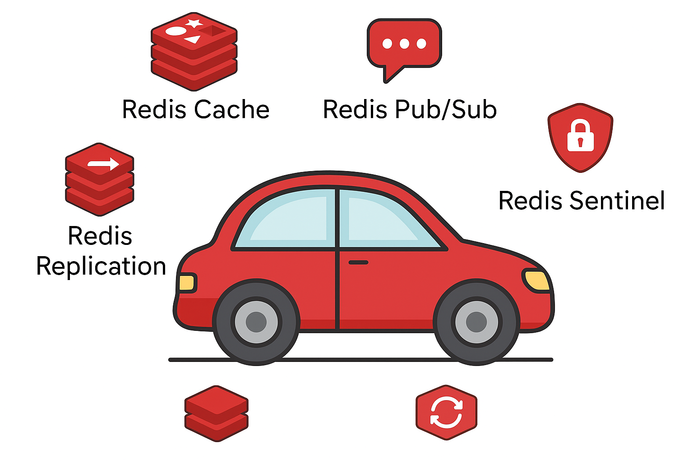

## ❓ **Вопрос 1: Бардачок автомобиля соответствует:**

A) Distributed Cache  
B) Cache-Aside Pattern ✅  
C) Write-Through Cache  
D) Read-Through Cache

**Объяснение:** Бардачок хранит часто нужные вещи под рукой. При необходимости достаем вещь из бардачка (кэш), если нет - идем в багажник (базу данных). Это аналогия Cache-Aside паттерна.

---

## ❓ **Вопрос 2: Топливный бак соответствует:**

A) Cache-Aside Pattern  
B) Write-Behind Cache  
C) Write-Through Cache ✅  
D) Read-Through Cache

**Объяснение:** Топливо сразу поступает и в бак, и в двигатель - аналогия Write-Through, где данные одновременно записываются в кэш и в постоянное хранилище.

---

## ❓ **Вопрос 3: Аккумулятор автомобиля соответствует:**

A) Write-Through Cache  
B) Cache-Aside Pattern  
C) Write-Behind (Write-Back) Cache ✅  
D) Read-Through Cache

**Объяснение:** Аккумулятор накапливает энергию и отдает по необходимости - аналог Write-Behind кэша, где данные сначала пишутся в кэш, а затем асинхронно в основное хранилище.

---

## ❓ **Вопрос 4: Багажник автомобиля соответствует:**

A) Local Cache  
B) Cache-Aside Pattern  
C) Distributed Cache ✅  
D) In-Memory Cache

**Объяснение:** Багажник - большой объем хранения, но доступ с задержкой. Аналогия Distributed Cache - много места, но выше latency по сравнению с локальным хранением.

---

## ❓ **Вопрос 5: Коробка передач соответствует:**

A) Cache Eviction Policies ✅  
B) Cache Coherency  
C) Cache Monitoring  
D) Cache Scaling

**Объяснение:** Коробка передач определяет, какая передача нужна в данный момент - аналог Cache Eviction Policies (LRU, LFU, FIFO), определяющие, какие данные вытеснять.

---

## ❓ **Вопрос 6: Система охлаждения соответствует:**

A) Cache Monitoring  
B) Cache Coherency ✅  
C) Cache Filtering  
D) Cache Prediction

**Объяснение:** Система охлаждения поддерживает оптимальную температуру двигателя - аналог Cache Coherency, обеспечивающий согласованность данных между различными кэшами.

---

## ❓ **Вопрос 7: Зеркала заднего вида соответствуют:**

A) Cache-Aside Pattern  
B) Write-Through Cache  
C) Read-Through Cache ✅  
D) Write-Behind Cache

**Объяснение:** Зеркала показывают информацию без необходимости оборачиваться - аналог Read-Through Cache, где кэш сам загружает данные при запросе, прозрачно для приложения.

---

## ❓ **Вопрос 8: Бензиновый фильтр соответствует:**

A) Cache Coherency  
B) Cache Filtering ✅  
C) Cache Monitoring  
D) Cache Prediction

**Объяснение:** Фильтр очищает топливо перед подачей в двигатель - аналог Cache Filtering, предобработка и очистка данных в кэше.

---

## ❓ **Вопрос 9: Резервный бак соответствует:**

A) Primary Cache  
B) Backup Cache ✅  
C) Local Cache  
D) In-Memory Cache

**Объяснение:** Резервный бак - дополнительный запас топлива на случай дефицита - аналог Backup Cache для обеспечения отказоустойчивости.

---

## ❓ **Вопрос 10: Система навигации соответствует:**

A) Cache Monitoring  
B) Cache Prediction ✅  
C) Cache Scaling  
D) Cache Filtering

**Объяснение:** Навигация предугадывает маршрут и подготавливает информацию - аналог Cache Prediction, предиктивное кэширование данных до запроса.

---

## 📊 **Результаты:**

- **8-10 правильных ответов:** 🏎️ Эксперт по кэшированию! Вы понимаете аналогии на глубоком уровне.
- **5-7 правильных ответов:** 🚗 Хорошее понимание базовых концепций.
- **Менее 5 ответов:** 🚙 Пора повторить материал по паттернам кэширования!

---

**Дополнительные визуальные элементы:**
- Диаграмма с изображениями автомобиля и соответствующих компонентов Redis
- Таблица соответствия всех аналогий
- Цитата: "Хорошая архитектура кэширования, как хороший автомобиль, должна быть сбалансированной!"