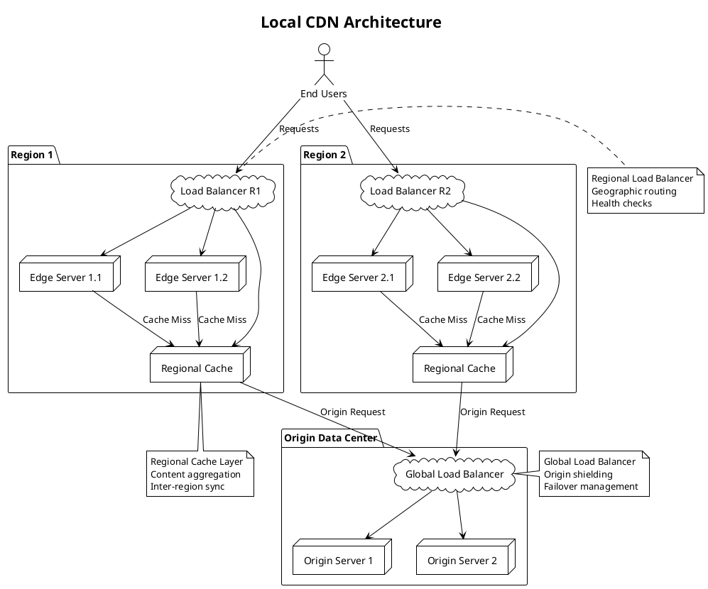

**Развертывание локального CDN** - Процесс создания и настройки собственной Content Delivery Network внутри корпоративной инфраструктуры или географического региона для ускорения доставки контента конечным пользователям с минимальной задержкой.

---

#### 🎯 **Цель и суть**
**Цель:**  
Создать распределённую систему доставки контента с минимальной latency и максимальной доступностью для пользователей в локальном регионе или корпоративной сети.

**Суть:**  
Развертывание иерархической архитектуры edge-серверов, кэширующих статический и динамический контент ближе к пользователям, с автоматическим routing'ом запросов к ближайшему узлу и эффективным управлением кэшем.

---

#### 📚 **Описание**
Локальный CDN представляет собой миниатюрную версию глобальных CDN (Cloudflare, Akamai), развернутую в пределах организации или региона. Система состоит из нескольких уровней: origin серверов (источник контента), edge-сереверов (точки присутствия), caching layer (уровень кэширования) и routing системы (интеллектуальное распределение нагрузки). Архитектура включает автоматическое кэширование статического контента (изображения, CSS, JS), интеллектуальную инвалидацию кэша, сжатие и оптимизацию контента, защиту от DDoS атак и load balancing. Локальный CDN особенно эффективен для организаций с распределённой географически структурой, где глобальные CDN не обеспечивают оптимальной latency, или в сценариях с чувствительными к безопасности данными, которые нельзя размещать в публичных CDN.

---

#### ⚖️ **Сравнение**

| Критерий | Локальный CDN | Публичный CDN (Cloudflare/Akamai) | Reverse Proxy (Nginx/Varnish) | Object Storage CDN |
|----------|---------------|-----------------------------------|-------------------------------|-------------------|
| **Контроль** | Полный | Ограниченный | Полный | Ограниченный |
| **Безопасность** | Высокая (внутренняя сеть) | Средняя | Высокая | Средняя |
| **Стоимость** | Высокая (инфраструктура) | Pay-per-use | Низкая | Средняя |
| **Latency** | Минимальная (локально) | Хорошая (глобально) | Хорошая (один узел) | Зависит от региона |
| **Масштабируемость** | Средняя | Высокая | Ограниченная | Высокая |
| **Сложность развертывания** | Высокая | Нулевая | Низкая | Средняя |
| **Customization** | Максимальная | Ограниченная | Высокая | Ограниченная |
| **DDoS Protection** | Средняя | Высокая | Низкая | Средняя |

---

#### 🛠️ **Классификация решений**

##### **Аппаратные решения:**
- **Высокопроизводительные edge-серверы** - серверы с SSD, большим объемом RAM и высокоскоростными сетевыми интерфейсами
- **Сетевое оборудование** - load balancers, switches, routers для оптимизации трафика
- **Специализированные caching appliances** - аппаратные решения для ускорения доставки контента

##### **Программные решения:**
- **Nginx + Varnish** - связка reverse proxy и HTTP accelerator для кэширования
- **Apache Traffic Server** - специализированный caching proxy от Apache
- **Squid Cache** - полнофункциональный caching proxy с поддержкой различных протоколов
- **Traefik + Redis** - современный reverse proxy с распределённым кэшированием

##### **Комбинированные решения:**
- **Kubernetes + Ingress Controllers** - оркестрация edge-серверов в контейнерной среде
- **Docker Swarm + Traefik** - контейнеризированное решение с автоматическим масштабированием
- **OpenResty + Lua** - высокопроизводительный web platform с возможностью custom logic
- **Cloud-native CDN** - комбинация облачной инфраструктуры и open-source компонентов

---

#### 📖 **Исторический контекст**

##### **Предпосылки (1995-2005):**
- Рост интернет-трафика и увеличение размеров web-контента
- Проблемы с latency при доставке контента пользователям в разных регионах
- Необходимость масштабирования web-приложений без увеличения origin нагрузки

##### **Формирование направления (2005-2015):**
- Появление первых коммерческих CDN (Akamai, Cloudflare)
- Развитие технологий caching и content optimization
- Стандартизация HTTP и протоколов доставки контента

##### **Локализация (2015-2020):**
- Рост корпоративных сетей и необходимость внутренней оптимизации
- Требования безопасности и compliance для чувствительных данных
- Развитие edge computing и распределённых архитектур

##### **Современный этап (2020-2024):**
- Интеграция с cloud-native технологиями и container orchestration
- Поддержка современных web-стандартов (HTTP/3, WebP, AVIF)
- Использование AI/ML для оптимизации routing и caching

---

#### ⚠️ **Текущие проблемы требующие решения**

##### **Технические проблемы:**
- **Cache invalidation** - сложность своевременного обновления кэшированного контента
- **Content optimization** - автоматическая оптимизация изображений и видео под устройства
- **Bandwidth management** - эффективное использование сетевых ресурсов при пиковых нагрузках
- **Origin shielding** - защита origin серверов от прямых запросов и DDoS атак

##### **Архитектурные проблемы:**
- **Multi-region consistency** - согласованность контента между различными регионами
- **Failover mechanisms** - автоматическое переключение при сбоях узлов
- **Load distribution** - интеллектуальное распределение нагрузки между edge-серверами
- **Geographic routing** - маршрутизация запросов к ближайшим узлам

##### **Эксплуатационные проблемы:**
- **Monitoring and observability** - отслеживание производительности и доступности всех узлов
- **Security management** - защита от атак и несанкционированного доступа
- **Capacity planning** - планирование ресурсов для пиковых нагрузок
- **Update and maintenance** - обновление без downtime и минимального влияния на пользователей

---

#### 📈 **Актуальные решения и тенденции 2025**
- **AI-powered caching** - интеллектуальное кэширование на основе анализа паттернов использования
- **Edge computing integration** - выполнение бизнес-логики на edge-узлах
- **HTTP/3 and QUIC support** - использование современных протоколов для уменьшения latency
- **WebAssembly on edge** - выполнение сложной логики на edge-серверах
- **Green CDN** - энергоэффективные решения с оптимизацией потребления

---

#### 🔮 **Ближайшие перспективы развития**
- **Autonomous CDN** - самооптимизирующиеся системы с минимальным вмешательством
- **Quantum networking** - использование квантовых технологий для ultra-low latency
- **Predictive content delivery** - предиктивная доставка контента на основе поведения пользователей
- **Blockchain-based CDN** - децентрализованные CDN с экономической мотивацией
- **5G edge CDN** - интеграция с 5G сетями для mobile-first доставки

---

#### 🧠 **Резюме и выводы**
Развертывание локального CDN - сложная, но высокоэффективная задача для организаций с распределённой структурой или специфическими требованиями к безопасности и производительности. Система позволяет значительно снизить latency, уменьшить нагрузку на origin серверы и повысить доступность контента. Ключевые компоненты успешного развертывания - правильная архитектура, эффективные механизмы кэширования, интеллектуальный routing и надёжная система мониторинга. При правильной реализации локальный CDN может обеспечить производительность, недостижимую с помощью публичных решений, особенно в корпоративных и географически специфических сценариях.

---

#### 🛠️ **Шаги по развертыванию локального CDN**

1. **Анализ требований и планирование**
   - Определение географического покрытия и точек присутствия
   - Анализ объемов и типов контента для кэширования
   - Расчет требуемых ресурсов (CPU, RAM, storage, bandwidth)

2. **Проектирование архитектуры**
   - Выбор топологии сети (иерархическая, плоская, гибридная)
   - Определение ролей узлов (origin, edge, caching, routing)
   - Планирование отказоустойчивости и масштабируемости

3. **Подготовка инфраструктуры**
   - Развертывание серверов и сетевого оборудования
   - Настройка операционных систем и базовой безопасности
   - Конфигурация сетевых интерфейсов и маршрутизации

4. **Установка и настройка программного обеспечения**
   - Развертывание caching и routing компонентов
   - Настройка протоколов (HTTP/2, HTTP/3, QUIC)
   - Конфигурация SSL/TLS сертификатов

5. **Конфигурация кэширования**
   - Настройка правил кэширования для разных типов контента
   - Определение TTL и стратегий инвалидации
   - Настройка сжатия и оптимизации контента

6. **Настройка маршрутизации и load balancing**
   - Конфигурация географического routing'а
   - Настройка health checks и failover механизмов
   - Оптимизация распределения нагрузки

7. **Интеграция с origin системами**
   - Настройка pull/push механизмов обновления контента
   - Конфигурация webhook'ов для инвалидации кэша
   - Интеграция с системами управления контентом

8. **Настройка мониторинга и логирования**
   - Развертывание систем мониторинга производительности
   - Настройка alerting для критических метрик
   - Конфигурация централизованного логирования

9. **Тестирование и оптимизация**
   - Проведение нагрузочного тестирования
   - Оптимизация параметров кэширования и routing'а
   - Настройка fine-tuning для максимальной производительности

10. **Запуск в production и эксплуатация**
    - Постепенный rollout с мониторингом
    - Создание runbooks и процедур эксплуатации
    - Планирование регулярного обслуживания и обновлений

---

#### 📋 **Пошаговая инструкция для выполнения шагов**

##### **Шаг 1: Анализ требований и планирование**
1. Проведите аудит текущего трафика и определите основные точки пользователей
2. Проанализируйте типы контента (статический vs динамический, размеры файлов)
3. Рассчитайте пиковую нагрузку и средний трафик по регионам
4. Определите требования к latency и доступности (SLA)
5. Составьте список необходимых точек присутствия (PoP)
6. Рассчитайте hardware требования для каждого узла

##### **Шаг 2: Проектирование архитектуры**
1. Выберите архитектурный паттерн (иерархическая с региональными центрами)
2. Определите роли серверов (origin, edge, intermediate caching)
3. Спроектируйте сетевую топологию с redundant links
4. Планируйте механизмы отказоустойчивости (active-passive, active-active)
5. Определите стратегию масштабирования (горизонтальная, вертикальная)
6. Спроектируйте систему мониторинга и alerting

##### **Шаг 3: Подготовка инфраструктуры**
1. Закажите/подготовьте серверы с требуемыми характеристиками
2. Установите Linux (Ubuntu/CentOS) на все узлы
3. Настройте базовую безопасность (firewall, SSH hardening)
4. Сконфигурируйте сетевые интерфейсы и маршрутизацию
5. Настройте NTP для синхронизации времени
6. Установите базовые monitoring tools (Prometheus node_exporter)

##### **Шаг 4: Установка и настройка программного обеспечения**
1. Установите Nginx/Apache Traffic Server на edge-узлы
2. Настройте Varnish/Apache Traffic Server как caching layer
3. Сконфигурируйте HTTP/2 и HTTP/3 поддержку
4. Установите SSL/TLS сертификаты (Let's Encrypt или корпоративные)
5. Настройте gzip/Brotli сжатие для текстового контента
6. Сконфигурируйте connection pooling и keep-alive

##### **Шаг 5: Конфигурация кэширования**
1. Определите правила кэширования для разных типов файлов
2. Настройте TTL для статического контента (1d-30d)
3. Сконфигурируйте cache-busting механизмы
4. Настройте инвалидацию кэша через API/webhooks
5. Включите conditional requests (ETag, Last-Modified)
6. Настройте cache partitioning для предотвращения cache stampede

##### **Шаг 6: Настройка маршрутизации и load balancing**
1. Установите и сконфигурируйте load balancer (HAProxy/Nginx)
2. Настройте географический routing на основе IP адресов
3. Сконфигурируйте health checks для всех узлов
4. Настройте failover механизмы с минимальным downtime
5. Оптимизируйте алгоритмы распределения нагрузки
6. Настройте sticky sessions если требуется

##### **Шаг 7: Интеграция с origin системами**
1. Настройте reverse proxy для связи с origin серверами
2. Сконфигурируйте retry механизмы при сбоях origin
3. Настройте webhook'и для автоматической инвалидации кэша
4. Интегрируйте с CMS для автоматического обновления контента
5. Настройте механизмы content preloading
6. Сконфигурируйте origin shielding для защиты backend

##### **Шаг 8: Настройка мониторинга и логирования**
1. Установите Prometheus для сбора метрик
2. Настройте Grafana dashboards для визуализации
3. Сконфигурируйте alerting rules для критических метрик
4. Установите ELK Stack для централизованного логирования
5. Настройте мониторинг cache hit ratio и latency
6. Сконфигурируйте tracing для end-to-end visibility

##### **Шаг 9: Тестирование и оптимизация**
1. Проведите нагрузочное тестирование с помощью Apache Bench/k6
2. Проверьте failover сценарии и время восстановления
3. Оптимизируйте параметры кэширования на основе реальных данных
4. Настройте fine-tuning для максимальной производительности
5. Проведите security testing и vulnerability assessment
6. Оптимизируйте network settings (TCP buffers, connection limits)

##### **Шаг 10: Запуск в production и эксплуатация**
1. Проведите staged rollout с постепенным переключением трафика
2. Настройте continuous monitoring с real-time alerting
3. Создайте runbooks для стандартных operational procedures
4. Планируйте регулярное обслуживание и обновления
5. Настройте backup и disaster recovery procedures
6. Проведите регулярные performance reviews и оптимизацию

---

#### ❓ **Проверочные вопросы (основные)**

**Вопрос 1:**  
Какой компонент является наиболее критичным для обеспечения высокой доступности локального CDN?

A) Origin серверы  
B) Edge-серверы  
C) Load balancer  
D) Caching layer  
E) DNS серверы  
F) Monitoring system  

✅ **Правильный ответ: C) Load balancer**

**Объяснение:** Load balancer является наиболее критичным компонентом для обеспечения высокой доступности локального CDN, так как он отвечает за распределение трафика между всеми узлами системы. Если load balancer выходит из строя, весь трафик не может быть правильно распределен, что приводит к downtime всего CDN. Load balancer также обеспечивает health checks, failover mechanisms и intelligent routing, которые критически важны для отказоустойчивости. Хотя другие компоненты (edge-серверы, caching layer) также важны, именно load balancer координирует работу всей системы и обеспечивает seamless failover между узлами.

**Почему другие варианты неверны:**
- A) Origin серверы важны, но при правильной архитектуре могут быть redundant
- B) Edge-серверы критичны, но при отказе одного узла load balancer перенаправляет трафик
- D) Caching layer важен для производительности, но не критичен для доступности
- E) DNS серверы важны, но обычно имеют backup и более высокий уровень доступности
- F) Monitoring system важен для оперативного реагирования, но не критичен для функционирования

**Вопрос 2:**  
Какой подход к кэшированию наиболее эффективен для динамического контента в локальном CDN?

A) Долгий TTL (24+ часов)  
B) Краткий TTL (1-5 минут) с частой инвалидацией  
C) No caching для динамического контента  
D) Персонализированное кэширование для каждого пользователя  
E) Кэширование на уровне origin серверов  
F) Использование только browser caching  

✅ **Правильный ответ: B) Краткий TTL (1-5 минут) с частой инвалидацией**

**Объяснение:** Для динамического контента в локальном CDN наиболее эффективен подход с кратким TTL (1-5 минут) и частой инвалидацией кэша. Этот подход обеспечивает баланс между производительностью (кэширование уменьшает нагрузку на origin) и актуальностью данных (короткий TTL предотвращает устаревание). Частая инвалидация позволяет мгновенно обновлять кэш при изменении данных на origin. Долгий TTL приведет к устареванию данных, no caching не даст преимуществ CDN, персонализированное кэширование создаст фрагментацию и увеличит использование памяти, кэширование на origin не решает проблему latency, browser caching не помогает при первом запросе.

**Почему другие варианты неверны:**
- A) Долгий TTL приведет к устареванию динамического контента
- C) No caching не дает преимуществ CDN для динамического контента
- D) Персонализированное кэширование создает фрагментацию и не масштабируется
- E) Кэширование на origin не решает проблему доставки контента пользователям
- F) Browser caching не помогает при первом запросе и не уменьшает нагрузку на origin

---

#### ❓ **Расширенные проверочные вопросы**

**Вопрос 1 (Design Question):**  
Как спроектировать локальный CDN для организации с 50 филиалов и требованиями: latency < 50ms, 99.99% availability, 10 Gbps peak traffic?

A) Централизованный подход с одним origin и всеми edge-серверами  
B) Иерархическая архитектура с региональными кластерами и федеративным кэшированием  
C) Только облачное решение с public CDN  
D) Каждый филиал как независимый CDN без связи  
E) Использование только одного edge-сервера для всех филиалов  

✅ **Правильный ответ: B) Иерархическая архитектура с региональными кластерами и федеративным кэшированием**

**Объяснение:** Для организации с 50 филиалами и такими требованиями необходима иерархическая архитектура с региональными кластерами. Такая архитектура обеспечивает:
1. **Low latency** - каждый филиал обслуживается ближайшим региональным кластером
2. **High availability** - redundant узлы в каждом регионе и федеративное кэширование
3. **Scalability** - возможность масштабирования каждого региона независимо
4. **Fault isolation** - проблемы в одном регионе не влияют на другие
5. **Efficient resource usage** - федеративное кэширование позволяет обмениваться контентом между регионами

Централизованный подход не обеспечит < 50ms latency, облачное решение не подходит для internal content, независимые CDN создают фрагментацию, один edge-сервер не обеспечит необходимую пропускную способность и отказоустойчивость.

**Вопрос 2 (Troubleshooting Question):**  
При увеличении трафика в 3 раза локальный CDN начал отдавать timeout ошибки. Какой компонент наиболее вероятно стал bottleneck'ом?

A) Edge-серверы (недостаточно CPU/RAM)  
B) Network bandwidth между узлами  
C) Origin серверы (перегрузка backend)  
D) Load balancer (ограничение connections)  
E) Storage subsystem (дисковый I/O)  
F) Все вышеперечисленное  

✅ **Правильный ответ: F) Все вышеперечисленное**

**Объяснение:** При увеличении трафика в 3 раза все компоненты системы могут стать bottleneck'ами одновременно:
1. **Edge-серверы** - увеличенная нагрузка может исчерпать CPU, RAM или connection pools
2. **Network bandwidth** - тройной трафик может превысить пропускную способность сетевых каналов
3. **Origin серверы** - увеличенное количество cache misses может перегрузить backend
4. **Load balancer** - может достичь лимита одновременных connections или обработки запросов
5. **Storage subsystem** - увеличенная активность кэша может создать дисковый I/O bottleneck

В реальной ситуации необходимо провести комплексный анализ всех компонентов системы, так как увеличение нагрузки влияет на всю архитектуру целиком. Изолированное рассмотрение одного компонента может привести к неполной оптимизации.

---

#### 🔗 **Интеграция с другими темами курса**

**Связи с предыдущими модулями курса:**
- **Кэширование и хранение данных** - применение caching patterns к распределённым системам доставки контента
- **Безопасность систем** - интеграция security measures в CDN архитектуру (DDoS protection, WAF)
- **Производительность и масштабирование** - использование scaling patterns для edge-серверов и load balancing

**Подготовка к комплексным проектам:**
- Интеграция локального CDN с облачными решениями для hybrid deployment
- Реализация monitoring и alerting для распределённых CDN кластеров
- Проектирование disaster recovery архитектур с географическим распределением

**Место темы в общей архитектуре системы:**
- Локальный CDN как edge layer в многоуровневой архитектуре
- Интеграция с microservices и API gateway для content delivery
- Влияние на overall system architecture и performance characteristics

**Как тема влияет на другие аспекты System Design:**
- Требует пересмотра подходов к network architecture и latency optimization
- Влияет на data consistency и cache invalidation strategies
- Определяет требования к monitoring и fault tolerance систем

---

#### 📊 **Визуальные элементы**

---

## 📚 **Перечень используемых терминов**

#### **CDN (Content Delivery Network)** - Распределённая сеть серверов, предназначенная для доставки контента пользователям с минимальной задержкой и максимальной доступностью.
Система, состоящая из географически распределённых серверов (точек присутствия), которые кэшируют контент ближе к конечным пользователям для уменьшения latency и улучшения производительности. CDN хранит копии статического и динамического контента на edge-серверах, что позволяет пользователям получать данные от ближайшего узла вместо удалённого origin сервера. В контексте локального CDN система развертывается внутри организации или региона для специфических требований к безопасности и производительности.

#### **Edge Server** - Сервер, расположенный на "краю" сети, ближе всего к конечным пользователям, выполняющий функции кэширования и доставки контента.
Физический или виртуальный сервер, размещённый в точке присутствия (Point of Presence) CDN, который кэширует контент и обслуживает запросы пользователей с минимальной latency. Edge-серверы являются первой линией обработки запросов в CDN архитектуре и обеспечивают основную функцию доставки контента. В локальном CDN edge-серверы могут быть размещены в филиалах организации или в региональных дата-центрах для оптимизации доставки внутреннего контента.

#### **Cache Invalidation** - Процесс обновления или удаления устаревшего контента из кэша для обеспечения актуальности данных.
Механизм, при котором система определяет, что закэшированный контент стал неактуальным, и либо удаляет его, либо заменяет новой версией. В CDN cache invalidation критически важен для обеспечения согласованности между origin серверами и edge-узлами. Может быть реализован через push-механизмы (origin уведомляет CDN об изменениях), pull-механизмы (CDN периодически проверяет изменения) или гибридные подходы. Эффективная инвалидация кэша обеспечивает баланс между производительностью и актуальностью данных.

#### **Origin Shielding** - Архитектурный паттерн, при котором запросы от edge-серверов направляются через промежуточные узлы вместо прямого обращения к origin серверам.
Механизм защиты origin серверов от прямых запросов и DDoS атак путём использования промежуточных caching узлов (shield servers). Origin shielding уменьшает нагрузку на backend системы, обеспечивает дополнительный уровень кэширования и защищает от атак. В локальном CDN origin shielding особенно важен для защиты внутренних систем от перегрузки и обеспечения отказоустойчивости. Shield серверы могут также выполнять функции content optimization и security filtering.

#### **Geographic Routing** - Механизм маршрутизации запросов пользователей к ближайшим или наиболее подходящим узлам CDN на основе географического положения.
Алгоритм, который определяет оптимальный путь доставки контента на основе географического местоположения пользователя, текущей нагрузки на узлы и других факторов. Geographic routing использует IP geolocation, network latency measurements и health status узлов для принятия решений. В локальном CDN geographic routing позволяет направлять запросы пользователей к ближайшим филиалам или региональным кластерам, что критически важно для обеспечения минимальной latency и максимальной производительности.

#### **Load Balancing** - Распределение сетевой нагрузки между несколькими серверами или узлами для обеспечения отказоустойчивости и оптимальной производительности.
Процесс распределения входящих запросов между множественными серверами или узлами системы для предотвращения перегрузки отдельных компонентов и обеспечения высокой доступности. В CDN load balancing может быть реализован на нескольких уровнях: между edge-серверами в регионе, между региональными кластерами и между origin серверами. Алгоритмы load balancing включают round-robin, weighted round-robin, least connections, IP hash и более сложные adaptive алгоритмы.

#### **TTL (Time To Live)** - Время жизни кэшированного объекта, после которого он считается устаревшим и должен быть обновлён.
Параметр, определяющий, как долго контент может оставаться в кэше до необходимости его обновления. TTL задаётся для каждого типа контента индивидуально: статические файлы могут иметь TTL в несколько дней, динамический контент - несколько минут. В CDN правильная настройка TTL критически важна для баланса между производительностью (длинный TTL) и актуальностью данных (короткий TTL). TTL может быть переопределён через cache control headers или механизмы инвалидации.

#### **Failover** - Процесс автоматического переключения на резервную систему или компонент при сбое основного.
Механизм обеспечения отказоустойчивости, при котором система автоматически перенаправляет трафик с неисправного узла на резервный при обнаружении сбоя. В CDN failover может происходить на уровне отдельных edge-серверов, регионов или даже между различными CDN провайдерами. Эффективный failover обеспечивает минимальное время downtime и прозрачное для пользователя переключение. В локальном CDN failover особенно важен для обеспечения непрерывной работы внутренних сервисов.

#### **Content Optimization** - Процесс автоматической оптимизации контента для улучшения производительности доставки и пользовательского опыта.
Набор техник, применяемых CDN для уменьшения размера контента и улучшения его качества: сжатие изображений, конвертация в современные форматы (WebP, AVIF), минификация CSS/JS, adaptive streaming для видео. Content optimization может выполняться на лету edge-серверами или заранее при загрузке контента. В локальном CDN content optimization особенно важна для ограничения использования bandwidth и улучшения производительности внутренних приложений.

#### **Point of Presence (PoP)** - Географически распределённая точка размещения серверов CDN для доставки контента пользователям.
Физическое или виртуальное местоположение, где размещены edge-серверы CDN для обслуживания пользователей в определённом регионе. Количество и расположение PoP определяет качество обслуживания CDN - чем больше PoP и чем они ближе к пользователям, тем ниже latency. В локальном CDN PoP могут быть размещены в филиалах организации, региональных офисах или дата-центрах для оптимизации доставки внутреннего контента. Каждый PoP обычно включает несколько edge-серверов для обеспечения отказоустойчивости.