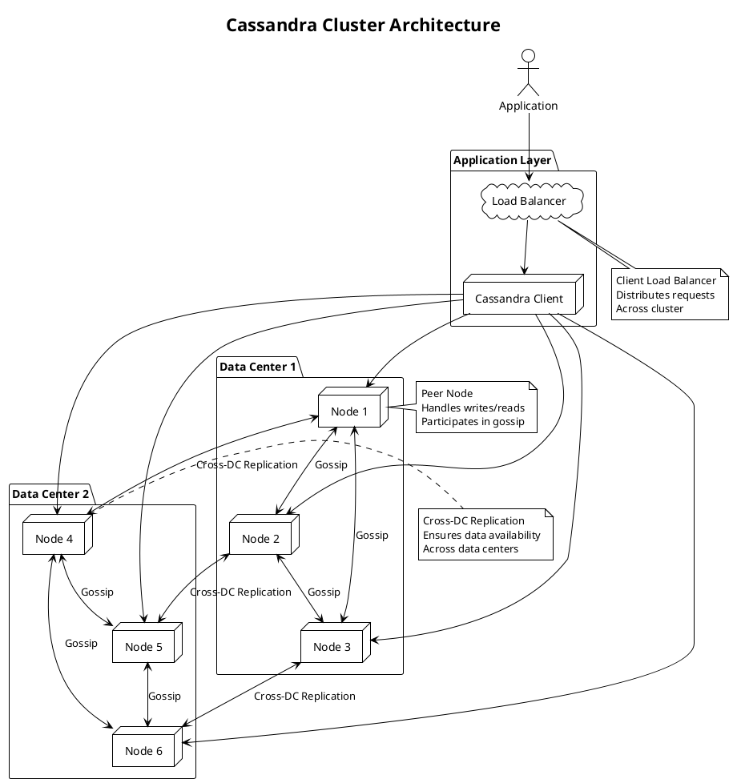

**Cassandra** - Высокомасштабируемая, отказоустойчивая NoSQL база данных с распределённой архитектурой, использующая модель "широких столбцов" (wide-column) и обеспечивающая высокую производительность при записи и доступности.

---

#### 🎯 **Цель и суть**
**Цель:**  
Обеспечить масштабируемость и высокую доступность для приложений с интенсивной нагрузкой на запись и требованиями к отсутствию единой точки отказа.

**Суть:**  
Cassandra сочетает распределённую архитектуру без централизованного координатора с гибкой моделью данных "широких столбцов", что позволяет достигать линейной масштабируемости и обеспечивать высокую доступность даже при сбоях узлов.

---

#### 📚 **Описание**
Apache Cassandra — это распределённая NoSQL база данных, изначально разработанная в Facebook для хранения данных в системе сообщений. Архитектура основана на гибридной модели, сочетающей идеи Amazon Dynamo (распределённая хэш-таблица) и Google Bigtable (модель данных). Основные компоненты включают: nodes (узлы), data centers (центры данных), clusters (кластеры), keyspaces (аналог баз данных), column families (аналог таблиц) и partitions (разделы данных). Cassandra использует peer-to-peer архитектуру без master узлов, что обеспечивает отсутствие единой точки отказа. Данные автоматически реплицируются между узлами согласно настройкам replication factor. База данных обеспечивает eventual consistency, но позволяет настраивать уровень согласованности (consistency level) для каждого запроса. Поддерживает CQL (Cassandra Query Language) — SQL-подобный язык для работы с данными. Широко используется в IoT, time-series данных, метриках, логах и системах с высокой нагрузкой на запись.

---

#### ⚖️ **Сравнение**

| Критерий | Cassandra | MongoDB | PostgreSQL | Redis |
|----------|-----------|---------|------------|-------|
| **Модель данных** | Wide-column | Document | Relational | Key-value |
| **Масштабирование** | Горизонтальное | Горизонтальное | Вертикальное | Горизонтальное |
| **Архитектура** | Peer-to-peer | Master-slave / Replica sets | Master-slave | Cluster |
| **Производительность на запись** | Очень высокая | Высокая | Средняя | Очень высокая |
| **Производительность на чтение** | Высокая | Высокая | Высокая | Очень высокая |
| **Consistency** | Eventual / Tunable | Strong / Eventual | Strong | Strong |
| **ACID транзакции** | Нет (на уровне строки) | Частичные | Полные | Ограниченные |
| **Использование памяти** | Среднее | Среднее | Низкое | Высокое |
| **Latency** | Низкая (мс) | Низкая (мс) | Низкая (мс) | Очень низкая (мкс) |

---

#### 🛠️ **Классификация решений**

##### **Аппаратные решения:**
- **Высокопроизводительные серверы с SSD** — для оптимизации I/O операций
- **NVMe диски** — для ускорения записи и чтения данных
- **Высокоскоростные сети (10/25 GbE)** — для эффективной репликации между узлами
- **Разделённые дисковые подсистемы** — отдельные диски для commit log и data files

##### **Программные решения:**
- **Apache Cassandra OSS** — базовая open-source версия
- **DataStax Enterprise** — коммерческая версия с расширенными функциями
- **Amazon Keyspaces** — managed Cassandra service в AWS
- **Google Cloud Bigtable** — аналогичная технология от Google

##### **Комбинированные решения:**
- **Cassandra + Kafka** — для обработки потоков данных
- **Cassandra + Spark** — для аналитики и обработки больших данных
- **Cassandra + Elasticsearch** — для полнотекстового поиска
- **Cassandra + Kubernetes** — контейнеризированное развертывание

---

#### 📖 **Исторический контекст**

##### **Создание (2008–2010):**
- Разработка в Facebook для системы сообщений
- Использование идей из Dynamo и Bigtable
- Открытие исходного кода в 2008 году
- Включение в Apache Incubator в 2009 году

##### **Развитие (2010–2015):**
- Формирование сообщества и экосистемы
- Развитие CQL как SQL-подобного языка запросов
- Улучшение инструментов мониторинга и управления
- Появление DataStax как основного коммерческого вендора

##### **Enterprise-адаптация (2015–2020):**
- Расширение использования в enterprise-средах
- Развитие managed services (Amazon Keyspaces)
- Интеграция с big data экосистемой (Spark, Kafka)
- Улучшение безопасности и аудита

##### **Современная эра (2020–2024):**
- Поддержка контейнеризации и Kubernetes
- Интеграция с cloud-native архитектурами
- Развитие для IoT и time-series данных
- Улучшение производительности и эффективности

---

#### ⚠️ **Текущие проблемы требующие решения**

##### **Технические проблемы:**
- **Сложность модели данных** — необходимость проектирования под конкретные запросы
- **Ограниченная поддержка JOIN** — отсутствие join-операций между таблицами
- **Сложность миграции схем** — трудности при изменении структуры данных
- **Потребление памяти** — значительные требования к RAM при больших партициях

##### **Архитектурные проблемы:**
- **Проектирование ключей партиций** — критически важное решение для производительности
- **Настройка consistency level** — баланс между доступностью и согласованностью
- **Репликация между дата-центрами** — latency и согласованность
- **Интеграция с реляционными системами** — совместимость с legacy архитектурами

##### **Эксплуатационные проблемы:**
- **Мониторинг распределённых кластеров** — сложность observability
- **Backup и восстановление** — время и ресурсы для больших кластеров
- **Оптимизация производительности** — настройка компактизации и кэширования
- **Обновление без downtime** — rolling upgrades в production

---

#### 📈 **Актуальные решения и тенденции 2025**
- **Cassandra 5.0** — улучшенная поддержка time-series и аналитических запросов
- **Serverless Cassandra** — функции как сервис с автоматическим масштабированием
- **Vector search capabilities** — интеграция с AI/ML для similarity search
- **Multi-cloud deployments** — seamless репликация между облаками
- **Enhanced CQL** — расширенные возможности для аналитики

---

#### 🔮 **Ближайшие перспективы развития**
- **AI-powered query optimization** — автоматическая оптимизация запросов
- **Quantum-ready storage engines** — подготовка к квантовым вычислениям
- **Edge computing integration** — распределённые инстансы на edge устройствах
- **Real-time analytics convergence** — объединение OLTP и OLAP
- **Blockchain data storage** — специализированные структуры для immutable data

---

#### 🧠 **Резюме и выводы**
Cassandra представляет собой мощное решение для масштабируемых, отказоустойчивых систем с высокой нагрузкой на запись. Её ключевые преимущества — линейная масштабируемость, отсутствие единой точки отказа и гибкая настройка согласованности. Cassandra особенно эффективна в сценариях, где требуется высокая доступность и производительность при записи, такие как IoT, time-series данные и метрики. При правильном проектировании модели данных и настройке кластера Cassandra может стать основой для high-load систем с требованиями к отказоустойчивости и масштабируемости.

---

#### ❓ **Проверочные вопросы (основные)**

**Вопрос 1:**  
Какой тип архитектуры использует Cassandra для обеспечения отказоустойчивости?

A) Master-slave  
B) Master-master  
C) Peer-to-peer  
D) Centralized coordinator  
E) Ring topology  
F) Hierarchical  

✅ **Правильный ответ: C) Peer-to-peer**

**Объяснение:** Cassandra использует peer-to-peer архитектуру, где все узлы равноправны и не существует master узлов. Это обеспечивает:
1. **Отсутствие единой точки отказа** — выход из строя любого узла не влияет на работоспособность кластера
2. **Автоматическое восстановление** — данные реплицируются между узлами согласно replication factor
3. **Горизонтальное масштабирование** — новые узлы легко добавляются в кластер
4. **Децентрализованное управление** — каждый узел знает о состоянии других узлов через gossip protocol
5. **Высокая доступность** — запросы могут обрабатываться любым узлом

Master-slave и master-master архитектуры имеют центральные узлы, что создает точки отказа. Centralized coordinator (как в Zookeeper) не используется в Cassandra. Ring topology — часть реализации, но не архитектурный паттерн. Hierarchical — иерархическая структура, не применимая к Cassandra.

**Почему другие варианты неверны:**
- A) Master-slave имеет центральный узел
- B) Master-master также имеет централизованные узлы
- D) Centralized coordinator создает точку отказа
- E) Ring topology — реализация, но не архитектурный паттерн
- F) Hierarchical — иерархическая структура, не используется в Cassandra

**Вопрос 2:**  
Какой механизм используется в Cassandra для распределения данных по узлам кластера?

A) Hashing  
B) Range partitioning  
C) Consistent hashing  
D) Round-robin  
E) Random distribution  
F) Linear partitioning  

✅ **Правильный ответ: C) Consistent hashing**

**Объяснение:** Cassandra использует consistent hashing для распределения данных по узлам кластера:
1. **Virtual nodes (vnodes)** — каждый узел отвечает за несколько диапазонов токенов
2. **Равномерное распределение** — данные равномерно распределяются между узлами
3. **Масштабируемость** — при добавлении/удалении узлов перераспределяется только часть данных
4. **Балансировка нагрузки** — равномерное распределение нагрузки между узлами
5. **Efficient lookups** — быстрое определение узла для конкретного ключа

Consistent hashing позволяет избежать полного перераспределения данных при изменении размера кластера, что критично для масштабируемых систем. Hashing и range partitioning используются в других системах, но не в Cassandra. Round-robin и random distribution не обеспечивают эффективного распределения. Linear partitioning — не используется в Cassandra.

**Почему другие варианты неверны:**
- A) Hashing — общий термин, но не consistent hashing
- B) Range partitioning — используется в других системах (например, HBase)
- D) Round-robin — неэффективно для распределения данных
- E) Random distribution — не обеспечивает предсказуемости
- F) Linear partitioning — не используется в Cassandra

---

#### ❓ **Расширенные проверочные вопросы**

**Вопрос 1 (Design Question):**  
Как спроектировать Cassandra кластер для приложения с 1M+ записей в секунду и 99.99% availability?

A) Один узел с высокой производительностью  
B) Master-slave архитектура с 3 узлами  
C) Peer-to-peer кластер с 10+ узлами и replication factor 3  
D) Только облачное решение без настройки  
E) Использование только одного региона  

✅ **Правильный ответ: C) Peer-to-peer кластер с 10+ узлами и replication factor 3**

**Объяснение:** Для приложения с такими требованиями необходима распределённая архитектура:
1. **Peer-to-peer кластер** — обеспечивает отсутствие единой точки отказа
2. **10+ узлов** — достаточно для распределения нагрузки в 1M+ RPS
3. **Replication factor 3** — обеспечивает отказоустойчивость при сбое 2 узлов
4. **Multiple data centers** — географическое распределение для 99.99% availability
5. **Consistent hashing** — равномерное распределение данных и нагрузки
6. **Gossip protocol** — эффективное обнаружение узлов и состояние кластера

Вариант A не масштабируется, B имеет центральные узлы, D может быть недостаточно гибким, E не решает задачу географического распределения.

**Вопрос 2 (Performance Question):**  
При увеличении latency Cassandra с 10ms до 100ms, какой компонент наиболее вероятно стал bottleneck'ом?

A) Network latency между узлами  
B) Disk I/O при compaction  
C) Memory pressure из-за больших партиций  
D) Gossip protocol overhead  
E) Все вышеперечисленное  
F) Client connection pool exhaustion  

✅ **Правильный ответ: E) Все вышеперечисленное**

**Объяснение:** Увеличение latency Cassandra может быть вызвано множеством факторов:
1. **Network latency** — проблемы с сетью между узлами кластера
2. **Disk I/O** — высокая нагрузка при compaction и записи
3. **Memory pressure** — нехватка RAM для кэширования и обработки
4. **Gossip overhead** — проблемы с протоколом обнаружения узлов
5. **Client connections** — исчерпание пула соединений

В реальной production среде такие проблемы часто комплексные. Network issues влияют на репликацию, disk I/O замедляет compaction, memory pressure увеличивает disk access, gossip overhead влияет на стабильность кластера, connection pool exhaustion создает очереди. Необходим комплексный анализ всех метрик.

---

#### 🔗 **Интеграция с другими темами курса**

**Связи с предыдущими модулями курса:**
- **Кэширование и хранение данных** — Cassandra как основа для high-write workloads
- **Безопасность систем** — применение security patterns к распределённым кластерам
- **Производительность и масштабирование** — использование scaling patterns для Cassandra

**Подготовка к комплексным проектам:**
- Интеграция Cassandra с микросервисной архитектурой
- Реализация monitoring и alerting для распределённых кластеров
- Проектирование disaster recovery архитектур

**Место темы в общей архитектуре системы:**
- Cassandra как wide-column storage layer
- Интеграция с API gateways и microservices
- Влияние на overall system architecture

**Как тема влияет на другие аспекты System Design:**
- Требует пересмотра подходов к data modeling
- Влияет на network architecture и latency
- Определяет требования к monitoring и fault tolerance

---

#### 📊 **Визуальные элементы**

---

## 📚 **Перечень используемых терминов**

#### **Cassandra** - Высокомасштабируемая, отказоустойчивая NoSQL база данных с распределённой архитектурой, использующая модель "широких столбцов" (wide-column) и обеспечивающая высокую производительность при записи и доступности.
Распределённая NoSQL база данных, изначально разработанная в Facebook для хранения данных в системе сообщений. Cassandra сочетает идеи Amazon Dynamo (распределённая хэш-таблица) и Google Bigtable (модель данных). Архитектура peer-to-peer без master узлов обеспечивает отсутствие единой точки отказа. Данные автоматически реплицируются между узлами, что обеспечивает высокую доступность. Поддерживает eventual consistency, но позволяет настраивать уровень согласованности для каждого запроса. Широко используется в IoT, time-series данных, метриках и системах с высокой нагрузкой на запись.

#### **Wide-column model** - Модель данных, в которой данные организованы в таблицы, где каждая строка может иметь разное количество столбцов.
Архитектурная модель хранения данных, используемая в Cassandra, где:
1. **Rows** — идентифицируются primary key
2. **Columns** — динамически добавляются к строкам
3. **Column families** — группы связанных столбцов
4. **Flexible schema** — каждая строка может иметь разные столбцы
5. **Efficient storage** — компактное хранение разреженных данных
Wide-column модель эффективна для хранения разреженных данных и позволяет легко добавлять новые столбцы без изменения схемы.

#### **Peer-to-peer architecture** - Архитектура распределённой системы, в которой все узлы равноправны и не существует центрального координатора.
Архитектурный паттерн, используемый в Cassandra, где:
1. **No master nodes** — все узлы равноправны
2. **Decentralized control** — каждый узел знает о состоянии других узлов
3. **Fault tolerance** — выход из строя любого узла не влияет на систему
4. **Linear scalability** — новые узлы легко добавляются в кластер
5. **Gossip protocol** — механизм обмена информацией между узлами
Peer-to-peer архитектура обеспечивает высокую доступность и масштабируемость, но требует сложных механизмов согласованности.

#### **Consistent hashing** - Алгоритм хэширования, обеспечивающий равномерное распределение данных по узлам кластера с минимальным перераспределением при изменении размера кластера.
Механизм распределения данных в Cassandra, где:
1. **Hash ring** — виртуальное кольцо токенов
2. **Virtual nodes** — каждый узел отвечает за несколько диапазонов токенов
3. **Data distribution** — данные распределяются по узлам на основе хэша ключа
4. **Scalability** — при добавлении узлов перераспределяется только часть данных
5. **Load balancing** — равномерное распределение нагрузки
Consistent hashing обеспечивает эффективное масштабирование и балансировку нагрузки.

#### **Gossip protocol** - Децентрализованный протокол обмена информацией в распределённых системах, при котором узлы обмениваются информацией случайным образом.
Алгоритм, используемый в Cassandra для обнаружения узлов и распространения информации о состоянии кластера:
1. **Periodic exchange** — узлы периодически обмениваются информацией
2. **Random peers** — информация передается случайным узлам
3. **Fast propagation** — информация быстро распространяется по кластеру
4. **Fault detection** — обнаружение сбоев узлов
5. **Membership management** — управление составом кластера
Gossip protocol обеспечивает отказоустойчивость и самоорганизацию кластера.

#### **Replication factor** - Количество копий данных, хранящихся на разных узлах кластера для обеспечения отказоустойчивости.
Параметр в Cassandra, определяющий:
1. **Data redundancy** — сколько копий данных хранится
2. **Fault tolerance** — количество узлов, которые могут выйти из строя
3. **Availability** — доступность данных при сбоях
4. **Storage overhead** — дополнительное использование дискового пространства
5. **Read/write consistency** — влияет на настройки consistency level
Replication factor 3 означает, что каждая запись хранится на 3 узлах, обеспечивая отказоустойчивость при сбое 2 узлов.

#### **Consistency level** - Настройка, определяющая количество реплик, которые должны подтвердить операцию для её завершения.
Параметр в Cassandra, позволяющий настраивать баланс между доступностью и согласованностью:
1. **ONE** — подтверждение от одного узла
2. **QUORUM** — подтверждение от большинства узлов
3. **ALL** — подтверждение от всех реплик
4. **Tunable** — настройка для каждого запроса
5. **Trade-offs** — между latency и consistency
Consistency level позволяет адаптировать поведение кластера под конкретные требования к согласованности.

#### **Compaction** - Процесс слияния SSTable файлов и удаления устаревших данных в Cassandra.
Фоновый процесс в Cassandra, который:
1. **Merges SSTables** — объединяет файлы хранения данных
2. **Removes tombstones** — удаляет помеченные на удаление записи
3. **Optimizes storage** — уменьшает фрагментацию
4. **Improves read performance** — ускоряет поиск данных
5. **Configurable strategies** — размерные, временные и другие стратегии
Compaction критически важен для поддержания производительности и эффективного использования дискового пространства.

#### **SSTable (Sorted String Table)** - Файл хранения данных в Cassandra, содержащий отсортированные ключи и значения.
Структура данных, используемая в Cassandra для хранения данных на диске:
1. **Immutable** — файлы не изменяются после создания
2. **Sorted** — ключи отсортированы для эффективного поиска
3. **Compressed** — поддерживают сжатие данных
4. **Indexed** — индексы для быстрого доступа
5. **Part of LSM-tree** — часть архитектуры Log-Structured Merge-Tree
SSTable файлы являются основным механизмом хранения данных и обеспечивают высокую производительность при записи.

#### **Token ring** - Виртуальное кольцо, используемое в Cassandra для распределения данных по узлам кластера.
Абстрактная структура, представляющая диапазон хэш-значений:
1. **Hash space** — диапазон от 0 до 2^64-1
2. **Node assignment** — каждому узлу назначается диапазон токенов
3. **Data placement** — данные размещаются на узле, отвечающем за токен ключа
4. **Virtual nodes** — каждый узел отвечает за несколько диапазонов
5. **Balanced distribution** — равномерное распределение данных
Token ring обеспечивает эффективное распределение данных и масштабируемость кластера.