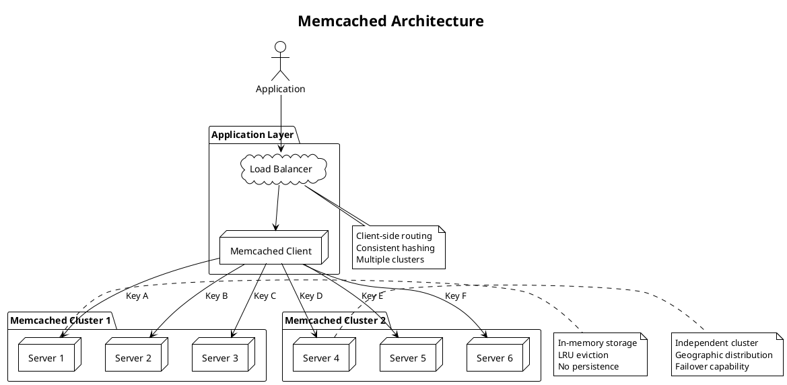

**Memcached** - Высокопроизводительная in-memory key-value кэширующая система с открытым исходным кодом, разработанная для ускорения веб-приложений за счёт кэширования данных в оперативной памяти.

---

#### 🎯 **Цель и суть**
**Цель:**  
Обеспечить ultra-low latency и high-throughput кэширование данных для снижения нагрузки на базы данных и ускорения отклика веб-приложений.

**Суть:**  
Memcached представляет собой простое, легковесное in-memory хранилище, оптимизированное для максимальной производительности при кэшировании часто используемых данных.

---

#### 📚 **Описание**
Memcached — это высокопроизводительная in-memory кэширующая система, изначально разработанная в 2003 году для LiveJournal и с тех пор ставшая стандартом де-факто для кэширования в веб-приложениях. Архитектура включает простые компоненты: клиентские библиотеки, серверные узлы и распределённую кэш-систему. Memcached хранит данные в оперативной памяти в виде ключ-значение пар, где значение может быть до 1MB. Система использует LRU (Least Recently Used) алгоритм вытеснения при достижении лимитов памяти. Memcached не поддерживает persistence, репликацию или сложные структуры данных — его сила в простоте и скорости. Клиенты используют consistent hashing для распределения ключей между серверами. Memcached широко используется для кэширования результатов запросов к базе данных, сессионного хранения, HTML фрагментов и других часто используемых данных.

---

#### ⚖️ **Сравнение**

| Критерий | Memcached | Redis | Tarantool | Cassandra |
|----------|-----------|-------|-----------|-----------|
| **Тип данных** | Key-value (strings) | Rich data structures | Key-value + Lua | Wide-column |
| **Масштабирование** | Горизонтальное | Горизонтальное | Горизонтальное | Горизонтальное |
| **Persistence** | Нет | RDB + AOF | WAL + snapshots | Full |
| **Производительность** | Очень высокая (мкс) | Очень высокая (мкс) | < 1ms | Высокая (мс) |
| **Репликация** | Нет | Есть | Есть | Есть |
| **ACID транзакции** | Нет | Ограниченные | Полные | Нет |
| **Язык запросов** | Простые команды | Команды Redis | Lua/SQL | CQL |
| **Pub/Sub** | Нет | Есть | Есть | Change Streams |
| **Использование памяти** | Очень эффективное | Среднее | Высокое | Среднее |
| **Сложность** | Очень низкая | Средняя | Высокая | Высокая |

---

#### 🛠️ **Классификация решений**

##### **Аппаратные решения:**
- **Высокопроизводительные серверы с большим объемом RAM** — для in-memory хранения данных
- **Высокоскоростные сети (10/25 GbE)** — для эффективного распределения нагрузки
- **NUMA-оптимизированные системы** — для эффективного использования многопроцессорных архитектур
- **Выделенные серверы** — изоляция от других нагрузок

##### **Программные решения:**
- **Memcached OSS** — базовая open-source версия
- **Managed Memcached services** — AWS ElastiCache, Google Memorystore
- **Memcached + Nginx** — интеграция с веб-серверами
- **Memcached + Varnish** — многоуровневое кэширование

##### **Комбинированные решения:**
- **Memcached + Redis** — гибридное решение: Memcached для простого кэширования, Redis для сложных структур
- **Memcached + PostgreSQL** — кэширование запросов к реляционной БД
- **Memcached + Kubernetes** — контейнеризированное развертывание
- **Memcached + CDN** — многоуровневое кэширование

---

#### 📖 **Исторический контекст**

##### **Создание и ранние версии (2003-2006):**
- Разработка Brad Fitzpatrick для LiveJournal
- Первая версия как простое in-memory кэширующее решение
- Открытие исходного кода и формирование сообщества
- Адаптация крупными веб-компаниями (Facebook, Twitter)

##### **Распространение (2006-2012):**
- Стандартизация как де-факто решение для кэширования
- Развитие клиентских библиотек для различных языков
- Интеграция с основными веб-фреймворками
- Формирование best practices и паттернов использования

##### **Энтерпрайз развитие (2012-2018):**
- Появление managed services в облачных платформах
- Интеграция с DevOps практиками и оркестрацией
- Улучшение мониторинга и управления
- Поддержка в enterprise-приложениях

##### **Современная эра (2018-2024):**
- Интеграция с cloud-native архитектурами
- Поддержка контейнеризации и Kubernetes
- Использование в high-load микросервисных архитектурах
- Совместное использование с более сложными кэширующими решениями

---

#### ⚠️ **Текущие проблемы требующие решения**

##### **Технические проблемы:**
- **Отсутствие persistence** — потеря данных при перезапуске сервера
- **Нет репликации** — отсутствие отказоустойчивости
- **Ограниченный размер значений** — максимум 1MB на ключ
- **Простые структуры данных** — только key-value пары

##### **Архитектурные проблемы:**
- **Отказоустойчивость** — необходимость внешних решений для fault tolerance
- **Распределение нагрузки** — зависимость от клиентской реализации consistent hashing
- **Мониторинг и управление** — отсутствие встроенных инструментов
- **Интеграция с современными архитектурами** — совместимость с microservices

##### **Эксплуатационные проблемы:**
- **Мониторинг производительности** — необходимость внешних инструментов
- **Управление памятью** — эффективное использование RAM
- **Обновление без downtime** — сложность при изменении конфигурации
- **Безопасность** — отсутствие встроенной аутентификации

---

#### 📈 **Актуальные решения и тенденции 2025**
- **Enhanced client libraries** — улучшенные библиотеки с advanced features
- **Cloud-native deployments** — Kubernetes операторы и helm charts
- **Hybrid caching solutions** — комбинация с Redis и другими кэшами
- **Edge caching integration** — использование в edge computing
- **AI-powered optimization** — предиктивное кэширование на основе паттернов

---

#### 🔮 **Ближайшие перспективы развития**
- **Lightweight persistence options** — опциональное сохранение данных
- **Enhanced security features** — аутентификация и шифрование
- **Multi-protocol support** — поддержка дополнительных протоколов
- **Serverless Memcached** — функции как сервис
- **Quantum-ready algorithms** — подготовка к пост-квантовым вычислениям

---

#### 🧠 **Резюме и выводы**
Memcached представляет собой зрелое, простое и высокопроизводительное решение для in-memory кэширования. Его ключевые преимущества — минимальная latency, простота использования и эффективное использование ресурсов. Memcached особенно эффективен в сценариях кэширования часто используемых данных, где критична производительность. Несмотря на отсутствие многих функций (persistence, репликация, сложные структуры данных), его простота и скорость делают его выбором №1 для high-performance кэширования. При правильной архитектуре и использовании Memcached может значительно улучшить производительность веб-приложений.

---

#### ❓ **Проверочные вопросы (основные)**

**Вопрос 1:**  
Какой алгоритм вытеснения данных использует Memcached при достижении лимитов памяти?

A) FIFO (First In, First Out)  
B) LRU (Least Recently Used)  
C) LFU (Least Frequently Used)  
D) Random Replacement  
E) ARC (Adaptive Replacement Cache)  
F) MRU (Most Recently Used)  

✅ **Правильный ответ: B) LRU (Least Recently Used)**

**Объяснение:** Memcached использует LRU (Least Recently Used) алгоритм вытеснения данных:
1. **Принцип работы** — данные, которые использовались дольше всего назад, вытесняются первыми
2. **Efficiency** — эффективно для кэширования, где часто используемые данные остаются "теплыми"
3. **Implementation** — реализован через linked list с перемещением при доступе
4. **Performance** — минимальные накладные расходы на управление кэшем
5. **Predictability** — предсказуемое поведение при высокой нагрузке

FIFO не учитывает частоту использования, LFU сложнее в реализации, Random Replacement неэффективен, ARC и MRU не используются в Memcached.

**Почему другие варианты неверны:**
- A) FIFO не учитывает актуальность данных
- C) LFU сложнее и не используется в Memcached
- D) Random Replacement неэффективен
- E) ARC более сложный алгоритм, не используется
- F) MRU противоречит логике кэширования

**Вопрос 2:**  
Какой механизм используется в Memcached для распределения ключей между серверами?

A) Round-robin  
B) Consistent hashing  
C) Range partitioning  
D) Random distribution  
E) Linear hashing  
F) Weighted distribution  

✅ **Правильный ответ: B) Consistent hashing**

**Объяснение:** Memcached использует consistent hashing для распределения ключей между серверами:
1. **Hash ring** — виртуальное кольцо хэш-значений
2. **Key mapping** — ключ хэшируется и размещается на кольце
3. **Server assignment** — сервер, следующий за ключом на кольце, хранит данные
4. **Scalability** — при добавлении/удалении серверов затрагивается только часть данных
5. **Load balancing** — равномерное распределение нагрузки

Consistent hashing обеспечивает эффективное масштабирование и минимизирует перераспределение данных при изменении конфигурации кластера.

**Почему другие варианты неверны:**
- A) Round-robin не подходит для кэширования
- C) Range partitioning используется в других системах
- D) Random distribution не обеспечивает предсказуемости
- E) Linear hashing не используется
- F) Weighted distribution не является стандартным механизмом

---

#### ❓ **Расширенные проверочные вопросы**

**Вопрос 1 (Design Question):**  
Как обеспечить отказоустойчивость Memcached в production среде?

A) Использовать один сервер с большим объемом RAM  
B) Настроить репликацию на уровне Memcached  
C) Использовать multiple independent clusters и client-side redundancy  
D) Только облачное решение без настройки  
E) Использовать только один регион  

✅ **Правильный ответ: C) Использовать multiple independent clusters и client-side redundancy**

**Объяснение:** Поскольку Memcached не поддерживает встроенную репликацию, отказоустойчивость обеспечивается:
1. **Multiple clusters** — независимые кластеры в разных availability zones
2. **Client-side redundancy** — клиенты пишут данные в несколько кластеров
3. **Read from primary, failover to secondary** — чтение из основного, переключение при сбое
4. **Data regeneration** — возможность восстановления данных из источника
5. **Monitoring and alerting** — отслеживание состояния кластеров

Вариант A не обеспечивает отказоустойчивость, B невозможен (Memcached не поддерживает репликацию), D может быть недостаточно гибким, E не решает задачу отказоустойчивости.

**Вопрос 2 (Performance Question):**  
При увеличении latency Memcached с 100μs до 1ms, какой компонент наиболее вероятно стал bottleneck'ом?

A) Network latency между клиентом и сервером  
B) Memory fragmentation  
C) CPU utilization  
D) Client-side consistent hashing  
E) Все вышеперечисленное  
F) Server restart  

✅ **Правильный ответ: A) Network latency между клиентом и сервером**

**Объяснение:** Увеличение latency Memcached чаще всего связано с network latency:
1. **Physical distance** — увеличение расстояния между клиентом и сервером
2. **Network congestion** — перегрузка сети
3. **Cross-region traffic** — трафик между регионами
4. **Latency-sensitive** — Memcached оптимизирован для microsecond latency
5. **Network overhead** — влияние network hops и routing

Хотя другие факторы (memory fragmentation, CPU) могут влиять, network latency является наиболее частой причиной увеличения latency с 100μs до 1ms.

---

#### 🔗 **Интеграция с другими темами курса**

**Связи с предыдущими модулями курса:**
- **Кэширование и хранение данных** — Memcached как основа для high-performance кэширования
- **Безопасность систем** — применение security patterns к кэширующим системам
- **Производительность и масштабирование** — использование scaling patterns для Memcached

**Подготовка к комплексным проектам:**
- Интеграция Memcached с микросервисной архитектурой
- Реализация monitoring и alerting для распределённых кластеров
- Проектирование disaster recovery архитектур

**Место темы в общей архитектуре системы:**
- Memcached как in-memory caching layer
- Интеграция с API gateways и microservices
- Влияние на overall system architecture

**Как тема влияет на другие аспекты System Design:**
- Требует пересмотра подходов к caching strategies
- Влияет на network architecture и latency optimization
- Определяет требования к memory management

---

#### 📊 **Визуальные элементы**

---

## 📚 **Перечень используемых терминов**

#### **Memcached** - Высокопроизводительная in-memory key-value кэширующая система с открытым исходным кодом, разработанная для ускорения веб-приложений за счёт кэширования данных в оперативной памяти.
Простая, легковесная in-memory кэширующая система, оптимизированная для максимальной производительности. Memcached хранит данные в оперативной памяти в виде ключ-значение пар, где значение может быть до 1MB. Не поддерживает persistence, репликацию или сложные структуры данных — его сила в простоте и скорости. Клиенты используют consistent hashing для распределения ключей между серверами. Широко используется для кэширования результатов запросов к базе данных, сессионного хранения и HTML фрагментов.

#### **LRU (Least Recently Used)** - Алгоритм вытеснения данных, при котором первыми удаляются наименее недавно использовавшиеся элементы.
Механизм управления кэшем, используемый в Memcached:
1. **Principle** — данные, к которым не было доступа дольше всего, вытесняются первыми
2. **Efficiency** — эффективно для кэширования, где часто используемые данные остаются "теплыми"
3. **Implementation** — реализован через linked list с перемещением при доступе
4. **Performance** — минимальные накладные расходы на управление кэшем
5. **Predictability** — предсказуемое поведение при высокой нагрузке
LRU обеспечивает хороший balance между эффективностью использования памяти и производительностью.

#### **Consistent hashing** - Алгоритм хэширования, обеспечивающий равномерное распределение данных по узлам кластера с минимальным перераспределением при изменении размера кластера.
Механизм распределения ключей в Memcached:
1. **Hash ring** — виртуальное кольцо хэш-значений
2. **Key mapping** — ключ хэшируется и размещается на кольце
3. **Server assignment** — сервер, следующий за ключом на кольце, хранит данные
4. **Scalability** — при добавлении/удалении серверов затрагивается только часть данных
5. **Load balancing** — равномерное распределение нагрузки
Consistent hashing обеспечивает эффективное масштабирование и минимизирует перераспределение данных.

#### **Key-value store** - Хранилище данных, организованное в пары ключ-значение, где значение может быть получено по уникальному ключу.
Простая модель данных, используемая в Memcached:
1. **Key** — уникальный идентификатор данных
2. **Value** — данные, связанные с ключом
3. **Operations** — get, set, delete
4. **Efficiency** — O(1) сложность операций
5. **Simplicity** — минимальная накладная работа
Key-value модель обеспечивает максимальную производительность при простых операциях доступа.

#### **In-memory caching** - Хранение данных в оперативной памяти для ускорения доступа по сравнению с диском.
Основной принцип работы Memcached:
1. **Speed** — доступ к RAM в миллионы раз быстрее диска
2. **Latency** — microsecond latency для операций
3. **Volatility** — данные теряются при перезапуске
4. **Capacity** — ограничен объёмом RAM
5. **Use case** — кэширование часто используемых данных
In-memory caching позволяет значительно ускорить приложения за счёт уменьшения обращений к медленным источникам данных.

#### **Client-side routing** - Механизм, при котором клиент определяет, на какой сервер направить запрос.
Архитектурный паттерн в Memcached:
1. **No central coordinator** — каждый клиент знает о конфигурации кластера
2. **Consistent hashing** — клиент вычисляет, на какой сервер направить ключ
3. **Decentralized control** — отсутствие единой точки отказа
4. **Efficiency** — минимальные накладные расходы
5. **Scalability** — новые серверы легко добавляются
Client-side routing обеспечивает высокую производительность и масштабируемость.

#### **Cache miss** - Ситуация, когда запрашиваемые данные отсутствуют в кэше.
Событие в системе кэширования:
1. **Performance impact** — требует обращения к медленному источнику данных
2. **Cache hit ratio** — ключевая метрика эффективности кэширования
3. **Mitigation** — предиктивное кэширование, warm-up
4. **Cost** — увеличение latency и нагрузки на backend
5. **Optimization** — анализ паттернов использования
Высокий процент cache miss снижает эффективность кэширования.

#### **Cache stampede** - Ситуация, когда множество запросов одновременно обращаются к истекшему кэшу.
Проблема в кэширующих системах:
1. **Cause** — одновременное истечение TTL нескольких ключей
2. **Effect** — резкий всплеск нагрузки на backend
3. **Mitigation** — staggered expiration, probabilistic early refresh
4. **Impact** — возможный сбой backend системы
5. **Prevention** — careful TTL management
Cache stampede может привести к cascading failures в high-load системах.

#### **TTL (Time To Live)** - Время жизни кэшированного объекта, после которого он считается устаревшим.
Параметр в Memcached:
1. **Expiration** — автоматическое удаление данных через указанное время
2. **Cache freshness** — баланс между актуальностью и производительностью
3. **Memory management** — освобождение памяти от устаревших данных
4. **Configuration** — настраивается для каждого ключа
5. **Trade-offs** — между cache hit ratio и data freshness
Правильная настройка TTL критична для эффективной работы кэширующей системы.

#### **Eviction policy** - Стратегия удаления данных из кэша при достижении лимитов памяти.
Механизм управления памятью в Memcached:
1. **LRU** — наименее недавно использовавшиеся данные удаляются первыми
2. **Memory pressure** — активируется при исчерпании доступной памяти
3. **Automatic** — процесс происходит прозрачно для приложения
4. **Efficiency** — минимизация потерь "теплых" данных
5. **Predictability** — предсказуемое поведение при высокой нагрузке
Eviction policy обеспечивает стабильную работу кэша при ограниченных ресурсах.