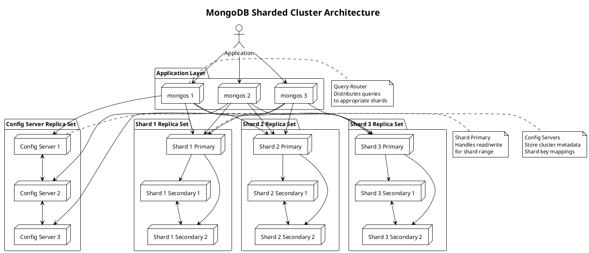

**MongoDB** - Документоориентированная NoSQL база данных с открытым исходным кодом, использующая JSON-подобные документы с динамической схемой для хранения и управления данными.

---

#### 🎯 **Цель и суть**
**Цель:**  
Обеспечить гибкое, масштабируемое и высокопроизводительное хранение данных для современных веб-приложений с минимальными требованиями к схеме данных.

**Суть:**  
MongoDB сочетает гибкость документной модели с мощными возможностями горизонтального масштабирования, поддержкой ACID транзакций и богатым языком запросов, что делает её идеальной для agile разработки и быстро меняющихся бизнес-требований.

---

#### 📚 **Описание**
MongoDB представляет собой документоориентированную базу данных, которая хранит данные в формате BSON (Binary JSON) - бинарном представлении JSON-документов. Основные компоненты архитектуры включают: документы (аналог строк в реляционных БД), коллекции (аналог таблиц), базы данных (логические контейнеры для коллекций) и шарды (для горизонтального масштабирования). MongoDB поддерживает динамическую схему, что позволяет хранить документы с разной структурой в одной коллекции. База данных обеспечивает автоматическое шардинг, репликацию, индексацию, агрегацию данных через pipeline, текстовый поиск и геопространственные запросы. MongoDB Atlas - облачное предложение от компании, предоставляет managed service с автоматическим масштабированием, backup и security features. Широко используется в веб-приложениях, real-time аналитике, content management и IoT системах.

---

#### ⚖️ **Сравнение**

| Критерий | MongoDB | PostgreSQL | Redis | Cassandra |
|----------|---------|------------|-------|-----------|
| **Тип данных** | Документы (BSON/JSON) | Реляционные таблицы | Структуры данных (strings, hashes, lists) | Wide-column |
| **Схема** | Динамическая | Строгая | Отсутствует | Динамическая |
| **Масштабирование** | Горизонтальное и вертикальное | Вертикальное (основное) | Вертикальное | Горизонтальное |
| **ACID транзакции** | Поддержка (4.0+) | Полная | Ограничена | Eventual consistency |
| **Язык запросов** | MongoDB Query Language | SQL | Команды Redis | CQL (Cassandra Query Language) |
| **Производительность** | Высокая (мс) | Средняя-Высокая | Очень высокая (мкс) | Высокая |
| **Использование памяти** | Среднее | Низкое | Высокое (in-memory) | Среднее |
| **Сложность запросов** | Богатые (агрегации, lookup) | Очень богатые (JOIN, CTE) | Ограничена | Средняя |
| **Геопространственные данные** | Отличная поддержка | Хорошая поддержка | Ограниченная | Средняя |

---

#### 🛠️ **Классификация решений**

##### **Аппаратные решения:**
- **Высокопроизводительные серверы с SSD** - для оптимальной производительности I/O операций
- **NVMe накопители** - для ускорения random read/write операций с большими коллекциями
- **Высокоскоростные сети (10/25 GbE)** - для репликации и шардинга в распределённых кластерах
- **Высокая плотность RAM** - для эффективного использования WiredTiger storage engine

##### **Программные решения:**
- **MongoDB Community Server** - open-source версия с базовыми функциями
- **MongoDB Enterprise Server** - расширенная версия с security и monitoring
- **MongoDB Atlas** - облачный managed service с автоматическим масштабированием
- **MongoDB Compass** - графический инструмент для разработки и анализа данных

##### **Комбинированные решения:**
- **MongoDB + Kafka** - для event-driven архитектур с real-time data streaming
- **MongoDB + Redis** - гибридное решение: MongoDB как основная БД, Redis как кэш
- **MongoDB + Elasticsearch** - для full-text search и аналитики поверх MongoDB данных
- **MongoDB + Kubernetes** - контейнеризированное развертывание с оркестрацией

---

#### 📖 **Исторический контекст**

##### **Предпосылки (2007-2009):**
- Рост веб-приложений с неструктурированными данными
- Ограничения реляционных БД в масштабировании и гибкости схемы
- Необходимость agile разработки без жестких схем данных
- Появление web 2.0 и социальных платформ с динамичными требованиями

##### **Разработка и первые версии (2009-2012):**
- Первая публичная версия MongoDB в 2009 году
- Открытие исходного кода и формирование сообщества
- Внедрение в стартапы и веб-компании для гибкого хранения данных
- Развитие экосистемы драйверов и инструментов

##### **Коммерциализация (2013-2018):**
- Основание MongoDB Inc. и привлечение инвестиций
- Релиз MongoDB 3.0 с WiredTiger storage engine
- Добавление поддержки ACID транзакций (4.0)
- Подготовка к IPO и расширение enterprise функций

##### **Облачная эра (2019-2024):**
- Запуск MongoDB Atlas - облачного managed service
- Интеграция с основными cloud провайдерами (AWS, GCP, Azure)
- Развитие serverless и функциональности для modern applications
- Расширение функционала для AI/ML и real-time аналитики

---

#### ⚠️ **Текущие проблемы требующие решения**

##### **Технические проблемы:**
- **Размер документа ограничен 16MB** - ограничение для хранения больших объектов (GridFS как workaround)
- **Ограниченная поддержка JOIN операций** - сложность работы со связанными данными (lookup pipeline stage)
- **Высокое потребление памяти** - WiredTiger требует значительных RAM ресурсов
- **Сложность миграции схем** - управление изменениями в динамических коллекциях

##### **Архитектурные проблемы:**
- **Шардинг и выбор ключа шардинга** - критически важное решение для производительности
- **Репликация и согласованность данных** - баланс между производительностью и consistency
- **Географическое распределение кластеров** - latency и согласованность между регионами
- **Интеграция с legacy системами** - совместимость с реляционными архитектурами

##### **Эксплуатационные проблемы:**
- **Мониторинг распределённых кластеров** - сложность observability в больших развертываниях
- **Backup и восстановление больших коллекций** - время и ресурсы для disaster recovery
- **Оптимизация производительности** - настройка индексов и query execution plans
- **Управление затратами** - баланс между производительностью и стоимостью hardware/cloud

---

#### 📈 **Актуальные решения и тенденции 2025**
- **MongoDB 7.0** - улучшенная поддержка time-series данных и аналитических рабочих нагрузок
- **Serverless MongoDB** - функции как сервис с автоматическим масштабированием
- **Vector search integration** - встроенные возможности для AI/ML similarity search
- **Multi-cloud deployments** - seamless репликация между облачными провайдерами
- **Enhanced aggregation pipeline** - расширенные возможности для data processing и аналитики

---

#### 🔮 **Ближайшие перспективы развития**
- **AI-powered query optimization** - автоматическая оптимизация запросов на основе machine learning
- **Quantum-ready storage engines** - подготовка к квантовым вычислениям и новым алгоритмам
- **Edge computing integration** - распределённые MongoDB инстансы на edge устройствах
- **Real-time analytics convergence** - объединение operational и analytical workloads
- **Blockchain data storage** - специализированные структуры для immutable data

---

#### 🧠 **Резюме и выводы**
MongoDB представляет собой зрелую и мощную NoSQL базу данных, которая идеально подходит для современных веб-приложений с динамичными требованиями к данным. Её ключевые преимущества - гибкость документной модели, мощные возможности масштабирования и богатый язык запросов. MongoDB особенно эффективна в сценариях, где требуется быстрая разработка, частые изменения схемы данных и горизонтальное масштабирование. Поддержка ACID транзакций делает её подходящей и для критически важных приложений. При правильной архитектуре и настройке MongoDB может стать основой для высоконагруженных систем с требованиями к гибкости и производительности.

---

#### ❓ **Проверочные вопросы (основные)**

**Вопрос 1:**  
Какой storage engine стал стандартом в MongoDB 3.2+ и какие у него основные преимущества?

A) MMAPv1  
B) WiredTiger  
C) In-Memory  
D) RocksDB  
E) TokuMX  
F) FoundationDB  

✅ **Правильный ответ: B) WiredTiger**

**Объяснение:** WiredTiger стал стандартным storage engine в MongoDB 3.2+ и принес множество улучшений по сравнению с предыдущим MMAPv1. Основные преимущества WiredTiger:
1. **Document-level concurrency control** - позволяет параллельно обрабатывать разные документы в одной коллекции
2. **Compression** - поддержка сжатия данных (Snappy, zlib, zstd) для экономии дискового пространства
3. **Better memory utilization** - более эффективное использование RAM и кэширование данных
4. **ACID transaction support** - базовая поддержка транзакций на уровне документа
5. **Performance improvements** - значительно лучшая производительность при высоких нагрузках

MMAPv1 был стандартным до версии 3.0, In-Memory используется для специфических сценариев, RocksDB и другие - альтернативные storage engines, но не стандартные.

**Почему другие варианты неверны:**
- A) MMAPv1 был стандартным до 3.0, но уступает WiredTiger по производительности
- C) In-Memory engine используется для специфических high-performance сценариев, но не как стандарт
- D) RocksDB - альтернативный engine, но не стандартный
- E) TokuMX - сторонняя реализация, не входящая в стандартную поставку
- F) FoundationDB - другой тип базы данных, не storage engine для MongoDB

**Вопрос 2:**  
Какой механизм используется в MongoDB для горизонтального масштабирования больших коллекций?

A) Репликация  
B) Индексация  
C) Шардинг (Sharding)  
D) Кэширование  
E) Архивация  
F) Компрессия  

✅ **Правильный ответ: C) Шардинг (Sharding)**

**Объяснение:** Шардинг - это основной механизм горизонтального масштабирования в MongoDB, который позволяет распределить данные по множеству серверов (шардов). При шардинге:
1. **Данные разделяются на чанки** по значению shard key
2. **Каждый шард хранит часть данных** и может находиться на отдельном сервере
3. **Query router (mongos)** направляет запросы к соответствующим шардам
4. **Config servers** хранят метаданные о распределении данных
5. **Автоматический балансировщик** перераспределяет чанки между шардами

Репликация обеспечивает отказоустойчивость, индексация улучшает производительность поиска, кэширование ускоряет доступ к часто используемым данным, архивация и компрессия экономят место - но только шардинг обеспечивает горизонтальное масштабирование.

**Почему другие варианты неверны:**
- A) Репликация обеспечивает отказоустойчивость, но не масштабирование
- B) Индексация улучшает производительность, но не масштабирует хранилище
- D) Кэширование ускоряет доступ, но не увеличивает объем хранимых данных
- E) Архивация освобождает место, но не масштабирует систему
- F) Компрессия экономит место, но не масштабирует хранилище

---

#### ❓ **Расширенные проверочные вопросы**

**Вопрос 1 (Design Question):**  
Как спроектировать MongoDB архитектуру для приложения с 100M+ документов, требующего 99.99% availability и < 10ms latency?

A) Один реплика-сет с 3 узлами в одном дата-центре  
B) Шардированный кластер с 5 шардами в одном регионе  
C) Географически распределённый шардированный кластер с 3+ регионами  
D) Только облачное решение MongoDB Atlas без настройки  
E) Использование только одного мощного сервера  

✅ **Правильный ответ: C) Географически распределённый шардированный кластер с 3+ регионами**

**Объяснение:** Для приложения с 100M+ документов и требованиями 99.99% availability и < 10ms latency необходим географически распределённый шардированный кластер:
1. **Шардинг** необходим для горизонтального масштабирования 100M+ документов
2. **Географическое распределение** (3+ региона) обеспечивает 99.99% availability через fault isolation
3. **Multiple regions** позволяют пользователям получать < 10ms latency за счёт близости
4. **Redundancy** в каждом регионе обеспечивает отказоустойчивость
5. **Automatic failover** между регионами при сбоях

Вариант A не масштабируется до 100M документов, B не обеспечивает географическую доступность, D может быть недостаточно гибким для специфических требований, E не обеспечивает отказоустойчивость и масштабируемость.

**Вопрос 2 (Trade-off Question):**  
При выборе shard key для коллекции с часто обновляемыми документами, какой подход обеспечит оптимальный баланс между write performance и query efficiency?

A) Использовать _id как shard key для максимальной случайности  
B) Выбрать поле с высокой cardinality и равномерным распределением  
C) Использовать поле с низкой cardinality для упрощения запросов  
D) Выбрать составной shard key из нескольких полей  
E) Использовать hashed shard key для равномерного распределения  

✅ **Правильный ответ: B) Выбрать поле с высокой cardinality и равномерным распределением**

**Объяснение:** Для коллекции с часто обновляемыми документами оптимальный shard key должен:
1. **Высокая cardinality** - обеспечивает равномерное распределение данных между шардами
2. **Равномерное распределение** - предотвращает hotspot'ы и обеспечивает балансировку нагрузки
3. **Часто используемое в запросах** - обеспечивает эффективность query execution
4. **Стабильное значение** - не изменяется после создания документа (для избежания перемещения между шардами)

Вариант A (_id) может создать hotspot'ы при последовательной вставке, C создаст неравномерное распределение, D может усложнить запросы, E обеспечивает равномерность, но ухудшает query performance для точечных запросов.

---

#### 🔗 **Интеграция с другими темами курса**

**Связи с предыдущими модулями курса:**
- **Кэширование и хранение данных** - MongoDB как основная БД с интеграцией Redis для кэширования
- **Безопасность систем** - применение security patterns к MongoDB развертываниям
- **Производительность и масштабирование** - использование scaling patterns для MongoDB кластеров

**Подготовка к комплексным проектам:**
- Интеграция MongoDB с микросервисной архитектурой и event-driven системами
- Реализация monitoring и alerting для распределённых MongoDB кластеров
- Проектирование disaster recovery архитектур с backup и restore стратегиями

**Место темы в общей архитектуре системы:**
- MongoDB как document storage layer в многоуровневой архитектуре
- Интеграция с API gateways и microservices для data access
- Влияние на overall system architecture и data flow patterns

**Как тема влияет на другие аспекты System Design:**
- Требует пересмотра подходов к data modeling и schema design
- Влияет на network architecture и latency requirements для distributed queries
- Определяет требования к monitoring, backup и disaster recovery систем

---

#### 📊 **Визуальные элементы**

---

## 📚 **Перечень используемых терминов**

#### **MongoDB** - Документоориентированная NoSQL база данных с открытым исходным кодом, использующая JSON-подобные документы с динамической схемой для хранения и управления данными.
База данных, которая хранит данные в виде документов, аналогичных JSON объектам, с гибкой структурой. MongoDB позволяет хранить сложные иерархические данные, массивы и вложенные объекты в одном документе, что делает её идеальной для веб-приложений с динамичными требованиями к структуре данных. Поддерживает автоматическое шардинг, репликацию, индексацию и богатый язык запросов. Широко используется в современных приложениях для хранения пользовательских профилей, контента, логов и других неструктурированных данных.

#### **Document** - Основная единица хранения данных в MongoDB, представляющая собой JSON-подобную структуру с полями и значениями.
Структура данных в MongoDB, аналогичная строке в реляционных базах данных, но с гибкой схемой. Документ содержит пары ключ-значение, где значения могут быть простыми типами данных (строки, числа, даты), массивами, вложенными документами или даже массивами документов. Каждый документ имеет уникальный идентификатор _id. Гибкость документов позволяет хранить сложные иерархические данные без необходимости нормализации, как в реляционных базах.

#### **Sharding** - Процесс горизонтального разделения данных по множеству серверов для масштабирования и распределения нагрузки.
Механизм горизонтального масштабирования в MongoDB, при котором данные распределяются между множеством серверов (шардов) на основе значения shard key. Шардинг позволяет обрабатывать большие объемы данных и высокую нагрузку, распределяя их между несколькими физическими серверами. Каждый шард может быть реплика-сетом для обеспечения отказоустойчивости. Query router (mongos) направляет запросы к соответствующим шардам, а config servers хранят метаданные о распределении данных.

#### **Replica Set** - Группа MongoDB инстансов, поддерживающих одну и ту же коллекцию данных для обеспечения отказоустойчивости и высокой доступности.
Набор из нескольких MongoDB серверов (обычно 3 или более), которые хранят идентичные копии данных для обеспечения отказоустойчивости. В replica set один сервер выступает в роли primary (принимает write операции), остальные - secondary (синхронизируют данные с primary). При сбое primary автоматически выбирается новый primary через голосование. Replica sets обеспечивают автоматический failover, read scalability (чтение с secondary) и disaster recovery.

#### **WiredTiger** - Storage engine по умолчанию в MongoDB 3.2+, обеспечивающий высокую производительность и эффективное использование ресурсов.
Современный storage engine для MongoDB, который стал стандартом начиная с версии 3.2. WiredTiger предоставляет document-level concurrency control, сжатие данных, эффективное использование памяти и поддержку ACID транзакций. По сравнению с предыдущим MMAPv1, WiredTiger обеспечивает лучшую производительность при высоких нагрузках, более эффективное использование дискового пространства и памяти. Поддерживает различные алгоритмы сжатия (Snappy, zlib, zstd) и оптимизирован для современных SSD накопителей.

#### **Aggregation Pipeline** - Мощный фреймворк для обработки и анализа данных в MongoDB, аналогичный SQL агрегатным функциям.
Фреймворк в MongoDB для выполнения сложных аналитических операций над данными. Pipeline состоит из последовательности этапов (stages), каждый из которых выполняет определенную операцию: $match (фильтрация), $group (агрегация), $sort (сортировка), $project (проекция), $lookup (JOIN-подобная операция). Aggregation pipeline позволяет выполнять сложные аналитические запросы, трансформации данных и генерацию отчетов прямо в базе данных без необходимости экспорта данных в внешние системы.

#### **Shard Key** - Поле или комбинация полей, используемая для определения распределения документов между шардами в MongoDB.
Ключ, который определяет, как документы будут распределены между шардами в шардированном кластере MongoDB. Выбор правильного shard key критически важен для производительности и балансировки нагрузки. Хороший shard key должен иметь высокую cardinality (много уникальных значений), равномерное распределение и часто использоваться в запросах. Плохой выбор shard key может привести к hotspot'ам (перегрузке одного шарда) и неравномерной балансировке данных.

#### **mongos** - Query router в шардированном кластере MongoDB, который направляет запросы к соответствующим шардам.
Сервис в шардированном кластере MongoDB, который выступает в роли прокси между клиентскими приложениями и шардами. mongos принимает запросы от приложений, определяет, какие шарды содержат необходимые данные (на основе информации от config servers), направляет запросы к соответствующим шардам и агрегирует результаты. mongos может работать в нескольких экземплярах для обеспечения отказоустойчивости и распределения нагрузки. Не хранит данные сам, а только координирует работу кластера.

#### **Config Servers** - Специализированные MongoDB инстансы, хранящие метаданные о конфигурации шардированного кластера.
Серверы в шардированном кластере MongoDB, которые хранят информацию о распределении данных между шардами, конфигурации кластера и shard key mappings. Config servers работают как replica set для обеспечения отказоустойчивости и хранят критически важные метаданные, без которых кластер не может функционировать. В шардированном кластере всегда должен быть нечетное количество config servers (обычно 3) для обеспечения кворума при голосовании.

#### **GridFS** - Спецификация и реализация для хранения и извлечения файлов, превышающих 16MB, в MongoDB.
Система в MongoDB для хранения больших файлов (которые превышают ограничение в 16MB на размер документа). GridFS автоматически разбивает файлы на chunks (по умолчанию 255KB) и хранит их в отдельной коллекции chunks, а метаданные - в коллекции files. Это позволяет эффективно хранить и извлекать большие файлы (видео, изображения, аудио) в MongoDB без необходимости внешних систем хранения. GridFS поддерживает потоковую передачу и позволяет извлекать только части файлов по запросу.