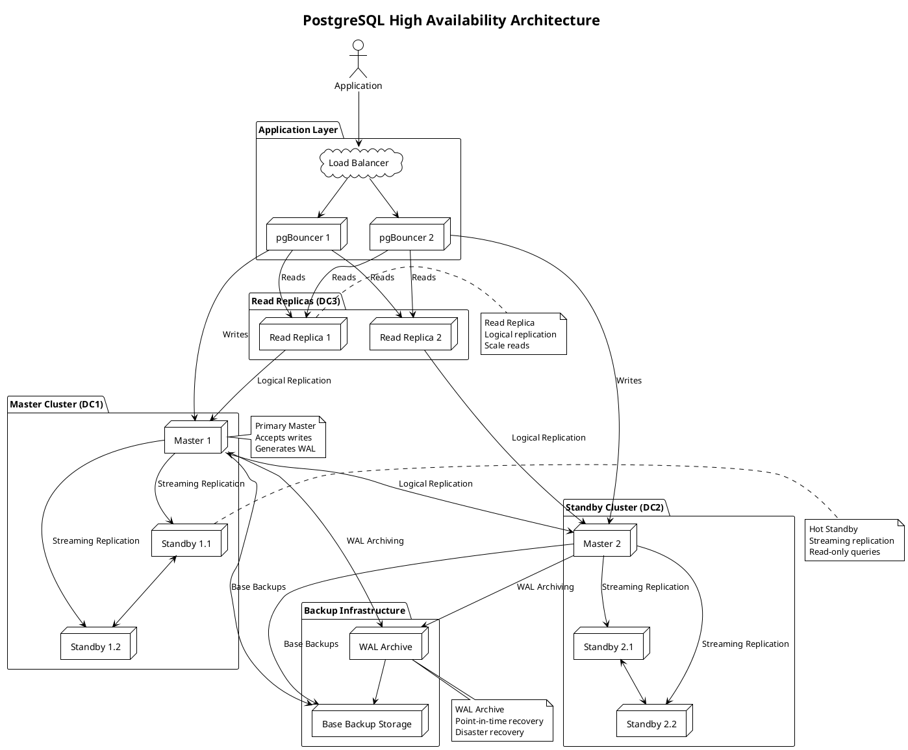

**PostgreSQL** - Мощная объектно-реляционная СУБД с открытым исходным кодом, обеспечивающая полную поддержку ACID, расширяемость и соответствие стандартам SQL.

---

#### 🎯 **Цель и суть**
**Цель:**  
Обеспечить надежное, масштабируемое и стандарт-совместимое хранение данных для критически важных приложений с требованиями к целостности и согласованности данных.

**Суть:**  
PostgreSQL сочетает мощные возможности реляционных баз данных с расширяемостью, поддержкой сложных типов данных, расширенными индексами и богатым экосистемой расширений, что делает её выбором №1 для enterprise приложений.

---

#### 📚 **Описание**
PostgreSQL представляет собой зрелую, стандарт-совместимую реляционную СУБД с более чем 30-летней историей разработки. Архитектура включает основные компоненты: процессор запросов (query parser, planner, executor), storage manager (buffer pool, WAL), transaction manager (MVCC, locking) и расширяемую систему типов данных и функций. База данных поддерживает сложные SQL конструкции, оконные функции, рекурсивные CTE, stored procedures на множестве языков (PL/pgSQL, PL/Python, PL/Java), foreign data wrappers для интеграции с другими системами. PostgreSQL обеспечивает надежность через WAL (Write-Ahead Logging), point-in-time recovery, streaming replication и logical replication. Поддерживает партиционирование, расширенные индексы (B-tree, Hash, GiST, GIN, BRIN), full-text search, JSON/JSONB для NoSQL-подобных операций. Широко используется в enterprise приложениях, аналитических системах, геоинформационных сервисах и веб-платформах.

---

#### ⚖️ **Сравнение**

| Критерий | PostgreSQL | MySQL | MongoDB | Oracle |
|----------|------------|-------|---------|--------|
| **ACID транзакции** | Полная поддержка | Ограничена (зависит от движка) | Частичная (4.0+) | Полная поддержка |
| **SQL стандарты** | Высокая совместимость | Средняя | Ограниченная | Высокая |
| **Расширяемость** | Высокая (UDF, типы, операторы) | Ограниченная | Высокая (документы) | Средняя |
| **Репликация** | Logical и streaming | Master-slave/Group replication | Replica sets | Advanced replication |
| **Производительность** | Высокая (мс) | Очень высокая | Высокая | Очень высокая |
| **Сложность запросов** | Очень богатые (CTE, window functions) | Средняя | Богатые (aggregation) | Очень богатые |
| **Использование памяти** | Среднее | Низкое | Среднее | Высокое |
| **Стоимость** | Бесплатная (open source) | Бесплатная | Бесплатная | Высокая (лицензии) |
| **Геопространственные данные** | Отличная поддержка (PostGIS) | Хорошая поддержка | Хорошая поддержка | Отличная поддержка |

---

#### 🛠️ **Классификация решений**

##### **Аппаратные решения:**
- **Высокопроизводительные серверы с большим объемом RAM** - для эффективной работы shared_buffers и кэширования
- **SSD/NVMe накопители** - для ускорения I/O операций и WAL записи
- **Высокоскоростные сети (10/25 GbE)** - для репликации и распределённых развертываний
- **Высокая плотность CPU cores** - для параллельной обработки запросов

##### **Программные решения:**
- **PostgreSQL Community Edition** - базовая open-source версия
- **PostgreSQL Pro Standard** - российская сборка с оптимизациями
- **PostgreSQL Pro Enterprise** - расширенная версия с enterprise функциями
- **Cloud managed services** (AWS RDS, Google Cloud SQL, Azure Database) - облачные решения

##### **Комбинированные решения:**
- **PostgreSQL + pgBouncer** - connection pooling для high-load приложений
- **PostgreSQL + Patroni** - автоматическая оркестрация кластеров
- **PostgreSQL + TimescaleDB** - расширение для time-series данных
- **PostgreSQL + Citus** - распределённая база данных на основе PostgreSQL

---

#### 📖 **Исторический контекст**

##### **Академические корни (1986-1994):**
- Проект POSTGRES в университете Беркли под руководством Майкла Стоунбрейкера
- Разработка как преемника Ingres с расширенными возможностями объектной ориентации
- Исследования в области расширяемости и новых типов данных
- Публикация фундаментальных работ по архитектуре СУБД

##### **Открытый исходный код (1995-2005):**
- Переход к открытому исходному коду и сообщество разработчиков
- Первые версии под именем PostgreSQL (в честь SQL-запроса POST QUEL)
- Добавление поддержки SQL и стандартов ANSI
- Формирование сообщества и экосистемы расширений

##### **Энтерпрайз развитие (2005-2015):**
- Развитие MVCC и конкурентного доступа
- Добавление поддержки JSON и NoSQL возможностей
- Улучшение репликации и отказоустойчивости
- Расширение экосистемы и коммерческой поддержки

##### **Облачная и современная эра (2015-2024):**
- Интеграция с облачными платформами и managed services
- Поддержка контейнеризации и оркестрации (Docker, Kubernetes)
- Развитие для big data и аналитических рабочих нагрузок
- Интеграция с AI/ML и real-time аналитикой

---

#### ⚠️ **Текущие проблемы требующие решения**

##### **Технические проблемы:**
- **Vertical scaling limitations** - ограничения вертикального масштабирования при очень больших нагрузках
- **Complexity of horizontal scaling** - сложность шардинга и распределённых архитектур
- **Memory usage optimization** - эффективное использование RAM при больших рабочих наборах
- **WAL management and archiving** - управление большими объёмами WAL при высокой нагрузке

##### **Архитектурные проблемы:**
- **Read replica scaling** - масштабирование read-heavy workloads без влияния на writes
- **Geographic distribution** - репликация между дата-центрами с минимальной latency
- **Mixed workload optimization** - баланс между OLTP и OLAP нагрузками
- **Schema migration complexity** - управление изменениями схемы при непрерывной работе

##### **Эксплуатационные проблемы:**
- **Backup and recovery time** - время backup и восстановления больших баз данных
- **Monitoring and observability** - комплексный мониторинг распределённых развертываний
- **Performance tuning expertise** - необходимость глубоких знаний для оптимизации
- **Upgrade complexity** - сложность обновлений major версий без downtime

---

#### 📈 **Актуальные решения и тенденции 2025**
- **PostgreSQL 17** - улучшенная поддержка JSON и аналитических функций
- **Cloud-native deployments** - Kubernetes операторы и serverless подходы
- **Vector data types** - встроенные типы данных для AI/ML similarity search
- **Enhanced logical replication** - улучшенная логическая репликация для микросервисов
- **Multi-version concurrency improvements** - оптимизации MVCC для high-concurrency сценариев

---

#### 🔮 **Ближайшие перспективы развития**
- **AI-assisted query optimization** - автоматическая оптимизация запросов с помощью машинного обучения
- **Quantum-resistant cryptography** - подготовка к пост-квантовой безопасности
- **Hybrid transactional-analytical processing (HTAP)** - объединение OLTP и OLAP в одной системе
- **Edge computing integration** - распределённые PostgreSQL инстансы на edge устройствах
- **Blockchain data integration** - специализированные функции для immutable data

---

#### 🧠 **Резюме и выводы**
PostgreSQL представляет собой зрелую, мощную и стандарт-совместимую реляционную СУБД, которая остается выбором №1 для критически важных приложений. Её ключевые преимущества - полная поддержка ACID, расширяемость, богатый язык запросов и надежность. PostgreSQL особенно эффективна в сценариях, требующих сложной бизнес-логики, строгой согласованности данных и долгосрочной поддержки. Поддержка современных функций (JSON, распределённая репликация, аналитика) делает её подходящей и для современных веб-приложений. При правильной архитектуре и настройке PostgreSQL может стать основой для enterprise систем с требованиями к надежности и производительности.

---

#### 🆚 **Сравнение с PostgreSQL Pro**

| Аспект | PostgreSQL Community | PostgreSQL Pro |
|--------|---------------------|----------------|
| **Происхождение** | Международное open-source сообщество | Российская разработка (Postgres Professional) |
| **Лицензия** | PostgreSQL License (BSD-like) | PostgreSQL License + дополнительные компоненты |
| **Оптимизации** | Стандартные оптимизации сообщества | Специфические оптимизации для российских условий |
| **Поддержка кириллицы** | Стандартная поддержка UTF-8 | Расширенная поддержка и оптимизации |
| **Репликация** | Streaming, logical replication | Расширенные российские решения репликации |
| **Мониторинг** | Стандартные инструменты | Расширенные инструменты мониторинга |
| **Документация** | Английская и переводы | Русскоязычная документация и поддержка |
| **Коммерческая поддержка** | Сообщество и сторонние компании | Официальная поддержка от разработчика |
| **Интеграция с российским ПО** | Стандартная | Улучшенная интеграция с отечественными решениями |
| **Сертификация** | Нет специфических сертификатов | Сертификация для российских государственных закупок |
| **Цена** | Бесплатно | Бесплатная и платная версии (Enterprise) |
| **Географическое распределение** | Стандартная репликация | Оптимизации для российских сетей и latency |

**Ключевые различия:**
- **PostgreSQL Pro** предоставляет специализированные оптимизации для российского рынка
- **Улучшенная поддержка кириллицы и российских стандартов**
- **Расширенные инструменты мониторинга и администрирования**
- **Официальная русскоязычная поддержка и документация**
- **Сертификация для государственных и корпоративных закупок РФ**
- **Интеграция с отечественным программным обеспечением**

---

#### ❓ **Проверочные вопросы (основные)**

**Вопрос 1:**  
Какой механизм обеспечивает согласованность данных и отказоустойчивость в PostgreSQL?

A) Master-slave репликация  
B) Write-Ahead Logging (WAL)  
C) Транзакции  
D) Индексация  
E) Блокировки  
F) MVCC  

✅ **Правильный ответ: B) Write-Ahead Logging (WAL)**

**Объяснение:** Write-Ahead Logging (WAL) - это фундаментальный механизм обеспечения согласованности данных и отказоустойчивости в PostgreSQL. WAL работает по принципу:
1. **Все изменения данных сначала записываются в WAL журнал** перед применением к основным данным
2. **При сбое система может восстановиться**, воспроизведя транзакции из WAL
3. **Point-in-time recovery** позволяет восстановить базу данных на любой момент времени
4. **Streaming replication** использует WAL для передачи изменений replica серверам
5. **Logical replication** также основана на WAL для логической синхронизации данных

Хотя другие механизмы (репликация, транзакции, MVCC) также важны для надежности, именно WAL является базовым механизмом, обеспечивающим durability и recovery capabilities.

**Почему другие варианты неверны:**
- A) Master-slave репликация обеспечивает доступность, но основана на WAL
- C) Транзакции обеспечивают ACID, но также используют WAL для durability
- D) Индексация улучшает производительность, но не обеспечивает согласованность
- E) Блокировки обеспечивают изоляцию, но не отказоустойчивость
- F) MVCC обеспечивает конкурентный доступ, но не persistence

**Вопрос 2:**  
Какой тип индекса наиболее эффективен для полнотекстового поиска в PostgreSQL?

A) B-tree  
B) Hash  
C) GiST  
D) GIN  
E) BRIN  
F) SP-GiST  

✅ **Правильный ответ: D) GIN**

**Объяснение:** GIN (Generalized Inverted Index) является наиболее эффективным типом индекса для полнотекстового поиска в PostgreSQL по следующим причинам:
1. **Инвертированный индекс** - хранит отображение терминов к документам, содержащим эти термины
2. **Оптимизирован для массивов и составных данных** - идеален для tsvector типов данных
3. **Эффективен для операций @ (содержит)** - основная операция полнотекстового поиска
4. **Поддерживает сложные запросы** с булевыми операторами (AND, OR, NOT)
5. **Хорошо работает с JSON/JSONB** для поиска по ключам и значениям

B-tree эффективен для точечных запросов, Hash для равенства, GiST универсальный но менее эффективный для текста, BRIN для больших таблиц с упорядоченными данными, SP-GiST для специфических структур данных.

**Почему другие варианты неверны:**
- A) B-tree эффективен для точечных запросов, но не для полнотекстового поиска
- B) Hash индекс только для равенства, не поддерживает полнотекстовый поиск
- C) GiST универсальный, но GIN более эффективен для текстовых данных
- E) BRIN для больших таблиц с упорядоченными данными
- F) SP-GiST для специфических структур (геометрия, IP адреса)

---

#### ❓ **Расширенные проверочные вопросы**

**Вопрос 1 (Design Question):**  
Как спроектировать PostgreSQL архитектуру для приложения с требованиями: 1M+ пользователей, 100K+ RPS, 99.99% availability, географическое распределение?

A) Один сервер с вертикальным масштабированием  
B) Мастер-слейв репликация с двумя серверами  
C) Мульти-мастер кластер с логической репликацией и read replicas  
D) Только облачное решение без настройки  
E) Использование только одного региона  

✅ **Правильный ответ: C) Мульти-мастер кластер с логической репликацией и read replicas**

**Объяснение:** Для приложения с такими требованиями необходима сложная распределённая архитектура:
1. **Мульти-мастер кластер** - позволяет принимать writes в разных географических регионах
2. **Логическая репликация** - обеспечивает гибкую синхронизацию между мастерами
3. **Read replicas** - масштабируют read нагрузку и обеспечивают близость к пользователям
4. **Географическое распределение** - кластеры в разных дата-центрах для low latency
5. **Connection pooling** - pgBouncer для эффективного использования connections
6. **Load balancing** - автоматическое распределение нагрузки между узлами

Вариант A не масштабируется до 100K+ RPS, B не обеспечивает достаточную доступность и масштабируемость, D может быть недостаточно гибким, E не решает задачу географического распределения.

**Вопрос 2 (Troubleshooting Question):**  
При высокой нагрузке PostgreSQL начал выдавать ошибки "out of shared memory". Какой параметр наиболее вероятно нужно увеличить?

A) shared_buffers  
B) work_mem  
C) max_connections  
D) maintenance_work_mem  
E) effective_cache_size  
F) temp_buffers  

✅ **Правильный ответ: C) max_connections**

**Объяснение:** Ошибка "out of shared memory" при высокой нагрузке чаще всего связана с параметром max_connections:
1. **Каждое соединение потребляет shared memory** для хранения состояния транзакций и блокировок
2. **При большом количестве одновременных соединений** (1000+) shared memory может исчерпаться
3. **Решение** - увеличение max_connections или использование connection pooling (pgBouncer)
4. **Shared_buffers** также важен, но ошибка скорее связана с количеством соединений
5. **Work_mem** влияет на память для отдельных операций, не на shared memory уровня соединений

Другие параметры влияют на разные аспекты памяти, но max_connections напрямую связан с shared memory consumption при множестве соединений.

---

#### 🔗 **Интеграция с другими темами курса**

**Связи с предыдущими модулями курса:**
- **Кэширование и хранение данных** - PostgreSQL как основная БД с интеграцией Redis для кэширования
- **Безопасность систем** - применение security patterns к PostgreSQL развертываниям
- **Производительность и масштабирование** - использование scaling patterns для PostgreSQL кластеров

**Подготовка к комплексным проектам:**
- Интеграция PostgreSQL с микросервисной архитектурой и event-driven системами
- Реализация monitoring и alerting для распределённых PostgreSQL кластеров
- Проектирование disaster recovery архитектур с backup и restore стратегиями

**Место темы в общей архитектуре системы:**
- PostgreSQL как relational storage layer в многоуровневой архитектуре
- Интеграция с API gateways и microservices для data access
- Влияние на overall system architecture и data flow patterns

**Как тема влияет на другие аспекты System Design:**
- Требует пересмотра подходов к data modeling и schema design
- Влияет на network architecture и latency requirements для distributed queries
- Определяет требования к monitoring, backup и disaster recovery систем

---

#### 📊 **Визуальные элементы**

---

## 📚 **Перечень используемых терминов**

#### **PostgreSQL** - Мощная объектно-реляционная СУБД с открытым исходным кодом, обеспечивающая полную поддержку ACID, расширяемость и соответствие стандартам SQL.
Зрелая реляционная СУБД с более чем 30-летней историей разработки, известная своей надежностью, стандарт-совместимостью и расширяемостью. PostgreSQL поддерживает сложные SQL конструкции, оконные функции, рекурсивные CTE, stored procedures на множестве языков, foreign data wrappers для интеграции с другими системами. Обеспечивает надежность через WAL, point-in-time recovery, streaming replication и logical replication. Поддерживает партиционирование, расширенные индексы, full-text search, JSON/JSONB для NoSQL-подобных операций. Широко используется в enterprise приложениях, аналитических системах и веб-платформах.

#### **Write-Ahead Logging (WAL)** - Механизм обеспечения надежности данных, при котором все изменения записываются в журнал перед применением к основным данным.
Фундаментальный механизм обеспечения durability и recovery в PostgreSQL. Все изменения данных сначала записываются в WAL журнал (предварительная запись), затем применяются к основным данным. При сбое система может восстановиться, воспроизведя транзакции из WAL. WAL также используется для streaming replication, point-in-time recovery и logical replication. WAL файлы имеют фиксированный размер (обычно 16MB) и управляются системой архивации. Эффективное управление WAL критично для производительности и отказоустойчивости системы.

#### **MVCC (Multi-Version Concurrency Control)** - Механизм управления конкурентным доступом, позволяющий нескольким транзакциям одновременно читать и писать данные без блокировок.
Архитектурный подход в PostgreSQL, при котором каждая транзакция видит "снимок" базы данных на момент начала транзакции. MVCC позволяет избежать read/write блокировок, обеспечивая высокий уровень конкурентности. Каждый кортеж (строка) содержит информацию о версиях, и транзакции работают с соответствующими версиями данных. При update создается новая версия кортежа, старая версия сохраняется до тех пор, пока все транзакции, которые могут её видеть, не завершатся. Vacuum процесс очищает устаревшие версии данных.

#### **Logical Replication** - Механизм репликации на уровне логических изменений данных, позволяющий реплицировать отдельные таблицы и базы данных.
Современный механизм репликации в PostgreSQL (с версии 10), который реплицирует изменения на уровне логических операций (INSERT, UPDATE, DELETE) вместо физических блоков данных. Logical replication позволяет:
1. Реплицировать отдельные таблицы или публикации
2. Объединять данные из нескольких источников
3. Реплицировать между разными версиями PostgreSQL
4. Поддерживать гибкие топологии репликации
Logical replication основана на WAL и использует logical decoding для преобразования физических изменений в логические.

#### **GIN (Generalized Inverted Index)** - Тип индекса, оптимизированный для поиска по составным данным (массивы, JSON, полнотекстовый поиск).
Специализированный тип индекса в PostgreSQL, который хранит инвертированное отображение значений к кортежам, содержащим эти значения. GIN особенно эффективен для:
1. **Полнотекстового поиска** (tsvector типы данных)
2. **Поиска по массивам** (содержит ли массив определенное значение)
3. **JSON/JSONB** (поиск по ключам и значениям)
4. **Геопространственных данных** (PostGIS расширения)
GIN индекс может быть медленнее для updates, но обеспечивает отличную производительность для сложных поисковых запросов.

#### **pgBouncer** - Легковесный connection pooler для PostgreSQL, уменьшающий накладные расходы на соединения.
Промежуточный прокси-сервер, который управляет пулом соединений к PostgreSQL, уменьшая накладные расходы на создание/закрытие соединений. PgBouncer поддерживает три режима работы:
1. **Session pooling** - соединение выделяется на время сессии
2. **Transaction pooling** - соединение возвращается в пул после каждой транзакции
3. **Statement pooling** - соединение возвращается после каждого statement
PgBouncer особенно полезен при высокой нагрузке с множеством краткосрочных соединений, помогает избежать "out of shared memory" ошибок.

#### **Patroni** - Инструмент для автоматической оркестрации высокодоступных кластеров PostgreSQL.
Система управления кластерами PostgreSQL с открытым исходным кодом, которая автоматизирует:
1. **Failover** - автоматическое переключение при сбое мастера
2. **Switchover** - плановое переключение между узлами
3. **Конфигурацию** - централизованное управление параметрами
4. **Мониторинг** - проверка состояния узлов и сервисов
Patroni использует распределенное хранилище (etcd, Consul, Zookeeper) для координации кластера и обеспечивает отказоустойчивость без единой точки отказа.

#### **PostGIS** - Расширение PostgreSQL для хранения и анализа геопространственных данных.
Мощное расширение, добавляющее поддержку географических объектов в PostgreSQL. PostGIS предоставляет:
1. **Пространственные типы данных** (geometry, geography)
2. **Пространственные индексы** (GiST для геометрии)
3. **Функции анализа** (расстояния, пересечения, буферы)
4. **Поддержку стандартов** (OGC, ISO SQL/MM)
PostGIS используется в геоинформационных системах, логистике, картографии и приложениях с геолокацией. Интегрируется с визуализацией и аналитическими инструментами.

#### **Table Partitioning** - Механизм разделения больших таблиц на логические части для улучшения производительности и управления.
Процесс разделения одной большой таблицы на множество меньших частей (партиций) на основе определенного ключа (диапазон, список, хэш). Partitioning в PostgreSQL (с версии 10) позволяет:
1. **Улучшить производительность** - сканирование только нужных партиций
2. **Упростить управление** - архивация старых данных, maintenance
3. **Увеличить параллелизм** - параллельная работа с разными партициями
4. **Экономить ресурсы** - эффективное использование индексов и памяти
Поддерживает range, list и hash partitioning с автоматическим routing'ом запросов.

#### **PostgreSQL Pro** - Российская сборка PostgreSQL с оптимизациями и расширениями для российского рынка.
Специализированная версия PostgreSQL, разработанная компанией Postgres Professional, которая включает:
1. **Оптимизации для российских условий** (сети, latency, hardware)
2. **Расширенную поддержку кириллицы и российских стандартов**
3. **Улучшенные инструменты мониторинга и администрирования**
4. **Русскоязычную документацию и поддержку**
5. **Сертификацию для государственных закупок РФ**
6. **Интеграцию с отечественным программным обеспечением**
PostgreSQL Pro сохраняет совместимость с оригинальной PostgreSQL, но добавляет специфические функции для российского рынка.