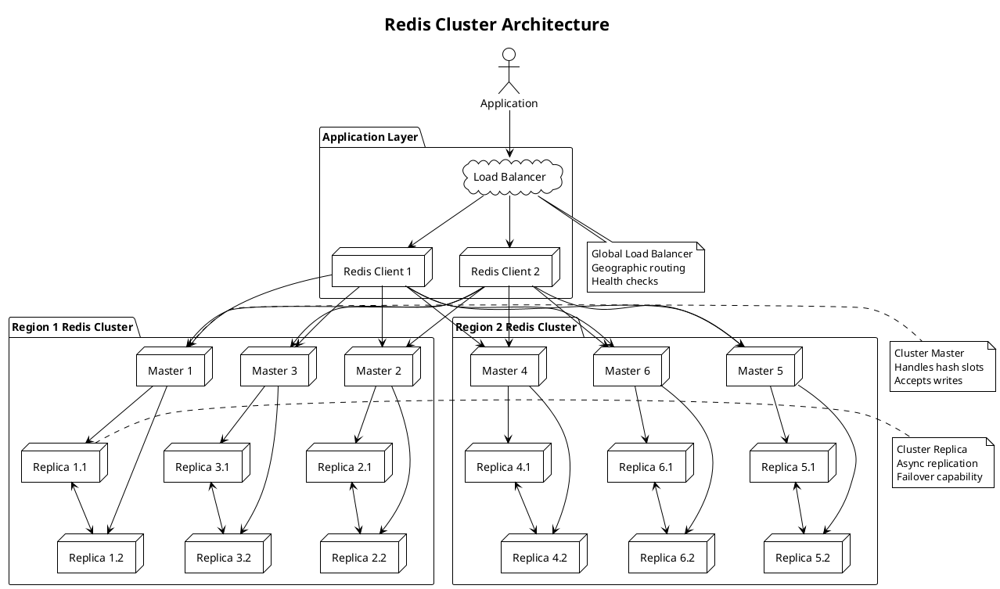

**Redis** - Высокопроизводительная in-memory key-value база данных с открытым исходным кодом, поддерживающая различные структуры данных и обеспечивающая миллисекундную latency для операций чтения/записи.

---

#### 🎯 **Цель и суть**
**Цель:**  
Обеспечить ultra-high performance и low-latency доступ к данным для кэширования, сессионного хранения, очередей сообщений и real-time приложений.

**Суть:**  
Redis сочетает in-memory хранение данных с богатым набором структур данных, persistence механизмами и распределёнными возможностями, что делает его идеальным для high-performance сценариев.

---

#### 📚 **Описание**
Redis (Remote Dictionary Server) представляет собой продвинутую in-memory key-value базу данных, которая поддерживает более 50 миллионов загрузок в день и используется такими компаниями как Twitter, GitHub, Stack Overflow и Snapchat. Архитектура включает основные компоненты: in-memory data store, persistence engines (RDB и AOF), replication механизм, cluster mode для горизонтального масштабирования и pub/sub систему для messaging. Redis поддерживает богатый набор структур данных: strings, hashes, lists, sets, sorted sets, bitmaps, hyperloglogs, streams. База данных обеспечивает атомарность операций через single-threaded архитектуру, поддерживает Lua скрипты для сложной логики, обеспечивает persistence через snapshotting (RDB) и append-only file (AOF). Redis используется для кэширования, сессионного хранения, real-time аналитики, leaderboard'ов, очередей сообщений и pub/sub систем.

---

#### ⚖️ **Сравнение**

| Критерий | Redis | Memcached | MongoDB | PostgreSQL |
|----------|-------|-----------|---------|------------|
| **Тип хранения** | In-memory (с persistence) | In-memory | Disk-based (с memory cache) | Disk-based |
| **Структуры данных** | Rich (strings, hashes, lists, sets, streams) | Simple (key-value strings) | Documents (BSON/JSON) | Tables (rows/columns) |
| **Persistence** | RDB + AOF | Ограниченная | Full | Full |
| **Производительность** | Очень высокая (< 1ms) | Очень высокая (< 1ms) | Высокая (1-10ms) | Высокая (1-10ms) |
| **Масштабирование** | Cluster mode | Sharding через клиенты | Sharding | Vertical (основное) |
| **ACID транзакции** | Ограниченные (atomic operations) | Нет | Частичные (4.0+) | Полные |
| **Язык запросов** | Commands | Commands | MongoDB Query | SQL |
| **Pub/Sub** | Встроенный | Нет | Change Streams | Listen/Notify |
| **Использование памяти** | Высокое | Высокое | Среднее | Низкое |

---

#### 🛠️ **Классификация решений**

##### **Аппаратные решения:**
- **Высокопроизводительные серверы с большим объемом RAM** - для in-memory хранения данных
- **NVMe SSD накопители** - для быстрой persistence (AOF, RDB) и снижения latency
- **Высокоскоростные сети (25/100 GbE)** - для cluster replication и распределённых развертываний
- **NUMA-оптимизированные системы** - для эффективного использования многопроцессорных архитектур

##### **Программные решения:**
- **Redis OSS** - базовая open-source версия с основными функциями
- **Redis Enterprise** - коммерческая версия с расширенными enterprise функциями
- **Redis Stack** - расширенная версия с модулями (Search, JSON, TimeSeries, Graph)
- **Managed services** (AWS ElastiCache, Google Memorystore, Azure Cache) - облачные решения

##### **Комбинированные решения:**
- **Redis + PostgreSQL** - гибридное решение: Redis как кэш, PostgreSQL как основная БД
- **Redis + Kafka** - для event-driven архитектур с real-time data streaming
- **Redis + Elasticsearch** - для search и analytics поверх Redis данных
- **Redis + Kubernetes** - контейнеризированное развертывание с оркестрацией

---

#### 📖 **Исторический контекст**

##### **Создание и ранние версии (2009-2012):**
- Разработка Сальваторе Санфилиппо (antirez) в 2009 году
- Первая версия как простой key-value store для улучшения работы веб-приложений
- Открытие исходного кода и формирование сообщества
- Добавление базовых структур данных (strings, lists, sets)

##### **Расширение функциональности (2012-2015):**
- Добавление persistence механизмов (RDB, AOF)
- Внедрение replication и sentinel для отказоустойчивости
- Расширение набора структур данных (hashes, sorted sets, bitmaps)
- Поддержка Lua скриптов для сложной логики

##### **Enterprise развитие (2015-2018):**
- Основание Redis Labs (ныне Redis Ltd) и коммерциализация
- Релиз Redis Cluster для горизонтального масштабирования
- Добавление Streams для messaging и event processing
- Расширение экосистемы модулей и интеграций

##### **Современная эра (2019-2024):**
- Развитие Redis Stack с расширенными модулями
- Интеграция с AI/ML и vector search capabilities
- Поддержка edge computing и serverless архитектур
- Расширение в сторону multi-model database подхода

---

#### ⚠️ **Текущие проблемы требующие решения**

##### **Технические проблемы:**
- **Ограниченный объем памяти** - необходимость эффективного использования RAM для больших датасетов
- **Single-threaded архитектура** - ограничения пропускной способности при CPU-bound операциях
- **Memory fragmentation** - неэффективное использование памяти при частых операциях
- **Persistence overhead** - влияние RDB snapshotting и AOF на производительность

##### **Архитектурные проблемы:**
- **Cluster complexity** - сложность настройки и управления Redis Cluster
- **Data sharding strategy** - выбор оптимального ключа шардинга и распределения данных
- **Cross-region replication** - репликация между дата-центрами с минимальной latency
- **Cache invalidation patterns** - эффективные стратегии обновления кэшированных данных

##### **Эксплуатационные проблемы:**
- **Memory optimization** - мониторинг и оптимизация использования памяти
- **Backup and recovery** - стратегии резервного копирования для persistence данных
- **Monitoring and alerting** - observability в распределённых Redis развертываниях
- **Capacity planning** - планирование ресурсов для пиковых нагрузок

---

#### 📈 **Актуальные решения и тенденции 2025**
- **Redis 8.0** - улучшенная поддержка vector search и AI/ML workloads
- **Redis Stack** - расширенные модули для search, JSON, time-series и графов
- **Serverless Redis** - функции как сервис с автоматическим масштабированием
- **Multi-model capabilities** - объединение различных типов данных в одной системе
- **Enhanced security features** - расширенные механизмы аутентификации и авторизации

---

#### 🔮 **Ближайшие перспективы развития**
- **AI-powered optimization** - автоматическая оптимизация использования памяти и кэширования
- **Quantum-ready algorithms** - подготовка к квантовым вычислениям и новым алгоритмам
- **Edge computing integration** - распределённые Redis инстансы на edge устройствах
- **Real-time analytics convergence** - объединение caching и аналитических функций
- **Blockchain data structures** - специализированные структуры для immutable data

---

#### 🧠 **Резюме и выводы**
Redis представляет собой зрелое и мощное in-memory решение, которое остается выбором №1 для high-performance сценариев. Его ключевые преимущества - ultra-low latency, богатый набор структур данных и простота использования. Redis особенно эффективен в сценариях кэширования, сессионного хранения, real-time аналитики и messaging систем. Поддержка persistence и cluster mode делает его подходящим и для критически важных приложений. При правильной архитектуре и настройке Redis может стать основой для high-load систем с требованиями к миллисекундной latency.

---

#### ❓ **Проверочные вопросы (основные)**

**Вопрос 1:**  
Какой механизм persistence в Redis обеспечивает наиболее точное восстановление данных после сбоя?

A) RDB (Redis Database Backup)  
B) AOF (Append Only File)  
C) RDB + AOF комбинированный режим  
D) Никакой (только in-memory)  
E) Snapshotting  
F) Journaling  

✅ **Правильный ответ: B) AOF (Append Only File)**

**Объяснение:** AOF (Append Only File) обеспечивает наиболее точное восстановление данных после сбоя, потому что:
1. **Лог всех операций** - AOF записывает каждую операцию изменения данных в лог-файл
2. **Полнота данных** - при восстановлении выполняются все операции в том же порядке
3. **Меньше потерь** - потери ограничены только последними операциями между fsync
4. **Консистентность** - гарантирует точное воспроизведение состояния базы данных

RDB создает периодические снимки, что может привести к потере данных между snapshot'ами. Комбинированный режим использует оба подхода, но AOF остается основным механизмом точного восстановления. Только in-memory режим не обеспечивает persistence. Snapshotting - это часть RDB, а journaling - общий термин, под которым в Redis подразумевается AOF.

**Почему другие варианты неверны:**
- A) RDB может потерять данные между snapshot'ами (до нескольких минут)
- C) Комбинированный режим использует AOF как основной механизм
- D) Только in-memory не обеспечивает восстановление после сбоя
- E) Snapshotting - часть RDB, менее точна чем AOF
- F) Journaling в контексте Redis - это AOF

**Вопрос 2:**  
Какая структура данных Redis наиболее эффективна для реализации leaderboard'а с рейтингами пользователей?

A) Strings  
B) Hashes  
C) Lists  
D) Sets  
E) Sorted Sets (ZSET)  
F) Streams  

✅ **Правильный ответ: E) Sorted Sets (ZSET)**

**Объяснение:** Sorted Sets (ZSET) наиболее эффективны для leaderboard'ов по следующим причинам:
1. **Автоматическая сортировка** - элементы автоматически упорядочены по score
2. **Эффективные операции** - O(log(N)) для добавления и обновления
3. **Range queries** - можно легко получить топ-N пользователей
4. **Atomic operations** - операции с рейтингами атомарны
5. **Score updates** - эффективное обновление рейтингов пользователей
6. **Rank queries** - можно получить позицию пользователя в рейтинге

Для leaderboard'а score представляет рейтинг пользователя, а member - идентификатор пользователя. Операции ZADD (добавление/обновление), ZRANGE (получение топ-N), ZRANK (получение позиции) делают реализацию тривиальной.

**Почему другие варианты неверны:**
- A) Strings не поддерживают сортировку и сложные операции
- B) Hashes хороши для хранения атрибутов, но не для сортировки
- C) Lists не поддерживают автоматическую сортировку
- D) Sets не упорядочены и не поддерживают scores
- F) Streams для messaging, не для рейтингов

---

#### ❓ **Расширенные проверочные вопросы**

**Вопрос 1 (Design Question):**  
Как спроектировать Redis архитектуру для приложения с требованиями: 1M+ ключей, 100K+ RPS, 99.99% availability, global distribution?

A) Один Redis инстанс с большим объемом RAM  
B) Redis Sentinel с 3 узлами в одном дата-центре  
C) Redis Cluster с 10+ узлами и географическая репликация  
D) Только облачное решение без настройки  
E) Использование только одного региона  

✅ **Правильный ответ: C) Redis Cluster с 10+ узлами и географическая репликация**

**Объяснение:** Для приложения с такими требованиями необходима распределённая архитектура:
1. **Redis Cluster** - обеспечивает горизонтальное масштабирование для 1M+ ключей и 100K+ RPS
2. **10+ узлов** - достаточно для распределения нагрузки и отказоустойчивости
3. **Географическая репликация** - узлы в разных регионах для 99.99% availability и low latency
4. **Шардинг** - автоматическое распределение ключей между узлами
5. **Failover** - автоматическое переключение при сбоях
6. **Load distribution** - балансировка нагрузки между регионами

Вариант A не масштабируется, B не обеспечивает горизонтальное масштабирование, D может быть недостаточно гибким, E не решает задачу глобального распределения.

**Вопрос 2 (Performance Question):**  
При увеличении latency Redis с 1ms до 10ms, какая метрика наиболее вероятно стала bottleneck'ом?

A) Memory usage > 80% от доступной RAM  
B) CPU utilization > 90%  
C) Network latency между клиентом и Redis  
D) Disk I/O при AOF fsync  
E) Все вышеперечисленное  
F) Client connection pool exhaustion  

✅ **Правильный ответ: E) Все вышеперечисленное**

**Объяснение:** Увеличение latency Redis в 10 раз может быть вызвано множеством факторов одновременно:
1. **Memory usage > 80%** - начинается swapping и memory pressure
2. **CPU utilization > 90%** - single-threaded Redis не может обрабатывать запросы
3. **Network latency** - проблемы с сетью между клиентом и сервером
4. **Disk I/O при AOF fsync** - blocking fsync операции при высокой нагрузке
5. **Connection pool exhaustion** - клиенты ждут доступных соединений

В реальной production среде такие проблемы часто комплексные. Memory pressure вызывает swapping, высокая CPU нагрузка замедляет обработку, сетевые проблемы увеличивают latency, disk I/O блокирует операции, исчерпание connection pool создает очереди. Необходим комплексный анализ всех метрик для точной диагностики.

---

#### 🔗 **Интеграция с другими темами курса**

**Связи с предыдущими модулями курса:**
- **Кэширование и хранение данных** - Redis как основное кэширующее решение с расширенными возможностями
- **Безопасность систем** - применение security patterns к Redis развертываниям
- **Производительность и масштабирование** - использование scaling patterns для Redis кластеров

**Подготовка к комплексным проектам:**
- Интеграция Redis с микросервисной архитектурой и event-driven системами
- Реализация monitoring и alerting для распределённых Redis кластеров
- Проектирование disaster recovery архитектур с backup и restore стратегиями

**Место темы в общей архитектуре системы:**
- Redis как in-memory caching и data structure layer в многоуровневой архитектуре
- Интеграция с API gateways и microservices для high-performance data access
- Влияние на overall system architecture и latency requirements

**Как тема влияет на другие аспекты System Design:**
- Требует пересмотра подходов к caching strategies и data access patterns
- Влияет на network architecture и latency optimization
- Определяет требования к memory management и resource allocation

---

#### 📊 **Визуальные элементы**

---

## 📚 **Перечень используемых терминов**

#### **Redis** - Высокопроизводительная in-memory key-value база данных с открытым исходным кодом, поддерживающая различные структуры данных и обеспечивающая миллисекундную latency для операций чтения/записи.
Продвинутая in-memory база данных, которая хранит данные в оперативной памяти для обеспечения ultra-low latency (обычно < 1ms). Redis поддерживает богатый набор структур данных (strings, hashes, lists, sets, sorted sets, bitmaps, hyperloglogs, streams) и обеспечивает атомарность операций через single-threaded архитектуру. Поддерживает persistence через RDB и AOF, replication для отказоустойчивости, cluster mode для масштабирования и pub/sub для messaging. Широко используется для кэширования, сессионного хранения, real-time аналитики, очередей сообщений и leaderboard'ов.

#### **Persistence** - Механизмы обеспечения долговременного хранения данных в Redis при перезапуске или сбоях.
Система сохранения данных Redis на диск для обеспечения durability и восстановления после перезапуска. Включает два основных механизма:
1. **RDB (Redis Database Backup)** - периодические снимки всего dataset'а
2. **AOF (Append Only File)** - лог всех операций изменения данных
RDB создает компактные snapshot'ы, но может потерять данные между backup'ами. AOF обеспечивает точное восстановление, но создает большие файлы. Комбинированный режим использует преимущества обоих подходов для оптимального баланса между производительностью и надежностью.

#### **Redis Cluster** - Распределённый режим работы Redis, обеспечивающий горизонтальное масштабирование и отказоустойчивость.
Архитектурный режим Redis, который позволяет распределять данные между множеством узлов для масштабирования и отказоустойчивости. Кластер использует:
1. **Hash slot mechanism** - 16384 hash slots для распределения ключей
2. **Automatic sharding** - автоматическое распределение данных между узлами
3. **Master-replica replication** - каждый shard имеет master и replica узлы
4. **Failover** - автоматическое переключение при сбое master узла
5. **Client-side sharding** - клиенты могут напрямую обращаться к нужным узлам
Redis Cluster позволяет масштабировать до сотен узлов и обеспечивает высокую доступность.

#### **Sorted Sets (ZSET)** - Структура данных Redis, хранящая уникальные элементы с ассоциированными числовыми score для автоматической сортировки.
Мощная структура данных, которая хранит набор уникальных элементов (members) с числовыми значениями (scores) для автоматической сортировки. Основные характеристики:
1. **Автоматическая сортировка** - элементы всегда упорядочены по score
2. **Уникальные members** - дубликаты элементов не допускаются
3. **Эффективные операции** - O(log(N)) для добавления, удаления, обновления
4. **Range queries** - возможность получения элементов в диапазоне scores
5. **Rank operations** - получение позиции элемента в сортированном порядке
Идеальна для leaderboard'ов, priority queues, time-series данных и рейтинговых систем.

#### **Pub/Sub** - Встроенный механизм publish/subscribe в Redis для обмена сообщениями между клиентами.
Система обмена сообщениями в Redis, реализующая паттерн publish/subscribe. Клиенты могут:
1. **Subscribe** - подписываться на каналы для получения сообщений
2. **Publish** - публиковать сообщения в каналы
3. **Pattern matching** - подписываться на шаблоны каналов
Pub/Sub не обеспечивает persistence сообщений и работает по принципу fire-and-forget. Используется для real-time notifications, event broadcasting, микросервисной коммуникации и системной интеграции. В Redis 5.0+ расширена Streams API для более надежного messaging.

#### **Lua Scripting** - Возможность выполнения серверных скриптов на языке Lua внутри Redis для сложной логики.
Механизм выполнения серверных скриптов на языке программирования Lua прямо внутри Redis. Преимущества:
1. **Atomic execution** - скрипты выполняются атомарно как одна операция
2. **Reduced round trips** - сложная логика выполняется на сервере
3. **High performance** - Lua JIT компиляция обеспечивает высокую скорость
4. **Access to all Redis commands** - скрипты могут вызывать любые команды Redis
5. **Custom logic** - реализация сложных алгоритмов и бизнес-логики
Lua скрипты компилируются и кэшируются для повторного использования, что делает их эффективными для часто вызываемых операций.

#### **Redis Sentinel** - Система мониторинга и автоматического failover'а для Redis инстансов.
Система управления Redis инстансами, обеспечивающая:
1. **Monitoring** - постоянный мониторинг состояния master и replica узлов
2. **Notification** - уведомление администраторов о событиях и сбоях
3. **Automatic failover** - автоматическое переключение master при сбое
4. **Configuration provider** - предоставление актуальной конфигурации клиентам
Sentinel работает как отдельные процессы, которые координируют failover и обновляют клиентскую конфигурацию. Используется в production средах для обеспечения высокой доступности Redis инстансов.

#### **Memory Eviction** - Механизмы освобождения памяти в Redis при достижении лимитов.
Процессы автоматического удаления данных из Redis при исчерпании доступной памяти. Redis поддерживает различные политики eviction:
1. **noeviction** - возвращать ошибки при достижении maxmemory
2. **allkeys-lru** - удалять наименее недавно использовавшиеся ключи
3. **volatile-lru** - удалять LRU ключи с установленным TTL
4. **allkeys-random** - удалять случайные ключи
5. **volatile-random** - удалять случайные ключи с TTL
6. **volatile-ttl** - удалять ключи с наименьшим TTL
Эффективная настройка eviction критична для стабильной работы кэширующих систем.

#### **Redis Streams** - Структура данных для хранения и обработки потоков сообщений с гарантиями доставки.
Современная структура данных в Redis (с версии 5.0) для потоковой обработки сообщений. Особенности:
1. **Append-only log** - сообщения добавляются в конец потока
2. **Message persistence** - сообщения сохраняются и доступны для повторного чтения
3. **Consumer groups** - группы потребителей для распределенной обработки
4. **Acknowledgments** - подтверждение обработки сообщений
5. **Blocking reads** - ожидание новых сообщений
6. **Message trimming** - автоматическое удаление старых сообщений
Streams обеспечивают надежный messaging с гарантиями доставки, аналогично Apache Kafka, но с более простой архитектурой.

#### **Redis Modules** - Расширяемая система плагинов для добавления новой функциональности в Redis.
Система расширений Redis, позволяющая добавлять новые команды, типы данных и функциональность без изменения ядра Redis. Популярные модули:
1. **RedisJSON** - поддержка JSON документов и операций
2. **RedisSearch** - полнотекстовый поиск и индексация
3. **RedisTimeSeries** - хранение и анализ временных рядов
4. **RedisGraph** - графовые базы данных и Cypher запросы
5. **RedisAI** - выполнение машинного обучения моделей
Модули компилируются как shared libraries и загружаются при старте Redis, расширяя возможности базы данных без потери производительности.