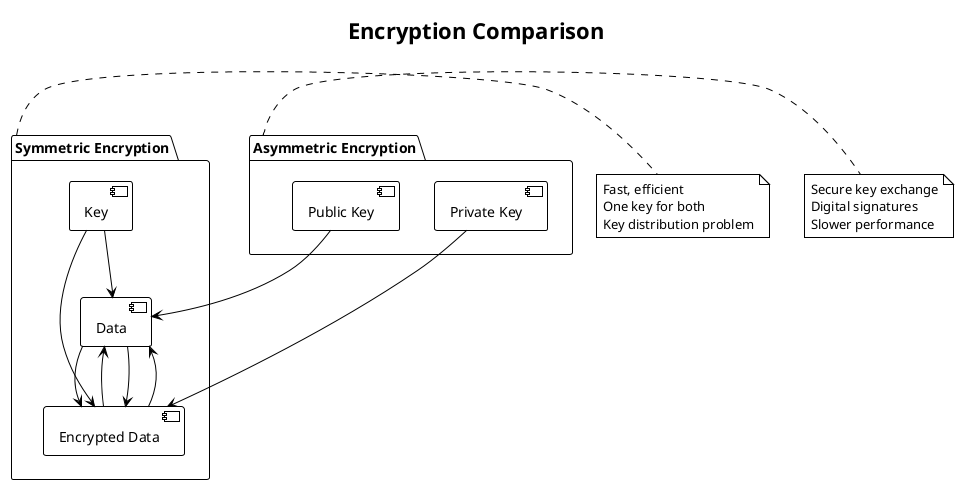
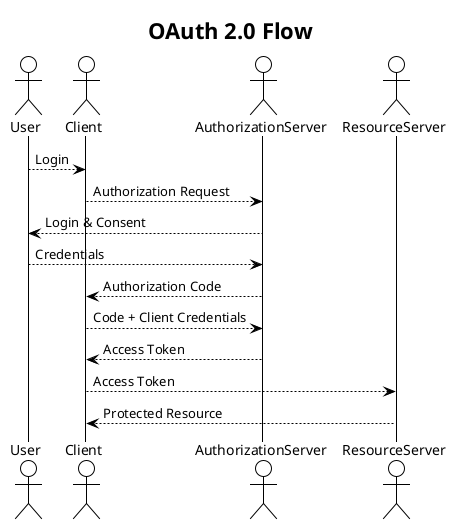

# 🔷 **Презентация: Безопасность систем**

---

## 📌 **Цели занятия**
- Разобраться с симметричным и асимметричным шифрованием и их применением в электронной подписи
- Обсудить векторы атак на хеши, ключи и методы защиты от уязвимостей
- Выявить различие между аутентификацией и авторизацией, изучить методы их реализации (OAuth, JWT, SAML)
- Проанализировать принципы работы SSL/TLS и их роль в обеспечении безопасности данных в сети
- Научиться проектировать системы с учетом требований безопасности и защиты данных при передаче
- Применять методы шифрования для защиты данных на разных уровнях системы

---

## 🎯 **Компетенции**
- Выбирать надежные и эффективные решения защиты доступа и данных
- Определять особенности работы аутентификации и авторизации
- Выбирать решения по шифрованию и хешированию
- Проектировать безопасные системы с учетом современных угроз

---

## ⏱️ **Структура занятия (90 минут)**

| Время | Тема |
|-------|------|
| 0-5 мин | Введение и цели занятия |
| 5-20 мин | Криптографические основы: шифрование и хеширование |
| 20-35 мин | Электронная подпись и векторы атак |
| 35-50 мин | Аутентификация vs Авторизация |
| 50-65 мин | Современные протоколы: OAuth, JWT, SAML |
| 65-80 мин | SSL/TLS и безопасность данных в сети |
| 80-85 мин | Практические рекомендации и best practices |
| 85-90 мин | Q&A и подведение итогов |

---

## 🔐 **1. Криптографические основы (15 мин)**

### **Симметричное шифрование**
- **Определение:** Один ключ для шифрования и дешифрования
- **Алгоритмы:** AES, DES, 3DES
- **Преимущества:** Высокая скорость, простота
- **Недостатки:** Проблема распределения ключей
- **Использование:** Шифрование больших объемов данных

### **Асимметричное шифрование**
- **Определение:** Пара ключей — публичный и приватный
- **Алгоритмы:** RSA, ECC, DSA
- **Преимущества:** Безопасное распределение ключей
- **Недостатки:** Медленнее симметричного
- **Использование:** Обмен ключами, электронная подпись

### **Хеширование**
- **Определение:** Преобразование данных в фиксированный хеш
- **Алгоритмы:** SHA-256, SHA-3, MD5 (устарел)
- **Свойства:** Детерминированность, аморфность, лавинный эффект
- **Использование:** Проверка целостности, хранение паролей

---

## 🛡️ **2. Электронная подпись и векторы атак (15 мин)**

### **Электронная подпись**
- **Процесс:**
  1. Хеширование документа
  2. Шифрование хеша приватным ключом
  3. Прикрепление подписи к документу
- **Проверка:**
  1. Расшифровка подписи публичным ключом
  2. Сравнение с хешем документа

### **Векторы атак**
- **Brute force:** Перебор всех возможных ключей
- **Rainbow tables:** Предварительно вычисленные хеши
- **Collision attacks:** Поиск двух разных входов с одинаковым хешем
- **Man-in-the-middle:** Перехват и модификация данных
- **Replay attacks:** Повторная отправка перехваченных данных

### **Методы защиты**
- **Соление (salting):** Добавление случайных данных к паролю
- **Печенье (peppering):** Добавление секретного значения
- **Key stretching:** Увеличение времени вычисления (PBKDF2, bcrypt, scrypt)
- **Multi-factor authentication:** Дополнительные факторы проверки

---

## 🔑 **3. Аутентификация vs Авторизация (15 мин)**

| **Аутентификация** | **Авторизация** |
|-------------------|----------------|
| Подтверждение личности | Проверка прав доступа |
| "Кто ты?" | "Что ты можешь делать?" |
| Логин/пароль, биометрия | Роли, разрешения |
| Одноразовые пароли | ACL, RBAC |
| Сертификаты | Policy-based access |

### **Методы аутентификации**
- Парольная
- Биометрическая
- Токен-базированная
- Сертификат-базированная
- Многофакторная (MFA)

### **Модели авторизации**
- DAC (Discretionary Access Control)
- MAC (Mandatory Access Control)
- RBAC (Role-Based Access Control)
- ABAC (Attribute-Based Access Control)

---

## 🔗 **4. Современные протоколы (15 мин)**

### **OAuth 2.0**
- **Цель:** Авторизация доступа к ресурсам
- **Flows:** Authorization Code, Implicit, Client Credentials, Resource Owner Password
- **Использование:** Delegated access, API authorization
- **Преимущества:** Гибкость, широкая поддержка
- **Недостатки:** Сложность реализации

### **JWT (JSON Web Token)**
- **Структура:** Header, Payload, Signature
- **Типы:** Access token, Refresh token
- **Преимущества:** Самодостаточность, масштабируемость
- **Недостатки:** Проблемы с отзывом, размер токена
- **Best practices:** Короткий TTL, безопасное хранение

### **SAML (Security Assertion Markup Language)**
- **Цель:** Обмен аутентификационными данными
- **Использование:** Single Sign-On (SSO)
- **Преимущества:** Безопасность, стандарт де-факто
- **Недостатки:** Сложность, XML-ориентированность

---

## 🔒 **5. SSL/TLS и безопасность данных (15 мин)**

### **SSL/TLS: Основные компоненты**
- **Handshake:** Установление безопасного соединения
- **Cipher suites:** Набор алгоритмов шифрования
- **Certificates:** Проверка подлинности сервера
- **Session keys:** Симметричные ключи для шифрования данных

### **TLS Handshake процесс**
1. Client Hello
2. Server Hello
3. Certificate exchange
4. Key exchange
5. Session key establishment
6. Encrypted communication

### **Версии TLS**
- TLS 1.0 (устарел)
- TLS 1.1 (устарел)
- TLS 1.2 (рекомендуется)
- TLS 1.3 (современный стандарт)

### **Best practices**
- Использование TLS 1.2+
- Strong cipher suites
- HSTS (HTTP Strict Transport Security)
- Certificate pinning
- Regular certificate rotation

---

## 🛠️ **6. Практические рекомендации (5 мин)**

### **Security by Design**
- Принцип наименьших привилегий
- Defense in depth
- Zero trust architecture
- Secure default configurations

### **Data Protection**
- Encryption at rest (AES-256)
- Encryption in transit (TLS 1.3)
- Secure key management
- Regular security audits

### **Monitoring and Response**
- Logging and monitoring
- Intrusion detection systems
- Incident response plan
- Regular penetration testing

---

## ❓ **7. Проверочные вопросы (5 мин)**

**Вопрос 1:**  
Какой алгоритм лучше использовать для хранения хешей паролей?

A) MD5  
B) SHA-1  
C) SHA-256  
D) bcrypt  
E) AES  
F) RSA  

✅ **Правильный ответ: D) bcrypt**

**Объяснение:** bcrypt специально разработан для хранения паролей:
- **Key stretching** — замедляет процесс хеширования
- **Salt встроен** — предотвращает атаки rainbow tables
- **Adaptive** — можно увеличивать cost factor
- **Трудоемкий** — делает brute force атаки неэффективными

MD5, SHA-1, SHA-256 — не подходят для паролей (быстрые, уязвимы к атакам). AES и RSA — алгоритмы шифрования, не хеширования.

**Вопрос 2:**  
Что обеспечивает TLS в процессе handshake?

A) Аутентификацию сервера  
B) Согласование шифров  
C) Обмен симметричными ключами  
D) Все вышеперечисленное  
E) Только шифрование данных  
F) Только аутентификацию клиента  

✅ **Правильный ответ: D) Все вышеперечисленное**

**Объяснение:** TLS handshake обеспечивает:
- **Аутентификацию сервера** через сертификаты
- **Согласование шифров** (cipher suites)
- **Обмен ключами** для симметричного шифрования
- **Установление безопасного канала**

Это комплексный процесс, обеспечивающий безопасность всего соединения.

---

## 📚 **Результаты занятия**
- Конспект основных концепций безопасности
- Понимание различий между аутентификацией и авторизацией
- Знание современных протоколов и их применения
- Навыки проектирования безопасных систем
- Готовность к technical interviews по security topics

---

## 📌 **Домашнее задание**
1. Спроектировать систему аутентификации для веб-приложения с требованиями:
   - Поддержка OAuth 2.0
   - Использование JWT
   - Реализация MFA
   - Соответствие security best practices

2. Проанализировать security audit одного из популярных open-source проектов и выявить потенциальные уязвимости.

---

## 🔗 **Дополнительные ресурсы**
- OWASP Top 10
- NIST Cybersecurity Framework
- RFC по TLS и OAuth
- Security documentation от cloud providers
- Books: "Security Engineering" by Ross Anderson, "The Web Application Hacker's Handbook"

---

## 🎯 **Итоги**
- Безопасность — не опция, а обязательный компонент системы
- Понимание основ криптографии критично для разработчиков
- Современные протоколы решают сложные задачи безопасности
- Security by design — основа надежных систем
- Постоянное обучение — ключ к актуальности знаний