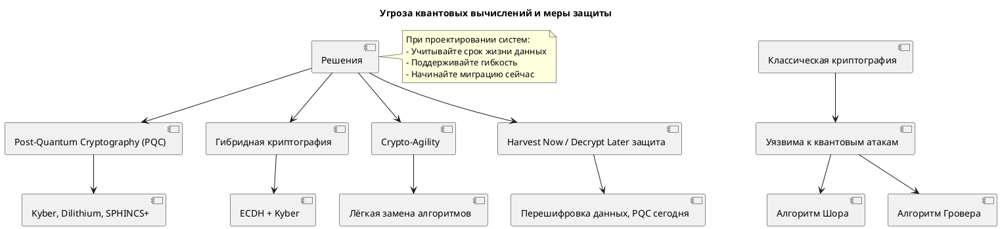

Квантовые вычисления — это не фантастика, а **реальность, которая уже влияет на проектирование информационных систем**, особенно с точки зрения **долгосрочной информационной безопасности**.

Хотя универсальные, масштабируемые квантовые компьютеры (capable of breaking modern crypto) ещё не существуют, **угроза квантового взлома уже актуальна сегодня** — особенно для систем, которые должны быть безопасны **в течение 10–30 лет**.

---

## 🔮 Почему квантовые вычисления — это угроза?

Классическая криптография (которой мы активно пользуемся) основана на **математических задачах, трудных для классических компьютеров**:

- **Факторизация больших чисел** → RSA
- **Дискретное логарифмирование** → Diffie-Hellman, DSA, ECDSA
- **Эллиптические кривые** → ECDH, ECDSA

Квантовые компьютеры, используя **алгоритм Шора (Shor’s Algorithm)**, могут решать эти задачи **экспоненциально быстрее**, чем классические машины.

> 📌 Это означает, что **RSA, ECC, DH — будут сломаны**, как только появятся достаточно мощные квантовые компьютеры.

---

## 🧨 Какие технологии окажутся под угрозой?

| Технология               | Уязвима к квантовым атакам? | Почему                                                          |
| ------------------------ | --------------------------- | --------------------------------------------------------------- |
| **RSA**                  | ✅ Да                       | Алгоритм Шора факторизует модуль за полиномиальное время        |
| **ECC / ECDSA / ECDH**   | ✅ Да                       | Шор решает задачу дискретного логарифма на эллиптических кривых |
| **Diffie-Hellman**       | ✅ Да                       | То же самое                                                     |
| **DSA**                  | ✅ Да                       | Основан на дискретном логарифмировании                          |
| **AES-256**              | ⚠️ Частично                 | Гровера ускоряет перебор, но 256 бит → остаётся безопасным      |
| **SHA-256, SHA-3**       | ⚠️ Частично                 | Квантовые атаки на хэши (Grover) — но требуют огромных ресурсов |
| **Пароли, хэши паролей** | ⚠️ Да, если короткие        | Гровер ускоряет перебор в √N раз                                |

---

## 🛡 Что делать? Подходы к "квантово-устойчивому" проектированию

### 1. **Post-Quantum Cryptography (PQC)**
Использование **криптографических алгоритмов, устойчивых к квантовым атакам**.

#### Примеры квантово-устойчивых подходов:
| Класс             | Примеры                          | Применение        |
| ----------------- | -------------------------------- | ----------------- |
| **Lattice-based** | Kyber (KEM), Dilithium (подпись) | Шифрование, ключи |
| **Hash-based**    | SPHINCS+                         | Цифровые подписи  |
| **Code-based**    | McEliece                         | Шифрование        |
| **Multivariate**  | Rainbow (подпись)                | Менее популярны   |

> 📌 **NIST** уже выбрал первые стандарты PQC (2022–2024):
> - **CRYSTALS-Kyber** — для обмена ключами (KEM)
> - **CRYSTALS-Dilithium**, **SPHINCS+**, **FALCON** — для подписей

---

### 2. **Гибридная криптография (Hybrid Cryptography)**
> Использование **одновременно классической и пост-квантовой криптографии**.

#### Пример: TLS с гибридным обменом ключами
- Клиент генерирует:
  - ECDH-ключ,
  - и Kyber-ключ.
- Оба передаются серверу.
- Общий секрет — комбинация обоих.

✅ Преимущество:
- Совместимость с текущими системами,
- Защита от классических **и** квантовых атак.

> 🔐 Такой подход уже используется в:
> - Google,
> - Cloudflare,
> - OpenSSH (экспериментально),
> - новых версиях TLS (1.3+ расширения).

---

### 3. **Криптографическая агора (Crypto-Agility)**
> Способность системы **быстро менять криптографические алгоритмы** без переписывания архитектуры.

#### Что включает:
- Абстракции над шифрованием (интерфейсы, плагины),
- Поддержка нескольких алгоритмов одновременно,
- Возможность обновления "на лету".

> 💡 Пример:  
> Вместо жёсткой привязки к RSA — использовать `KeyExchangeProvider`, который может быть ECDH, Kyber или гибридным.

---

### 4. **Долгосрочное хранение данных — "захват и расшифруй позже" (Harvest Now, Decrypt Later)**

#### 🚨 Опасность:
Злоумышленник **уже сегодня может перехватывать и сохранять зашифрованный трафик**, в надежде **расшифровать его в будущем**, когда появятся квантовые компьютеры.

> 📌 Особенно угрожает:
> - Государственным архивам,
> - Медицинским данным,
> - Военной и дипломатической переписке,
> - Корпоративным секретам.

#### ✅ Что делать:
- Шифровать **уже сейчас** с учётом будущих угроз.
- Использовать **гибридные схемы**.
- Оценивать **срок жизни данных** — если >10 лет → нужна PQC.

---

### 5. **Обновление PKI и доверенных центров (CA)**
- Сертификаты, подписанные RSA/ECC, **станут ненадёжными**.
- Нужно будет:
  - Перевыпускать сертификаты с PQC-алгоритмами,
  - Обновлять доверенные корни,
  - Поддерживать миграцию в ОС, браузерах, IoT-устройствах.

> 🔧 Уже сейчас:
> - Firefox, Chrome, Windows — тестируют поддержку PQC.
> - Let’s Encrypt и другие CA — готовятся к переходу.

---

## 🧩 Что учитывать при проектировании систем?

| Аспект                         | Что учитывать                                                        |
| ------------------------------ | -------------------------------------------------------------------- |
| **Архитектура**                | Поддержка crypto-agility, модульность криптографии                   |
| **Протоколы**                  | Выбор TLS с поддержкой PQC, использование гибридных схем             |
| **Хранение данных**            | Оценка срока жизни данных — если >5–10 лет → PQC                     |
| **API и интеграции**           | Поддержка нескольких алгоритмов, расширяемость форматов (JOSE, COSE) |
| **Устройства (IoT, embedded)** | PQC-алгоритмы могут быть тяжелее — нужна оптимизация                 |
| **Резервное копирование**      | Зашифрованные бэкапы могут быть уязвимы — нужна перешифровка         |
| **Команды и процессы**         | Обучение DevOps, ИБ, разработчиков основам PQC                       |

---

## 📅 Таймлайн и реалистичные оценки

| Год           | Ожидания                                                                                |
| ------------- | --------------------------------------------------------------------------------------- |
| **2024–2026** | NIST публикует стандарты PQC, первые реализации в ОС и браузерах                        |
| **2026–2030** | Пилотные внедрения в госсекторе, финансах, критической инфраструктуре                   |
| **2030+**     | Массовый переход; RSA/ECC — устаревают                                                  |
| **~2035+**    | Появление квантовых компьютеров, способных сломать 2048-битный RSA (оценка IBM, Google) |

> ⏳ **Сейчас — время готовиться**, а не ждать.

---

## ✅ Рекомендации по действиям

1. **Проведите инвентаризацию критических данных** — что должно быть защищено на 10+ лет?
2. **Оцените криптографические зависимости** — где используется RSA, ECC?
3. **Начните тестировать PQC** в лаборатории (например, BoringSSL с Kyber).
4. **Внедряйте crypto-agility** в архитектуру.
5. **Следите за стандартами NIST, IETF, Cloudflare, Google**.
6. **Обучайте команды** — Dev, DevOps, ИБ.

---

## 💬 Цитата для запоминания

> **"Квантовая угроза начинается не тогда, когда появится квантовый компьютер, а тогда, когда вы перестаёте к нему готовиться."**

---

## 🖼️ Простая схема (можно в PlantUML)

---
