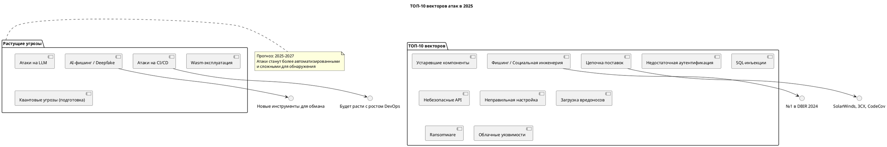

> ❗ **Нет точного "количества векторов атак" в мире** — их число не фиксировано и постоянно **эволюционирует**.  
> Это как спрашивать: «Сколько видов вирусов в природе?» — точного числа нет, но есть **категории, тренды и топ-угрозы**.

Однако мы можем чётко ответить на:
- Какие **векторы атак наиболее актуальны в 2025 году**,
- Какие из них входят в **OWASP Top 10, MITRE ATT&CK, Verizon DBIR** и другие авторитетные рейтинги,
- Какие **прогнозы** дают эксперты на ближайшие годы.

---

## 📊 Как измеряются векторы атак?

Вектор атаки — это **путь, которым злоумышленник проникает в систему**.  
Они классифицируются по:
- **Среде**: веб, сеть, email, облачные платформы, IoT.
- **Методу**: инъекции, подбор, фишинг, эксплуатация уязвимостей.
- **Цели**: данные, доступ, отказ в обслуживании.

---

## 🔝 ТОП-10 векторов атак в 2025 году (на основе OWASP, MITRE, Verizon DBIR, Gartner)

| №   | Вектор атаки                                                | Описание                                                                                        | Источник                 |
| --- | ----------------------------------------------------------- | ----------------------------------------------------------------------------------------------- | ------------------------ |
| 1   | **Социальная инженерия / Фишинг**                           | Самый частый вектор. Включает **целевые фишинг-атаки (spear phishing), бизнес-имитации (BEC)**. | Verizon DBIR 2024        |
| 2   | **Уязвимые и устаревшие компоненты**                        | Использование библиотек/софта с известными CVE (например, Log4Shell, Spring4Shell).             | OWASP Top 10:2021 (A06)  |
| 3   | **Недостаточная аутентификация**                            | Слабые пароли, отсутствие MFA, неправильная реализация сессий.                                  | OWASP A07                |
| 4   | **SQL-инъекции (SQLi)**                                     | По-прежнему в топе, особенно в легаси-системах.                                                 | OWASP A03                |
| 5   | **Небезопасные API**                                        | Неправильная защита REST, GraphQL, gRPC — без аутентификации, валидации.                        | OWASP API Top 10         |
| 6   | **Неправильная настройка безопасности**                     | Открытые S3-бакеты, дебаг-режим в проде, открытие портов.                                       | Verizon DBIR             |
| 7   | **Загрузка вредоносных файлов**                             | Загрузка скриптов, документов с макросами, веб-шеллов.                                          | MITRE T1190              |
| 8   | **Самоисполняемый вредоносный код (Ransomware, Backdoors)** | Через фишинг, эксплойты, компрометацию CI/CD.                                                   | CISA, INTERPOL           |
| 9   | **Компрометация цепочки поставок (Supply Chain Attacks)**   | Взлом пакетных менеджеров (npm, PyPI), подмена образов, компрометация билдов.                   | SolarWinds, CodeCov, 3CX |
| 10  | **Несанкционированный доступ к облачной инфраструктуре**    | Неправильные IAM-политики, пермишен-эскалация, доступ через сервисные аккаунты.                 | MITRE Cloud Matrix       |

---

## 📈 Прогнозы на 2025–2027: новые и растущие векторы

| Вектор                                          | Почему растёт                                                             | Примеры                                           |
| ----------------------------------------------- | ------------------------------------------------------------------------- | ------------------------------------------------- |
| **AI-фишинг и deepfake-атаки**                  | Генерация реалистичных писем, голосов, видео для обмана сотрудников.      | Deepfake-звонок CFO с "приказом" перевести деньги |
| **Атаки на CI/CD-пайплайны**                    | Компрометация артефактов, подмена образов, бэкдоры в билдах.              | Codecov, SolarWinds, Octopus Deploy               |
| **Атаки через mTLS и service mesh**             | Подмена sidecar, эксплуатация уязвимостей в Envoy, Istio.                 | CVE в sidecar-прокси                              |
| **Квантово-ориентированные атаки (подготовка)** | "Захват и расшифруй позже" — сбор трафика для будущего взлома.            | Гос. структуры уже собирают трафик                |
| **Атаки на Wasm-модули**                        | Wasm используется в edge-вычислениях, но может содержать вредоносный код. | FaaS, Cloudflare Workers                          |
| **Атаки на LLM и RAG-системы**                  | Prompt injection, data leakage, обход безопасности ИИ.                    | Подмена контекста в чат-ботах                     |
| **Атаки на IaC (Terraform, Ansible)**           | Уязвимости в шаблонах, хардкод в конфигах, небезопасные модули.           | Утечка секретов через публичные репозитории       |

---

## 🧠 Откуда берутся данные? Основные источники

| Источник                                                                                                                     | Что даёт                                      |
| ---------------------------------------------------------------------------------------------------------------------------- | --------------------------------------------- |
| **[OWASP Top 10](https://owasp.org/www-project-top-ten/)**                                                                   | Топ уязвимостей веб-приложений                |
| **[MITRE ATT&CK](https://attack.mitre.org/)**                                                                                | Тактики, техники и процедуры (TTPs) атакующих |
| **[Verizon Data Breach Investigations Report (DBIR)](https**://www.verizon.com/about/news/data-breach-investigations-report) | Реальные инциденты — кто, как, зачем атаковал |
| **[CISA Known Exploited Vulnerabilities (KEV)](https**://www.cisa.gov/known-exploited-vulnerabilities-catalog)               | Уязвимости, активно используемые в атаках     |
| **[Gartner, Forrester, ENISA]**                                                                                              | Прогнозы и стратегические тренды              |

---

## 🎯 Ключевые выводы на 2025

1. **Фишинг и социальная инженерия — №1**  
   → 74% инцидентов начинаются с человека (Verizon DBIR 2024).

2. **Легаси-уязвимости живы**  
   → SQLi, XSS, устаревшие библиотеки — по-прежнему в топе.

3. **Цепочка поставок — главная поверхность атаки**  
   → Злоумышленник атакует не вас, а вашего поставщика.

4. **Облако и DevOps — новые цели**  
   → IAM, IaC, CI/CD — критически важны для защиты.

5. **AI и LLM — двойной меч**  
   → Помогают защитникам, но и дают новые векторы атакующим.

---

## 🛡 Что делать? Рекомендации

| Мера                                         | Цель                                         |
| -------------------------------------------- | -------------------------------------------- |
| **Внедрить MFA везде**                       | Снизить риск компрометации учётных записей   |
| **Проводить SCA и SAST в CI/CD**             | Находить уязвимые зависимости до продакшена  |
| **Обучать сотрудников фишингу**              | Регулярные симуляции и тренинги              |
| **Применять Zero Trust**                     | Ни один запрос не доверяется по умолчанию    |
| **Шифровать трафик (TLS/mTLS)**              | Защита от перехвата и подмены                |
| **Регулярно аудитить IAM и IaC**             | Найти избыточные права и ошибки конфигурации |
| **Подписывать артефакты (Sigstore, Cosign)** | Гарантия подлинности образов и бинарников    |

---

## 💬 Цитата для запоминания

> **"Самый слабый элемент в системе — не код, а цепочка между клавиатурой и креслом."**

---

## 🖼️ Упрощённая схема (можно в PlantUML)

---

> **Tочное количество векторов атак неизвестно**, потому что:
> - они **эволюционируют**,
> - зависят от контекста (веб, сеть, облачные платформы, IoT, AI),
> - могут быть **комбинациями** базовых уязвимостей,
> - и зависят от **новых технологий** (например, WebAssembly, LLM, квантовые сети).
>
> Но можно оценить **порядок** — сколько их **"в принципе"** может существовать?

---

## 🔢 Оценка порядка количества векторов атак

### 📌 Краткий ответ:
> **От 100 до 100 000+ уникальных векторов**, в зависимости от уровня детализации.  
> Но **практически значимых — несколько сотен**.

Разберём по уровням:

---

### 1. **Количество *категорий* векторов: ~10–100**
Это **широкие классы** атак, используемые в стандартах:

| Источник                   | Количество категорий                  |
| -------------------------- | ------------------------------------- |
| **OWASP Top 10**           | 10 основных типов уязвимостей         |
| **OWASP API Top 10**       | 10                                    |
| **MITRE ATT&CK Framework** | Более **200 техник** (в enterprise)   |
| **CWE Top 25**             | 25 наиболее опасных типов уязвимостей |

👉 На этом уровне — **десятка два до сотни** основных **типов** векторов.

---

### 2. **Количество *конкретных техник*: ~1 000 – 10 000**
Это уже **детализированные векторы**, включая:
- конкретные эксплойты,
- комбинации уязвимостей,
- реализации атак в разных средах.

#### Примеры:
- `SQLi через User-Agent заголовок`
- `XSS через SVG-файл`
- `JWT алгоритм none`
- `Path Traversal в Log4j через JNDI`
- `Подмена OIDC ID-токена`
- `Атака на Istio через gateway`

Каждая уязвимость из **CVE/NVD** (National Vulnerability Database) может порождать **один или несколько векторов**.

> 🔹 В базе **NVD** — более **200 000 зарегистрированных уязвимостей** (на 2025).  
> 🔹 Каждая уязвимость может быть эксплуатирована **одним или несколькими векторами**.

👉 Но **не все векторы уникальны** — многие сводятся к базовым паттернам.

---

### 3. **Количество *уникальных эксплойтов / векторов*: ~10 000 – 100 000+**
Если считать:
- каждую **уникальную комбинацию** уязвимости + среды + метода эксплуатации,
- каждый **эксплойт из Metasploit, ExploitDB, GitHub**,
- каждую **атаку из MITRE ATT&CK** (с подтехниками),

→ получаем **десятки тысяч** реально используемых векторов.

#### Пример:
- `CVE-2021-44228` (Log4Shell) — один CVE, но:
  - может быть эксплуатирован через HTTP-заголовки,
  - через JSON-поля,
  - через JNDI в логах,
  - в Kubernetes,
  - в микросервисах,
  - через email-парсеры и т.д.

👉 **Один CVE → десятки векторов** в зависимости от контекста.

---

### 4. **Теоретически возможных векторов: >1 000 000**
Если рассматривать **все возможные комбинации**:
- входных данных,
- протоколов,
- форматов (JSON, XML, YAML, Protobuf),
- методов инъекции,
- мест обработки (backend, frontend, proxy, sidecar, WAF),

→ число **теоретически возможных векторов** может **превысить миллион**.

Но:
- 99% из них **никогда не используются**,
- многие **технически невозможны**,
- большинство сводятся к **уже известным паттернам**.

---

## 📊 Сводка: порядок количества векторов

| Уровень                              | Оценка количества     | Пояснение                       |
| ------------------------------------ | --------------------- | ------------------------------- |
| **Базовые категории**                | **~10 – 100**         | OWASP Top 10, MITRE тактики     |
| **Конкретные техники**               | **~1 000 – 10 000**   | Подтехники MITRE, типы инъекций |
| **Реальные эксплуатируемые векторы** | **~10 000 – 100 000** | CVE + контекст + эксплойты      |
| **Теоретически возможные**           | **> 1 000 000**       | Все комбинации входов и систем  |

---

## 🎯 Главный вывод

> ❗ **Не количество векторов важно — а их *распространённость* и *влияние*.**  
> Злоумышленники используют **не все 100 000**, а **топ-10–100 самых эффективных**.

👉 Как сказал один специалист по ИБ:
> **"Хватит 10 векторов, чтобы сломать 90% систем."**

---

## ✅ Что из этого запомнить?

- **Не нужно знать все векторы**, но **нужно понимать принципы**:
  - Как возникает уязвимость?
  - Как её можно эксплуатировать?
  - Как предотвратить?
- Обучать **мышлению атакующего**, а не заучиванию списков.
- Использовать **MITRE ATT&CK** как карту, а не справочник.

---
