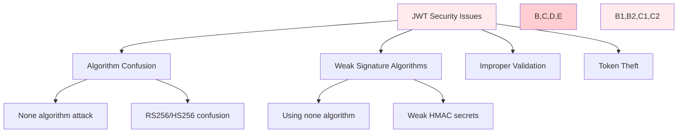
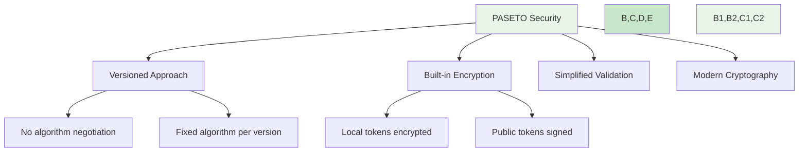

# 🔐 **Современные токены аутентификации**

---

## 📋 **Общее сравнение**

| Характеристика | **JWT (JSON Web Token)** | **PASETO (Platform-Agnostic Security Tokens)** |
| :--- | :--- | :--- |
| **Год создания** | 2010 | 2018 |
| **Стандарт** | RFC 7519 | RFC 8417 |
| **Философия** | Гибкость и расширяемость | Простота и безопасность |
| **Подход** | Много алгоритмов и опций | Ограниченный набор версий |
| **Структура** | `header.payload.signature` | `version.purpose.nonce.payload.footer` |
| **Алгоритмы** | Множество (HS256, RS256, ES256 и др.) | Фиксированные версии (v1, v2, v3, v4) |
| **Шифрование** | Требует отдельной реализации (JWE) | Встроено (local tokens) |
| **Безопасность** | Зависит от правильной реализации | Встроенная защита от атак |
| **Уязвимости** | Algorithm Confusion, weak signatures | Минимум векторов атак |
| **Гибкость** | Высокая (custom claims) | Ограниченная (фиксированные форматы) |
| **Экосистема** | Широкая поддержка | Меньше библиотек |
| **Размер токена** | Компактный | Больше (из-за nonce и версий) |
| **Отладка** | Человекочитаемый (base64) | Закодирован (бинарный формат) |
| **Когда использовать** | Интеграция с существующими системами, гибкость в claims | Новые проекты с фокусом на безопасность |
| **Когда избегать** | Высокие требования к безопасности | Интеграция с legacy системами |

---

## 🔧 **Технические особенности**

### **JWT (JSON Web Token):**
```json
{
  "header": {
    "alg": "HS256",
    "typ": "JWT"
  },
  "payload": {
    "sub": "1234567890",
    "name": "John Doe",
    "iat": 1516239022
  },
  "signature": "HMACSHA256(...)"
}
```

**Преимущества:**
✅ Широкая поддержка и экосистема  
✅ Гибкость в выборе алгоритмов  
✅ Расширяемость через claims  

**Недостатки:**
❌ Уязвимости при неправильной реализации  
❌ Алгоритм confusion attacks  
❌ Сложность валидации  

### **PASETO:**
```
v4.local.AAAAAAAAAAAAAAAA...
```

**Версии:**
- **v1**: RSASSA-PKCS1-v1_5 + AES-CTR + HMAC-SHA384
- **v2**: EdDSA + XChaCha20-Poly1305
- **v3**: RSASSA-PSS + AES-256-CTR + HMAC-SHA384
- **v4**: Ed25519 + XChaCha20-Poly1305

**Преимущества:**
✅ Встроенная защита от атак  
✅ Простота реализации  
✅ Нет алгоритм confusion  
✅ Лучшая криптография  

**Недостатки:**
❌ Меньше поддержки  
❌ Меньше гибкости  
❌ Новизна стандарта  

---

## ⚔️ **Сравнение безопасности**

### **JWT уязвимости:**


### **PASETO преимущества:**


---

## 🛡️ **Реализация**

### **JWT Implementation:**
```javascript
// Node.js JWT Example
const jwt = require('jsonwebtoken');

// Создание токена
const token = jwt.sign(
  { userId: 123, role: 'user' },
  process.env.JWT_SECRET,
  { expiresIn: '1h', algorithm: 'HS256' }
);

// Валидация токена
try {
  const decoded = jwt.verify(token, process.env.JWT_SECRET);
  // Проверка claims и бизнес-логики
} catch (error) {
  // Обработка ошибок валидации
}
```

### **PASETO Implementation:**
```javascript
// Node.js PASETO Example
const { V4 } = require('paseto');

// Создание локального токена
const token = await V4.encrypt(
  { userId: 123, role: 'user' },
  Buffer.from(process.env.PASETO_KEY, 'hex')
);

// Валидация токена
try {
  const decoded = await V4.decrypt(
    token,
    Buffer.from(process.env.PASETO_KEY, 'hex')
  );
} catch (error) {
  // Обработка ошибок дешифрования
}
```

---

## 📊 **Сравнение использования**

### **JWT:**
✅ **Когда использовать:**
- Существующие системы с JWT инфраструктурой
- Требуется гибкость в claims
- Интеграция с third-party сервисами

❌ **Когда избегать:**
- Высокие требования к безопасности
- Нет опыта в криптографии
- Критичные данные

### **PASETO:**
✅ **Когда использовать:**
- Новые проекты с фокусом на безопасность
- Высокие требования к защите данных
- Простота реализации важна

❌ **Когда избегать:**
- Нужна интеграция с legacy системами
- Требуется специфичная кастомизация
- Ограниченная поддержка библиотек

---

## 🎯 **Рекомендации для System Design**

### **Выбор JWT, если:**
- Интеграция с существующими OAuth2/OpenID Connect провайдерами
- Требуется расширяемость через custom claims
- Команда имеет опыт работы с JWT

### **Выбор PASETO, если:**
- Проектирование новой системы с нуля
- Высокие требования к безопасности (финансы, здравоохранение)
- Предпочтение простоты и надежности

### **Архитектурные соображения:**
```yaml
security_considerations:
  jwt:
    - Use only HS256 or RS256
    - Implement proper token validation
    - Use short expiration times
    - Implement refresh token rotation
  
  paseto:
    - Use v4 for new implementations
    - Proper key management
    - Implement token blacklisting if needed
```

---

## 🔚 **Вывод**

**JWT** - зрелый стандарт с широкой экосистемой, но требует осторожности в реализации  
**PASETO** - современный подход с встроенной безопасностью, но меньшей гибкостью  

Выбор зависит от:
- Требований к безопасности проекта
- Опыта команды
- Существующей инфраструктуры
- Долгосрочных целей системы

Оба подхода могут быть частью безопасной архитектуры при правильной реализации.
