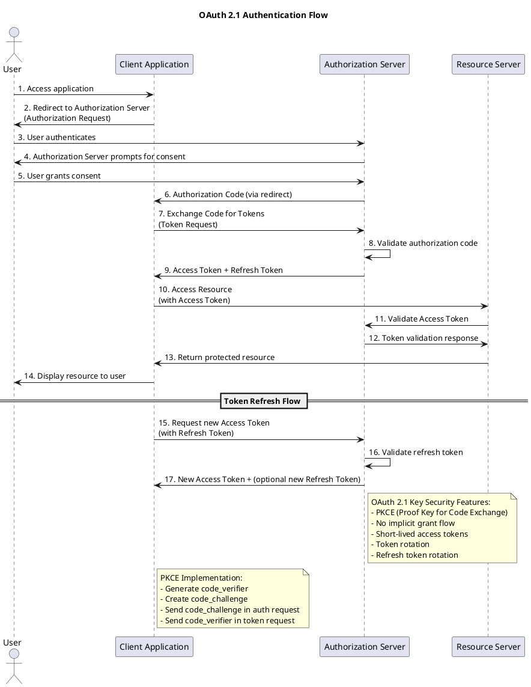

Эта схема включает:

1. **Основной поток авторизации** через Authorization Code Grant
2. **Поток обновления токенов**
3. **Заметки о ключевых особенностях OAuth 2.1**:
   - Использование PKCE для защиты от перехвата кодов авторизации
   - Отсутствие Implicit Grant (который был в OAuth 2.0)
   - Ротация токенов для повышения безопасности

Если нужно, могу создать более детализированную версию для конкретного типа приложения (web, mobile, SPA и т.д.).