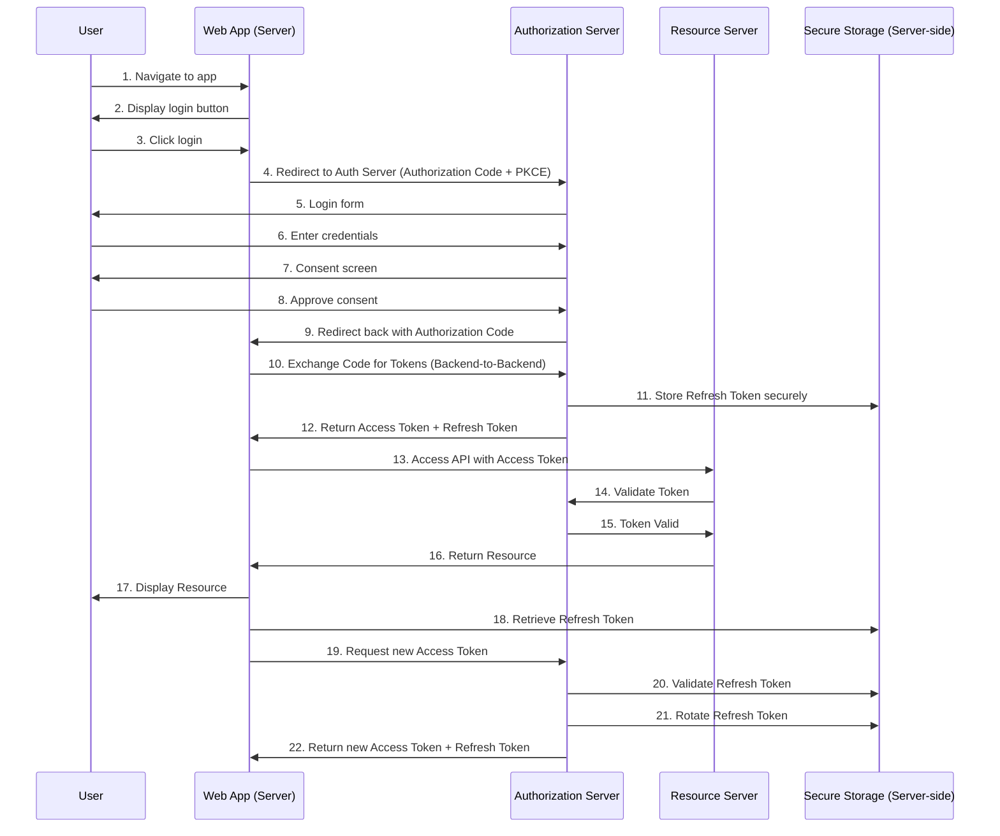
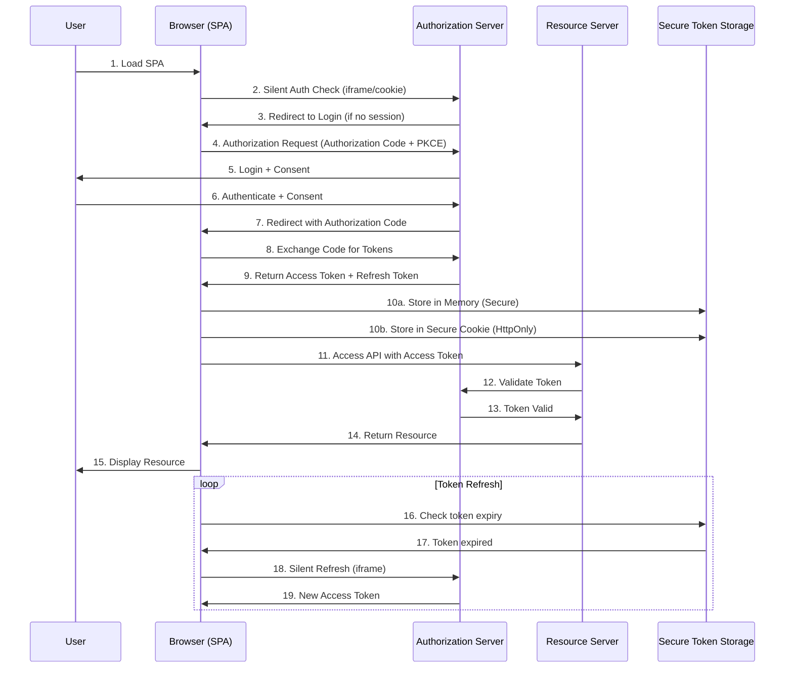
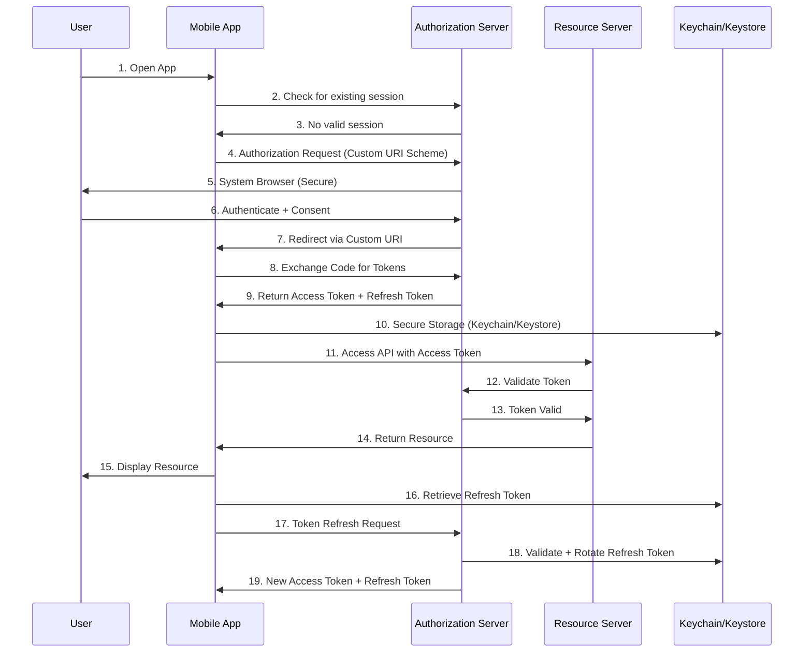
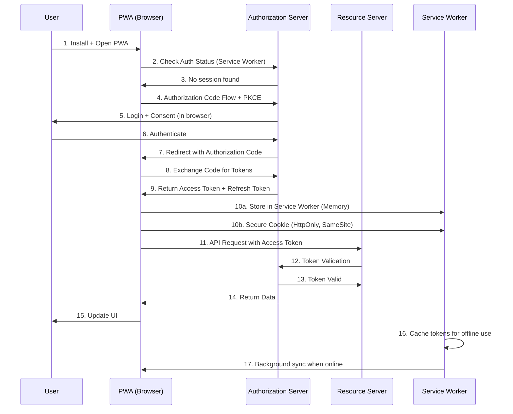

Вот расширенные схемы OAuth 2.1 Auth Flow + Refresh для различных типов клиентов:

## 🌐 **Web Application (Traditional Server-Side)**

**Особенности:**
- ✅ **PKCE** для защиты от code interception
- ✅ **Backend storage** токенов (безопасно)
- ✅ **Secure session cookies** (HttpOnly, SameSite)
- ✅ **Token rotation** при refresh

---

## 🖥️ **Single Page Application (SPA)**

**Особенности:**
- ✅ **PKCE обязательна** (публичный клиент)
- ⚠️ **Ограниченное хранение токенов** (no HttpOnly cookies)
- ✅ **Silent refresh** через iframe
- ⚠️ **Внимание к XSS/CSRF**

---

## 📱 **Mobile Application (Native)**

**Особенности:**
- ✅ **System Browser** для безопасности
- ✅ **Custom URI schemes** для redirect
- ✅ **Secure storage** (Keychain/Keystore)
- ✅ **Background refresh** возможен
- ✅ **AppAuth libraries** рекомендованы

---

## 🌐 **Progressive Web App (PWA)**

**Особенности:**
- ✅ **Service Worker** для offline capabilities
- ✅ **Hybrid approach** (web + native-like features)
- ⚠️ **Storage limitations** как у SPA
- ✅ **Push notifications** для session management
- ✅ **Installable** с homescreen

---

## 🛡️ **Сравнительная таблица реализаций**

| Характеристика | **Web App** | **SPA** | **Mobile** | **PWA** |
|----------------|-------------|---------|------------|---------|
| **Хранение токенов** | Server-side DB | Browser memory/cookies | Keychain/Keystore | Service Worker |
| **PKCE** | Рекомендуется | Обязательна | Рекомендуется | Обязательна |
| **Redirect URI** | HTTPS URL | HTTPS URL | Custom Scheme | HTTPS URL |
| **Browser** | Server-side | In-app | System | Browser/PWA |
| **Refresh Token Storage** | Secure Server DB | Browser-limited | Secure OS Storage | Service Worker |
| **Offline Support** | Limited | No | Yes | Yes (Service Worker) |
| **Security Level** | Высокий | Средний | Высокий | Средний-Высокий |

---

## 🔐 **Рекомендации по безопасности:**

### **Для всех клиентов:**
- ✅ Использовать **Authorization Code Flow + PKCE**
- ✅ Реализовать **Token Rotation**
- ✅ Настроить **Session Management**
- ✅ Включить **Rate Limiting**
- ✅ Использовать **Short-lived Access Tokens**

### **Специфично:**
- **Web Apps**: Хранить токены на сервере
- **SPA/PWA**: Минимизировать хранение токенов, использовать silent refresh
- **Mobile**: Использовать системный браузер, безопасное хранение

Эти схемы демонстрируют современные подходы к реализации OAuth 2.1 для различных типов клиентов с учетом их специфики и ограничений.