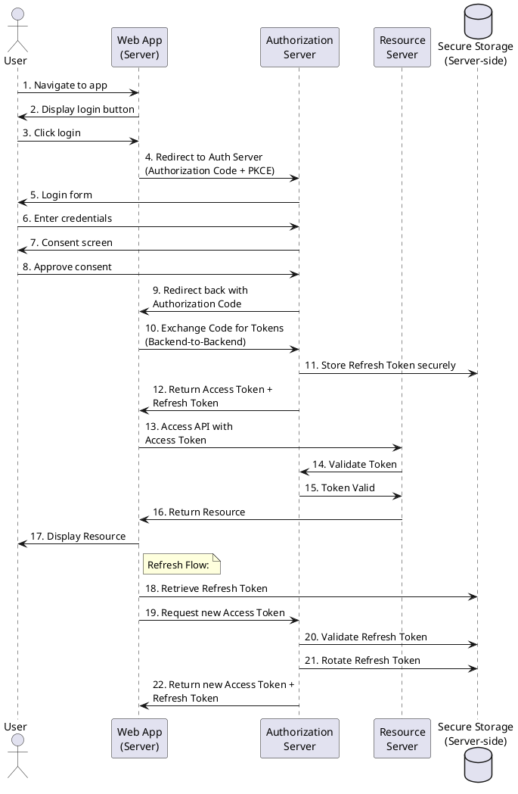
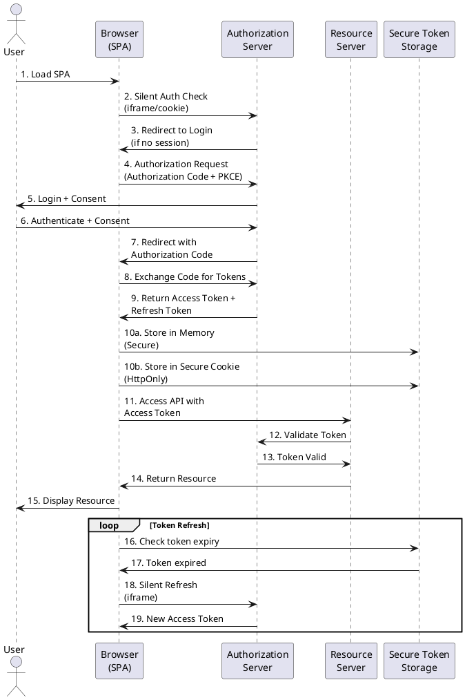
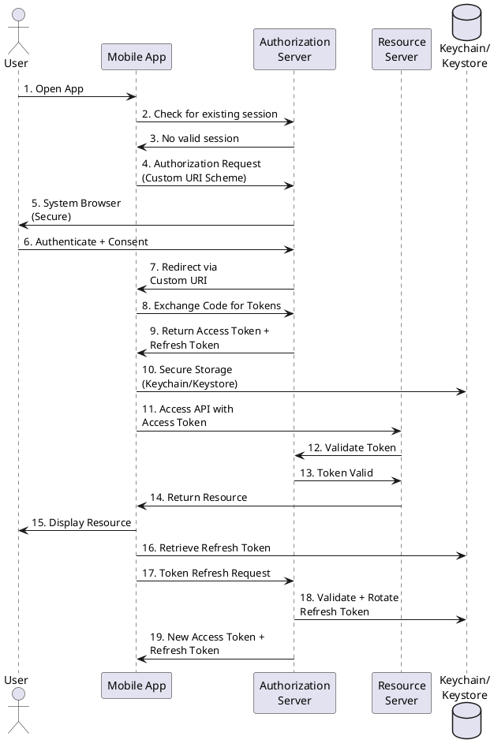
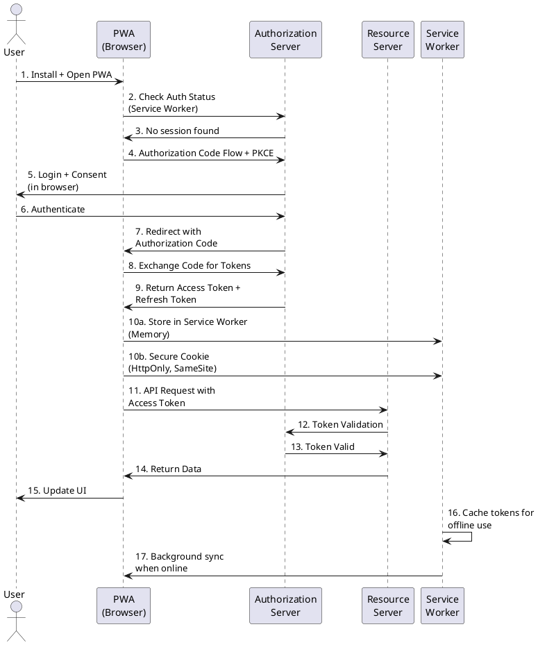

## 🌐 **Web Application (Traditional Server-Side)**

## 🖥️ **Single Page Application (SPA)**

## 📱 **Mobile Application (Native)**

## 🌐 **Progressive Web App (PWA)**

## 🛡️ **Сравнительная таблица реализаций**

| Характеристика | Web App | SPA | Mobile | PWA |
|:---|:---|:---|:---|
| Хранение токенов | Server-side DB | Browser memory/cookies | Keychain/Keystore | Service Worker |
| PKCE | Рекомендуется | Обязательна | Рекомендуется | Обязательна |
| Redirect URI | HTTPS URL | HTTPS URL | Custom Scheme | HTTPS URL |
| Browser | Server-side | In-app | System | Browser/PWA |
| Refresh Token Storage | Secure Server DB | Browser-limited | Secure OS Storage | Service Worker |
| Offline Support | Limited | No | Yes | Yes (Service Worker) |
| Security Level | Высокий | Средний | Высокий | Средний-Высокий |

Сравнение реализаций OAuth 2.1 для разных типов клиентов

Эти диаграммы демонстрируют различные подходы к реализации OAuth 2.1 для различных типов клиентов с учетом их специфики и ограничений.