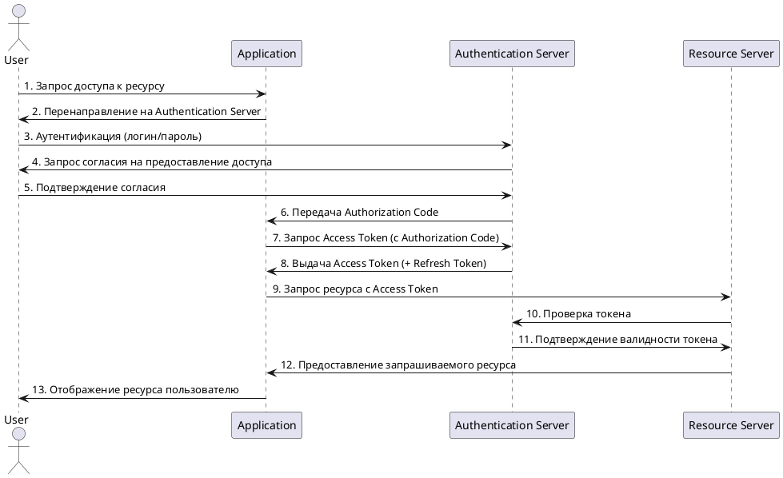
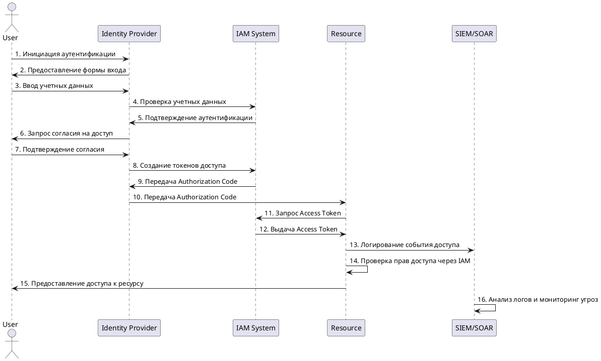
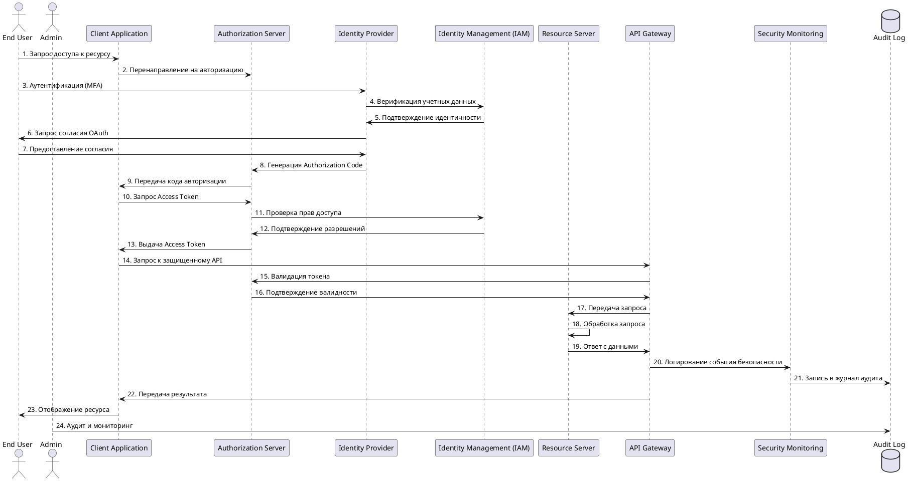

## Схема 1: OAuth 2.1 Flow с основными участниками

## Схема 2: OAuth 2.1 Flow с расширенными участниками

## Схема 3: OAuth 2.1 Flow с учетом требований безопасности

**Преимущества:**
1. **API Gateway** - централизованная точка контроля доступа
2. **Admin** - для управления и аудита системы
3. **Audit Log** - отдельное хранилище для логов безопасности
4. **Security Monitoring** - специализированная система мониторинга
5. **MFA** - многофакторная аутентификация для повышения безопасности

Этот набор лучше отражает современные требования к безопасности и соответствует принципам Zero Trust Architecture.