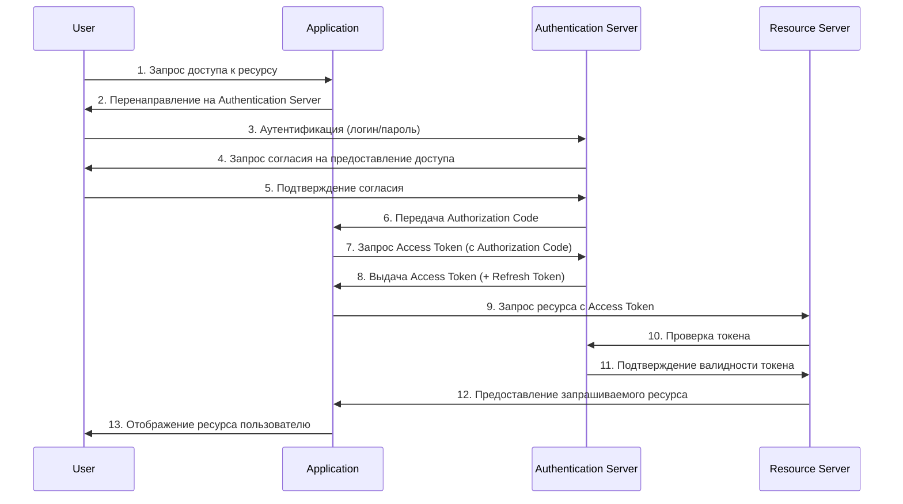
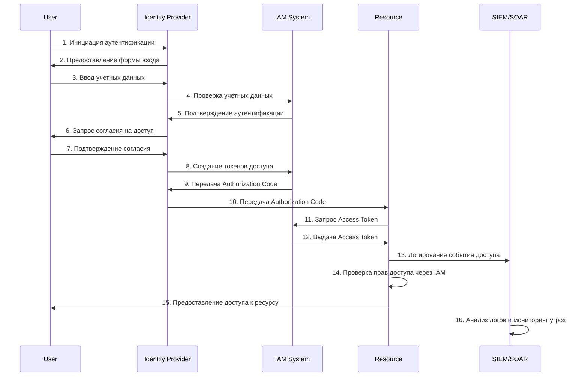
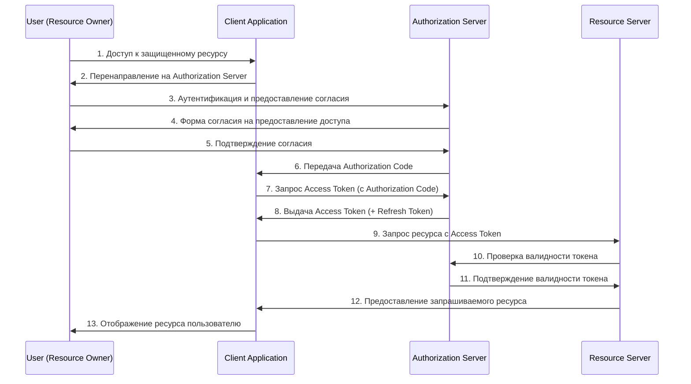

Вот две схемы OAuth 2.1 Authentication Flow в формате Mermaid:

## Схема 1: OAuth 2.1 Flow с основными участниками

## Схема 2: OAuth 2.1 Flow с расширенными участниками

Эти схемы демонстрируют поток аутентификации OAuth 2.1 с учетом различных уровней абстракции участников процесса. Первая схема показывает базовый поток, а вторая - более детализированное взаимодействие с системами безопасности и управления идентификацией.

Вот общая схема взаимодействия участников OAuth 2.0:

**Участники:**
- **User (Resource Owner)**: Владелец данных/ресурсов
- **Client Application**: Приложение, запрашивающее доступ
- **Authorization Server**: Сервер, выдающий токены доступа
- **Resource Server**: Сервер, хранящий защищенные ресурсы

Эта схема демонстрирует стандартный **Authorization Code Flow** OAuth 2.0, который обеспечивает безопасную аутентификацию и делегирование доступа.
