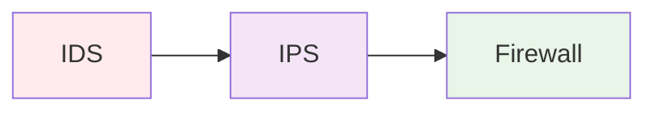

## 🔥 **Firewall (Брандмауэр)**

### **Определение:**
**Firewall** - это **сетевой фильтр**, который контролирует **входящий и исходящий сетевой трафик** на основе **заранее определенных правил безопасности**.

### **Основные функции:**
- **Фильтрация трафика** по портам, протоколам, IP-адресам
- **Блокировка** подозрительных соединений
- **NAT** (Network Address Translation)
- **VPN** туннелирование

### **Типы Firewall:**
```
1. Пакетные фильтры ( Stateless )
2. Фильтры с отслеживанием состояния ( Stateful )
3. Прокси-файрволы ( Application Layer )
4. Next-Generation Firewall ( NGFW )
```

---

## 👁️ **IDS (Intrusion Detection System)**

### **Определение:**
**IDS** - это **система обнаружения вторжений**, которая **мониторит сетевой трафик** и **анализирует его** на наличие **подозрительной активности** или **известных атак**.

### **Основные функции:**
- **Мониторинг** сетевого трафика
- **Анализ** паттернов атак
- **Генерация алертов**
- **Логирование** инцидентов

### **Типы IDS:**
```
1. NIDS (Network-based IDS) - анализ сетевого трафика
2. HIDS (Host-based IDS) - анализ активности на хосте
3. Signature-based IDS - поиск известных сигнатур
4. Anomaly-based IDS - обнаружение отклонений
```

---

## ⚔️ **Различия между Firewall и IDS**

| Характеристика | **Firewall** | **IDS** |
|----------------|--------------|---------|
| **Основная функция** | Блокировка/разрешение трафика | Обнаружение атак |
| **Реакция** | Активная (блокирует в реальном времени) | Пассивная (только оповещает) |
| **Позиция** | На границе сетей | Внутри сети/на хостах |
| **Действие** | Предотвращает атаки | Обнаруживает атаки |

---

## 🛡️ **Современные решения**

### **IPS (Intrusion Prevention System):**


**IPS** = **IDS + активная защита** (может блокировать трафик)

### **NGFW (Next-Generation Firewall):**
- Встроенный **IPS**
- **Глубокая инспекция** трафика
- **Контроль приложений**
- **Интеграция с облачными сервисами**

---

## 🎯 **Пример защиты**

```mermaid
graph TD
    Internet --> A[Firewall]
    A --> B[IPS/IDS]
    B --> C[Internal Network]
    B -.-> D[Security Team]
    
    style A fill:#e8f5e8
    style B fill:#f3e5f5
    style C fill:#e1f5fe
    style D fill:#fff3e0
    
    note right of A
        Фильтрация трафика
        по правилам безопасности
    end note
    
    note right of B
        Обнаружение и
        предотвращение атак
    end note
```

---

## 📊 **Когда использовать:**

### **Firewall:**
- ✅ **Обязательно** на границе сетей
- ✅ **Фильтрация** по политикам безопасности
- ✅ **NAT** и **VPN** функции

### **IDS/IPS:**
- ✅ **Мониторинг** внутренней сети
- ✅ **Обнаружение** нулевых дней
- ✅ **Анализ** подозрительной активности
- ✅ **Соответствие** требованиям безопасности

**Firewall/IDS** - это **базовые элементы** любой системы информационной безопасности!