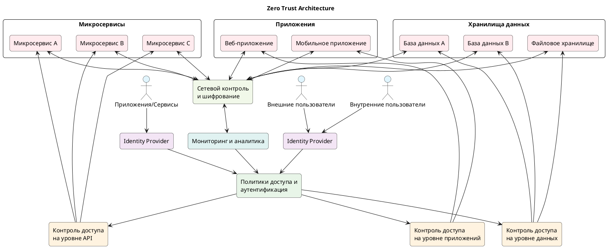
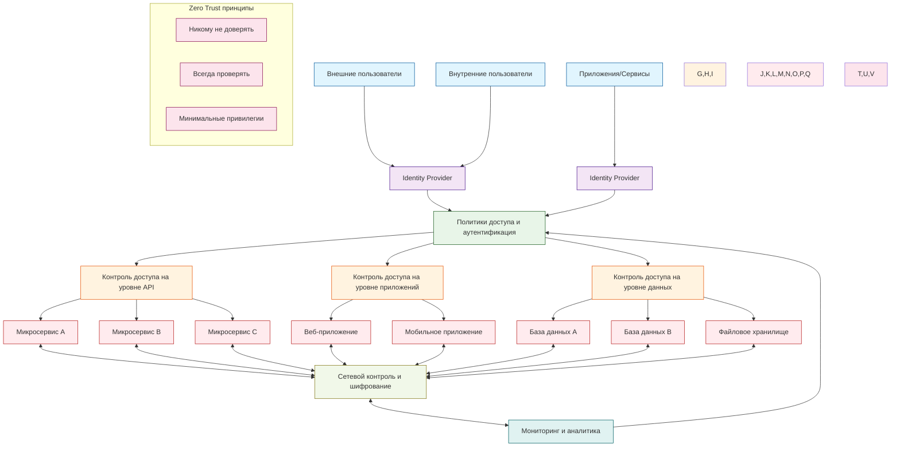

## 🔐 **Принципы Zero Trust архитектуры:**

### **Основные принципы:**
1. **Никому не доверять** - проверять все запросы
2. **Всегда проверять** - непрерывная аутентификация
3. **Минимальные привилегии** - доступ только к необходимому

### **Ключевые компоненты:**
- **Identity Provider** - централизованная аутентификация
- **Политики доступа** - динамическое управление правами
- **Контроль на каждом уровне** - приложения, данные, API
- **Сетевой контроль** - шифрование и мониторинг
- **Непрерывный мониторинг** - аналитика и реагирование

### **Преимущества:**
✅ **Защита от внутренних угроз**  
✅ **Сопротивление компрометации учетных записей**  
✅ **Гранулярный контроль доступа**  
✅ **Соответствие требованиям безопасности**  
✅ **Защита в гибридной среде**  

Эта диаграмма иллюстрирует архитектуру Zero Trust с ключевыми компонентами:
1. **Идентификация** - через Identity Provider для всех типов пользователей и сервисов
2. **Политики доступа** - централизованное управление аутентификацией и авторизацией
3. **Гранулярный контроль доступа** - на уровне API, приложений и данных
4. **Защищенная сеть** - с контролем и шифрованием трафика
5. **Непрерывный мониторинг** - для анализа и адаптации политик
6. **Основные принципы** - не доверять, всегда проверять, минимальные привилегии

