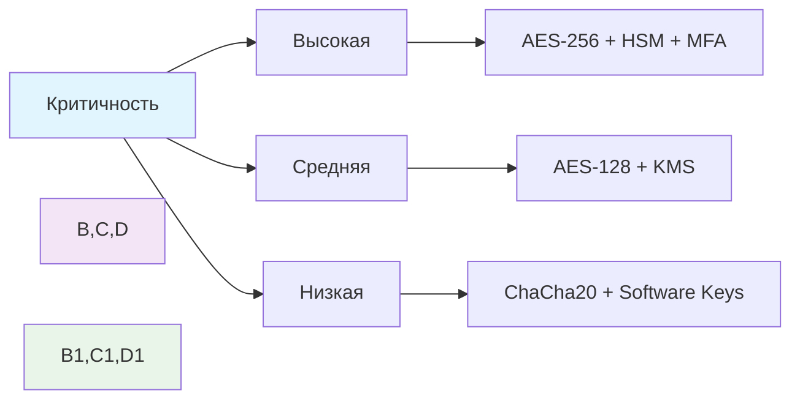

## 🔌 **1. Физический уровень**

### **Методы шифрования:**
- **Шифрование на уровне оборудования**
- **TPM (Trusted Platform Module)**
- **HSM (Hardware Security Module)**
- **Self-Encrypting Drives (SED)**

### **Принципы применения:**
- **Full Disk Encryption (FDE)**
- **Аппаратное шифрование**
- **Защита ключей на чипах**

### **Примеры:**
```bash
# BitLocker (Windows)
manage-bde -on C: -encryptionmethod XTS-AES-256

# FileVault (macOS)
fdesetup enable

# LUKS (Linux)
cryptsetup luksFormat /dev/sda1
```

### **Преимущества:**
✅ **Прозрачность** для пользователя  
✅ **Высокая производительность**  
✅ **Защита при физическом доступе**  

---

## 🌐 **2. Сетевой уровень**

### **Методы шифрования:**
- **TLS/SSL** (Transport Layer Security)
- **IPsec** (Internet Protocol Security)
- **SSH** (Secure Shell)
- **VPN** (Virtual Private Network)

### **Принципы применения:**
- **End-to-End Encryption**
- **Channel Encryption**
- **Mutual Authentication**

### **Примеры:**
```nginx
# HTTPS конфигурация (Nginx)
server {
    listen 443 ssl;
    ssl_certificate /path/to/cert.pem;
    ssl_certificate_key /path/to/key.pem;
    ssl_protocols TLSv1.2 TLSv1.3;
    ssl_ciphers ECDHE-RSA-AES256-GCM-SHA384;
}
```

```bash
# IPsec настройка
ipsec auto --add my-tunnel
ipsec auto --up my-tunnel
```

### **Преимущества:**
✅ **Защита при передаче**  
✅ **Аутентификация**  
✅ **Целостность данных**  

---

## 🖥️ **3. Прикладной уровень**

### **Методы шифрования:**
- **Application Layer Encryption**
- **Field-level Encryption**
- **API Encryption**
- **Message Encryption**

### **Принципы применения:**
- **Selective Encryption**
- **Attribute-based Encryption**
- **Homomorphic Encryption**

### **Примеры:**
```python
# Field-level encryption (Python)
from cryptography.fernet import Fernet

class SecureField:
    def __init__(self, key):
        self.cipher = Fernet(key)
    
    def encrypt(self, data):
        return self.cipher.encrypt(data.encode())
    
    def decrypt(self, encrypted_data):
        return self.cipher.decrypt(encrypted_data).decode()
```

```javascript
// API encryption (Node.js)
const crypto = require('crypto');

function encryptData(data, key) {
    const cipher = crypto.createCipher('aes-256-cbc', key);
    let encrypted = cipher.update(data, 'utf8', 'hex');
    encrypted += cipher.final('hex');
    return encrypted;
}
```

### **Преимущества:**
✅ **Гранулярный контроль**  
✅ **Независимость от сети**  
✅ **Защита в недоверенной среде**  

---

## 💾 **4. Уровень хранилища данных**

### **Методы шифрования:**
- **Database Encryption**
- **File System Encryption**
- **Object Storage Encryption**
- **Column/Field Encryption**

### **Принципы применения:**
- **At-Rest Encryption**
- **Transparent Data Encryption (TDE)**
- **Client-Side Encryption**

### **Примеры:**
```sql
-- Transparent Data Encryption (SQL Server)
CREATE DATABASE ENCRYPTION KEY
WITH ALGORITHM = AES_256
ENCRYPTION BY SERVER CERTIFICATE MyCertificate;

ALTER DATABASE MyDatabase
SET ENCRYPTION ON;
```

```bash
# MongoDB client-side encryption
db.createCollection("patients", {
  encryptedFields: {
    fields: [{
      path: "ssn",
      bsonType: "string",
      keyId: UUID("...") 
    }]
  }
})
```

### **Преимущества:**
✅ **Защита при компрометации СУБД**  
✅ **Соответствие требованиям** (GDPR, HIPAA)  
✅ **Управление ключами**  

---

## 👤 **5. Пользовательский уровень**

### **Методы шифрования:**
- **End-to-End Encryption (E2EE)**
- **Zero-Knowledge Encryption**
- **Multi-factor Encryption**
- **Biometric Encryption**

### **Принципы применения:**
- **User-Controlled Keys**
- **No Plaintext on Server**
- **Device Binding**

### **Примеры:**
```javascript
// E2E encryption для мессенджера
class E2EEncryption {
    constructor() {
        this.keyPair = nacl.box.keyPair();
    }
    
    encrypt(message, recipientPublicKey) {
        const nonce = nacl.randomBytes(nacl.box.nonceLength);
        const encrypted = nacl.box(
            new TextEncoder().encode(message),
            nonce,
            recipientPublicKey,
            this.keyPair.secretKey
        );
        return { encrypted, nonce };
    }
}
```

### **Преимущества:**
✅ **Максимальная конфиденциальность**  
✅ **Нулевое доверие к серверу**  
✅ **Контроль пользователем**  

---

## 🎯 **Принципы применения шифрования**

### **1. Принцип наименьших привилегий:**
```yaml
encryption_policy:
  user_data:
    method: AES-256-GCM
    key_rotation: 90d
    access_control: role-based
  
  system_data:
    method: AES-128-CBC
    key_rotation: 180d
    access_control: system-only
```

### **2. Defense in Depth:**
- **Многоуровневая защита**
- **Разные алгоритмы для разных целей**
- **Избыточность механизмов**

### **3. Ключевые принципы:**
```
✓ Управление ключами (Key Management)
✓ Ротация ключей (Key Rotation)  
✓ Аудит использования (Audit Trail)
✓ Резервное копирование ключей (Backup)
✓ Уничтожение ключей (Key Destruction)
```

---

## 🔐 **Выбор методов шифрования**

### **По типам данных:**

| Тип данных | Рекомендуемый метод | Причина |
|------------|-------------------|---------|
| **Пароли** | bcrypt/scrypt/Argon2 | Медленные хеши |
| **Персональные данные** | AES-256 + TDE | Соответствие требованиям |
| **Сетевой трафик** | TLS 1.3 | Стандарт безопасности |
| **Резервные копии** | AES-256 + HSM | Максимальная защита |
| **Временные файлы** | ChaCha20-Poly1305 | Высокая скорость |

### **По критичности:**



---

## 🛠️ **Рекомендации по реализации**

### **1. Архитектурные рекомендации:**
- **Используйте проверенные библиотеки**
- **Разделяйте ключи и данные**
- **Реализуйте отказоустойчивость**
- **Мониторьте использование ключей**

### **2. Лучшие практики:**
```yaml
security_best_practices:
  key_management:
    - Use HSM for critical keys
    - Implement key rotation
    - Maintain audit logs
    - Backup keys securely
  
  encryption_standards:
    - AES-256 for sensitive data
    - TLS 1.3 for network traffic
    - bcrypt for password hashing
    - Perfect Forward Secrecy
  
  monitoring:
    - Key usage tracking
    - Anomaly detection
    - Compliance reporting
    - Incident response
```

---

Эти методы обеспечивают **комплексную защиту** данных на всех уровнях информационной системы!