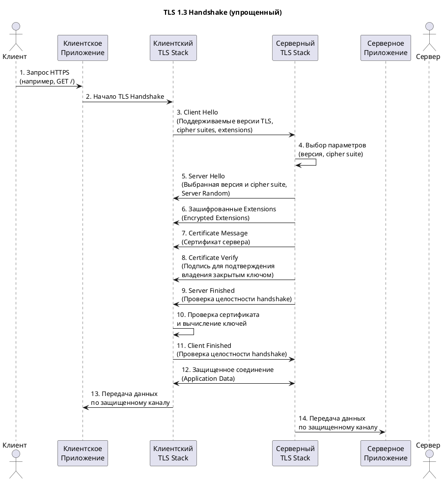
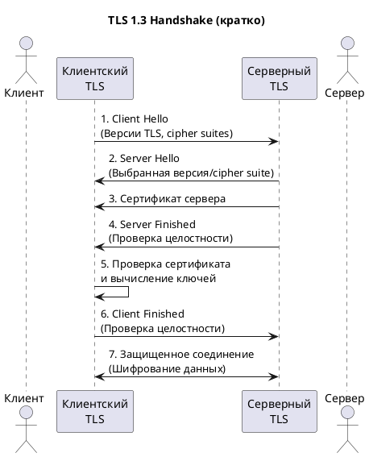
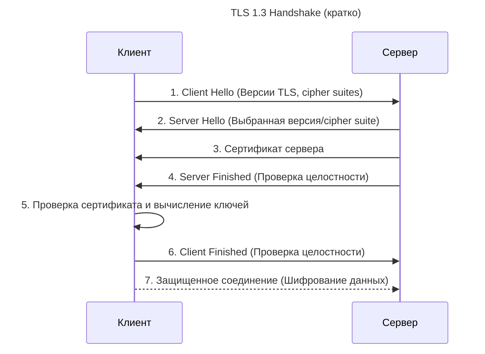
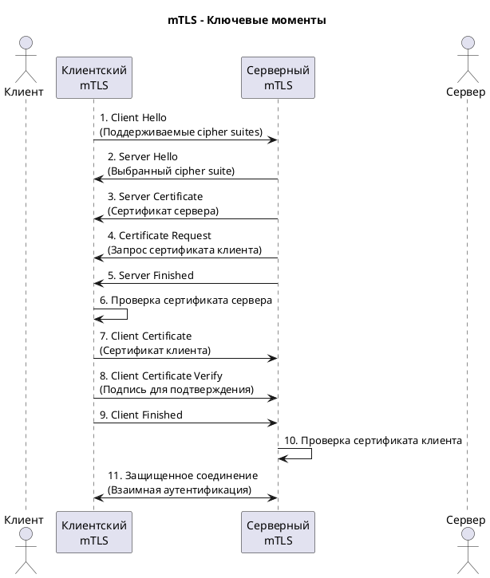

```
Важные особенности TLS 1.3:
- Ускоренный handshake (1 RTT)
- Встроенный PFS через (EC)DHE
- Защита метаданных handshake
- 0-RTT возобновление сессии (опционально)
```

Эта диаграмма показывает упрощенный процесс TLS 1.3 handshake, который является современным стандартом и обеспечивает:
- **Шифрование данных** (конфиденциальность)
- **Аутентификацию сервера** (подлинность)
- **Целостность данных** (неизменность)
- **Perfect Forward Secrecy** (PFS) через встроенные механизмы обмена ключами

---

## 🔐 **Принципы работы TLS/SSL**

### **Что такое TLS/SSL:**
**TLS (Transport Layer Security)** и его устаревший predecessor **SSL (Secure Sockets Layer)** - это **криптографические протоколы**, предназначенные для обеспечения **безопасности данных**, передаваемых по сети. Они обеспечивают:
- **Шифрование** (конфиденциальность)
- **Аутентификацию** (подлинность сторон)
- **Целостность** (неизменность данных)

### **Как работает TLS Handshake (упрощенно):**

1.  **Client Hello:** Клиент отправляет список поддерживаемых версий TLS, cipher suites (наборов алгоритмов шифрования) и случайное число.
2.  **Server Hello:** Сервер выбирает версию TLS и cipher suite из предложенных клиентом и отправляет свое случайное число, сертификат и, возможно, запрос сертификата клиента.
3.  **Аутентификация и обмен ключами:**
    - Клиент проверяет сертификат сервера (доверие к Центру Выдачи, срок действия, имя хоста).
    - В зависимости от выбранного cipher suite, происходит обмен ключами (например, Diffie-Hellman) или клиент шифрует предварительный ключ (pre-master secret) с использованием открытого ключа сервера из сертификата и отправляет его серверу.
4.  **Установление соединения:**
    - Обе стороны независимо вычисляют сессионные ключи из обменянных данных.
    - Клиент и сервер обмениваются сообщениями `Finished`, зашифрованными сессионными ключами, подтверждая успешное завершение handshake.
5.  **Защищенная передача данных:** Вся дальнейшая коммуникация шифруется с использованием сессионных ключей.

### **Ключевые компоненты:**
- **Сертификаты:** Используются для аутентификации сервера (и опционально клиента). Содержат открытый ключ и информацию о владельце, подписанные Центром Выдачи (CA).
- **Cipher Suites:** Комбинации алгоритмов для обмена ключами, аутентификации, шифрования и проверки целостности (например, `TLS_ECDHE_RSA_WITH_AES_128_GCM_SHA256`).
- **Сессионные ключи:** Симметричные ключи, генерируемые для шифрования данных текущей сессии.

---

## 🛡️ **Роль PKCE, HSTS, PFS**

### **PKCE (Proof Key for Code Exchange):**
- **Роль:** **Расширение OAuth 2.0**, созданное специально для защиты **публичных клиентов** (мобильные и одностраничные приложения), где секрет клиента не может быть надежно сохранен.
- **Как работает:** Клиент генерирует криптографический "ключ" (`code_verifier`) и его преобразованную версию (`code_challenge`). `code_challenge` отправляется при авторизации. При обмене кода авторизации на токен, клиент отправляет `code_verifier`. Сервер проверяет его соответствие `code_challenge`. Это предотвращает атаки, где перехваченный код авторизации мог быть использован злоумышленником.
- **Кратко:** Защита потока OAuth 2.0 для приложений, которые не могут скрыть секрет клиента.

### **HSTS (HTTP Strict Transport Security):**
- **Роль:** **Политика безопасности**, которую веб-сайт передает браузеру через HTTP-заголовок, указывая, что **всегда** следует использовать **HTTPS** для связи с этим сайтом на протяжении определенного времени.
- **Как работает:** После первого успешного HTTPS-подключения браузер запоминает политику HSTS. При последующих попытках доступа по `http://` браузер **автоматически** меняет протокол на `https://` до отправки запроса.
- **Кратко:** Принудительное использование HTTPS браузером, предотвращающее downgrade-атаки (SSL Stripping).

### **PFS (Perfect Forward Secrecy):**
- **Роль:** **Свойство** согласования ключей в TLS, обеспечивающее **защиту прошлых сессий** даже в случае **компрометации** долгосрочного приватного ключа сервера в будущем.
- **Как работает:** Вместо использования долгосрочного ключа сервера (например, из сертификата RSA) для непосредственного шифрования данных сессии, используются **эфемерные (временные) ключи** (например, ECDHE - Elliptic Curve Diffie-Hellman Ephemeral). Эти временные ключи генерируются для каждой сессии и уничтожаются после нее.
- **Кратко:** Защита прошлых сессий от расшифровки, даже если главный ключ сервера будет украден позже.

---

### **Ключевые принципы:**

1. **In-Transit (при передаче):** Шифрование данных во время их передачи по сети (например, TLS 1.3).
2. **At-Rest (в хранилище):** Шифрование данных, находящихся в базах данных, файловых системах, объектном хранилище (например, AES-256).
3. **Client-Side (на клиенте):** Шифрование данных на устройстве пользователя до их отправки на сервер (например, для конфиденциальных заметок или сообщений).
4. **In-Use (в использовании):** Шифрование данных, находящихся в памяти приложения во время обработки (например, Confidential Computing).
5. **Application-Layer (на уровне приложения):** Шифрование конкретных полей или объектов внутри приложения (например, шифрование паролей или номеров карт).
6. **Key Encryption (шифрование ключей):** Шифрование ключей данных с помощью ключей обертки (Key Wrapping) для управления секретами.
7. **Post-Quantum (постквантовое):** Использование алгоритмов, устойчивых к криптоанализу с помощью квантовых компьютеров (экспериментально/гибридно).

---



---



---



```
Ключевые особенности mTLS:
- Взаимная аутентификация
- Клиент и сервер проверяют\nдруг друга
- Повышенная безопасность
- Используется в микросервисах\nи API
```