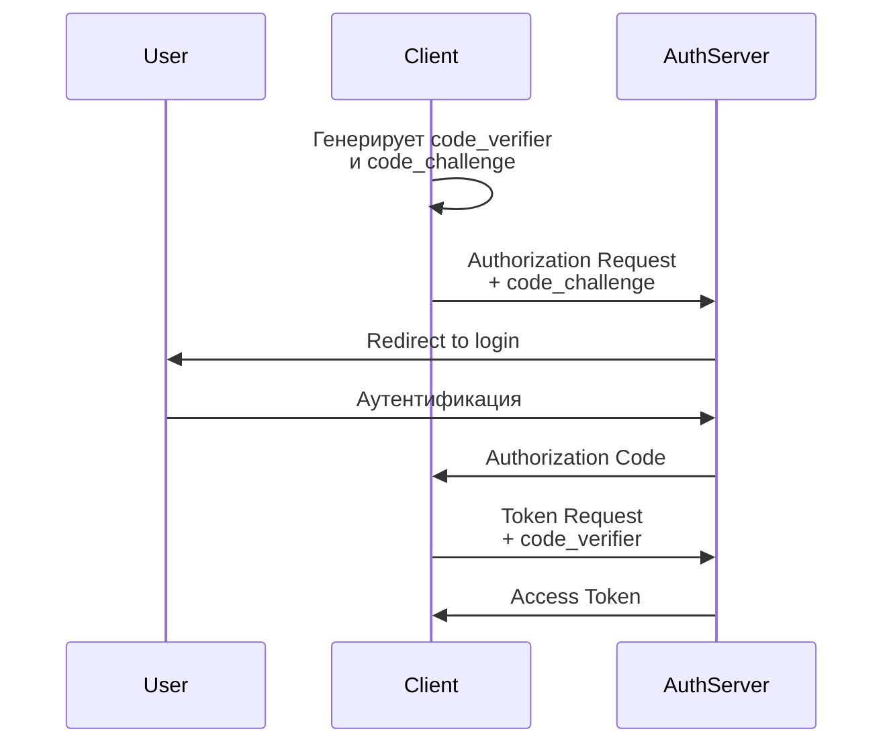

## 🔐 **PKCE (Proof Key for Code Exchange)**

**PKCE** (произносится как "pixie") — это **расширение протокола OAuth 2.0**, разработанное для **повышения безопасности** в сценариях авторизации, особенно для **публичных клиентов** (мобильных и одностраничных приложений).

---

## 🎯 **Основная проблема, которую решает PKCE:**

### **Атака перехвата Authorization Code**
В традиционном OAuth 2.0:
1. Приложение получает `authorization code`
2. Обменивает его на `access token`
3. **Проблема**: `authorization code` может быть перехвачен в небезопасных каналах

---

## 🔧 **Как работает PKCE:**

### **1. Генерация кода:**
```
code_verifier = случайная строка (43-128 символов)
code_challenge = BASE64URL-ENCODE(SHA256(code_verifier))
```

### **2. Authorization Request:**
```
GET /authorize?
  client_id=...
  code_challenge=... (хэш)
  code_challenge_method=S256
  redirect_uri=...
  response_type=code
  scope=...
```

### **3. Token Request:**
```
POST /token
  grant_type=authorization_code
  code=...
  redirect_uri=...
  code_verifier=... (оригинальная строка)
```

---

## 📋 **Преимущества PKCE:**

✅ **Защита от перехвата authorization code**  
✅ **Не требует shared secret** (подходит для публичных клиентов)  
✅ **Стандарт RFC 7636**  
✅ **Поддерживается большинством провайдеров** (Google, Microsoft, Auth0, Okta)  
✅ **Обязательно для Native Apps** (по RFC 8252)

---

## 📱 **Где используется PKCE:**

### **1. Мобильные приложения**
- Нет безопасного места для хранения client_secret
- Redirect URI может быть перехвачен

### **2. SPA (Single Page Applications)**
- JavaScript в браузере
- Невозможно скрыть client_secret

### **3. Desktop приложения**
- Нет безопасного хранилища для секретов

---

## 🔁 **Поток авторизации с PKCE:**



---

## 🛡️ **Пример реализации (Node.js):**

```javascript
const crypto = require('crypto');

// 1. Генерация code_verifier
const code_verifier = base64URLEncode(crypto.randomBytes(32));

// 2. Создание code_challenge
const code_challenge = base64URLEncode(
  crypto.createHash('sha256')
    .update(code_verifier)
    .digest()
);

// 3. Authorization Request
const authUrl = `https://auth.example.com/authorize?
  client_id=...
  code_challenge=${code_challenge}
  code_challenge_method=S256
  response_type=code`;
```

---

## 📚 **Стандарты:**

- **RFC 7636** - PKCE specification
- **RFC 8252** - OAuth 2.0 for Native Apps (рекомендует PKCE)
- **OAuth 2.1** - PKCE становится обязательным

---

## ✅ **Когда использовать PKCE:**

- **Всегда** для мобильных и desktop приложений  
- **Всегда** для SPA приложений  
- **Рекомендуется** для всех публичных клиентов  
- **Обязательно** по современным стандартам безопасности

PKCE — это **best practice** для современной OAuth 2.0 авторизации!