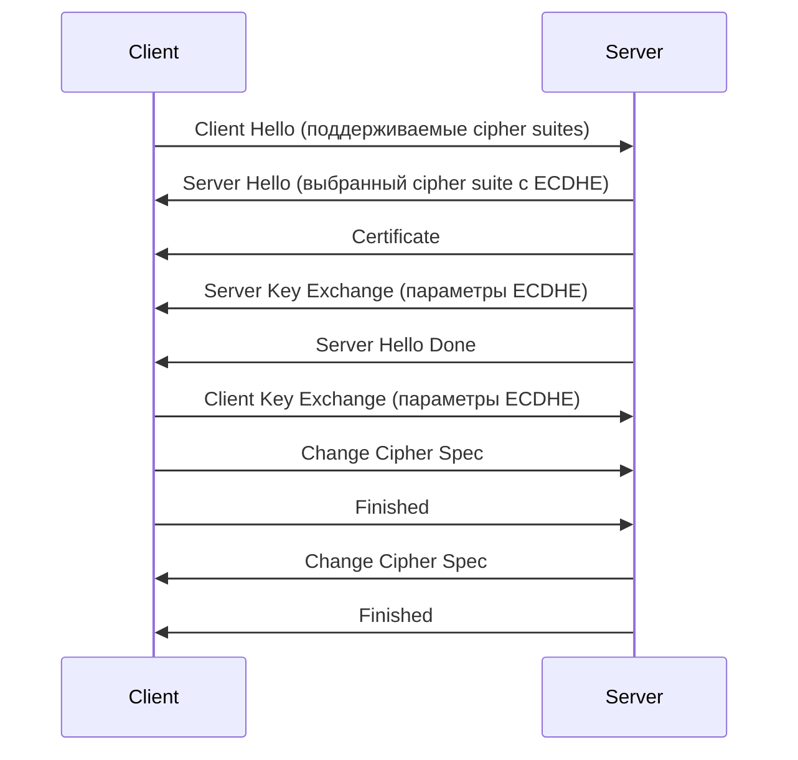

## 🔐 **HSTS (HTTP Strict Transport Security) и PFS (Perfect Forward Secrecy)**

---

## 🔒 **HSTS (HTTP Strict Transport Security)**

### **Что это:**
**HSTS** - это **политика безопасности**, которую веб-сайты передают браузерам через специальный **HTTP заголовок**. Эта политика указывает браузеру **всегда использовать HTTPS** при соединении с данным сайтом в течение указанного времени.

### **Как работает:**
```http
Strict-Transport-Security: max-age=31536000; includeSubDomains; preload
```

1. **Первое подключение** - клиент получает заголовок HSTS
2. **Браузер сохраняет** политику на указанное время (max-age)
3. **Последующие подключения** - браузер **автоматически использует HTTPS**, даже если пользователь ввел `http://`

### **Преимущества:**
✅ **Защита от SSL Stripping атак**  
✅ **Предотвращение MITM** через HTTP  
✅ **Автоматическая переадресация** на HTTPS  
✅ **Улучшение безопасности** пользователей

### **Параметры:**
- `max-age` - время действия политики в секундах
- `includeSubDomains` - применять ко всем поддоменам
- `preload` - включение в список HSTS preload браузеров

---

## 🛡️ **PFS (Perfect Forward Secrecy)**

### **Что это:**
**PFS** - это **свойство криптографических протоколов**, обеспечивающее **защиту прошлых сессий** даже в случае **компрометации** долгосрочного приватного ключа сервера.

### **Как работает:**
- Использует **эфемерные (временные) ключи** для каждой сессии
- **Диффи-Хеллман** с эфемерными ключами (DHE/ECDHE)
- **Главное**: главный приватный ключ **не используется** для шифрования данных сессии

### **Преимущества:**
✅ **Защита архивных данных**  
✅ **Сопротивление компрометации ключей**  
✅ **Конфиденциальность в будущем**  
✅ **Соответствие требованиям безопасности**

### **Пример handshake с PFS:**


---

## ⚔️ **Сравнение HSTS и PFS**

| Характеристика | **HSTS** | **PFS** |
|----------------|----------|---------|
| **Уровень** | Application (HTTP) | Transport (TLS) |
| **Цель** | Принудительное использование HTTPS | Защита ключей сессии |
| **Защита от** | SSL Stripping, downgrade атак | Компрометации прошлых сессий |
| **Реализация** | HTTP заголовок | Cipher suites (ECDHE) |
| **Время действия** | Указанное в max-age | Одна сессия |

---

## 🎯 **Пример конфигурации**

### **Nginx с HSTS и PFS:**
```nginx
server {
    listen 443 ssl http2;
    server_name example.com;
    
    # SSL с PFS
    ssl_certificate /path/to/cert.pem;
    ssl_certificate_key /path/to/key.pem;
    ssl_protocols TLSv1.2 TLSv1.3;
    ssl_ciphers ECDHE-RSA-AES256-GCM-SHA384:ECDHE-RSA-AES128-GCM-SHA256;
    ssl_prefer_server_ciphers off;
    
    # HSTS
    add_header Strict-Transport-Security "max-age=31536000; includeSubDomains; preload" always;
    
    # Другие security headers
    add_header X-Frame-Options DENY;
    add_header X-Content-Type-Options nosniff;
}
```

### **Apache:**
```apache
<VirtualHost *:443>
    # SSL с PFS
    SSLEngine on
    SSLCertificateFile /path/to/cert.pem
    SSLCertificateKeyFile /path/to/key.pem
    SSLProtocol all -SSLv2 -SSLv3 -TLSv1 -TLSv1.1
    SSLCipherSuite ECDHE-RSA-AES256-GCM-SHA384:ECDHE-RSA-AES128-GCM-SHA256
    
    # HSTS
    Header always set Strict-Transport-Security "max-age=31536000; includeSubDomains; preload"
</VirtualHost>
```

---

## 📊 **Проверка реализации**

### **Проверка HSTS:**
```bash
# Через curl
curl -I https://example.com | grep -i strict

# Через онлайн сервисы
https://hstspreload.org/
https://securityheaders.com/
```

### **Проверка PFS:**
```bash
# SSL Labs тест
https://www.ssllabs.com/ssltest/

# OpenSSL
openssl ciphers -V 'ALL:COMPLEMENTOFALL' | grep -i dhe
```

---

## ⚠️ **Важные моменты**

### **Для HSTS:**
- ⚠️ **Нельзя откатиться** на HTTP после включения
- ⚠️ **Осторожно с preload** - сложно удалить из списков
- ✅ **Начинайте с малого max-age** при тестировании

### **Для PFS:**
- ⚠️ **Больше вычислений** на сервере
- ⚠️ **Требует поддержки** современных браузеров
- ✅ **Обязательно** для современных стандартов безопасности

---

**HSTS и PFS** - это **важные компоненты** современной веб-безопасности, обеспечивающие **принудительное шифрование** и **защиту ключей** соответственно!

