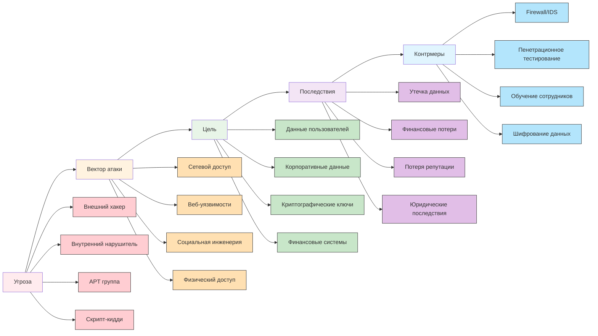
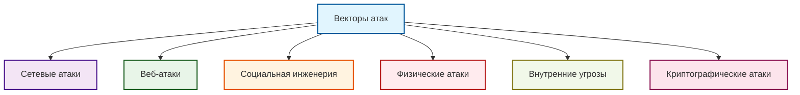
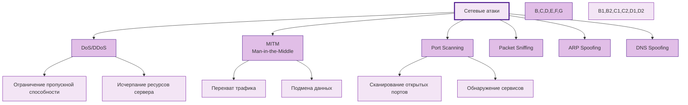
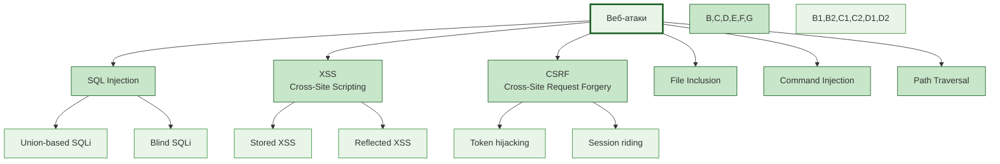
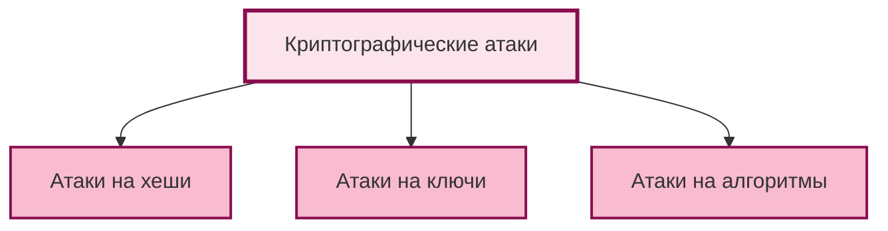
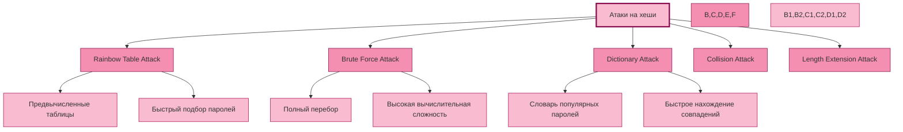
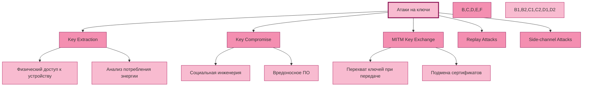

## 🛡️ **Матрица угроз и контрмер**

## 🎯 **Общая схема векторов атак**

---

## 🌐 **Сетевые атаки**

---

## 🌐 **Веб-атаки**

---

## 🎯 **Общая схема криптографических атак**

---

## 🔐 **Атаки на хеши**

---

## 🔑 **Атаки на ключи**

