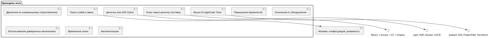

Понимание **основных принципов атак на информационные системы (ИС)** — ключ к построению устойчивой защиты. Злоумышленники действуют не хаотично, а **по определённым закономерностям и принципам**, которые можно изучить, предсказать и противостоять им.

Ниже — **структурированный обзор основных принципов кибератак**, основанный на реальных тактиках (MITRE ATT&CK, OWASP, Verizon DBIR), а не на теории.

---

## 🔍 Основные принципы атак на информационные системы

### 1. **Поиск и эксплуатация слабого звена**
> ❝ *Атакуют не самую защищённую систему, а самое слабое звено в цепи.* ❞

Часто это:
- **Человек** (социальная инженерия),
- **Устаревший компонент** (например, Log4j),
- **Ошибка конфигурации** (открытый S3-бакет),
- **Слабый пароль**.

> ✅ Пример:  
> Взлом через фишинг → получение учётных данных → доступ к админке → шифрование данных (ransomware).

---

### 2. **Движение по принципу "наименьшего сопротивления"**
Злоумышленник **не идёт напролом**, а ищет **самый лёгкий путь**:
- Если нельзя взломать фронтенд — попробует API.
- Если нет уязвимостей в коде — попробует фишинг.
- Если MFA включён — попробует session hijacking.

> 🔍 Он адаптируется, как вода — течёт туда, где проще.

---

### 3. **Постепенное повышение привилегий (Privilege Escalation)**
Атака редко начинается с `root` или `admin`.  
Обычно:
1. Получение **ограниченного доступа** (например, через SQLi или фишинг),
2. Поиск способа **повысить права** (exploit, подбор пароля, abuse IAM),
3. Получение **полного контроля**.

> 📌 Пример:  
> Доступ к поду в Kubernetes → чтение `ServiceAccount` токена → доступ к API → управление кластером.

---

### 4. **Уклонение от обнаружения (Defense Evasion)**
Злоумышленник старается:
- **Маскировать активность** (подмена User-Agent, использование легальных инструментов — LOLBins),
- **Удалять логи**,
- **Работать в "тихом режиме"** (low and slow),
- Использовать **шифрование (TLS)** для C2-трафика.

> 🔐 Цель: остаться незамеченным как можно дольше.

---

### 5. **Использование доверенных механизмов (Abuse of Trust)**
Атакующий **не создаёт новые векторы**, а **использует легальные функции системы против неё**:

| Пример | Как используется |
|-------|------------------|
| `kubectl` | Для перемещения по кластеру |
| `curl`, `wget` | Для загрузки вредоносов |
| `PowerShell`, `bash` | Для выполнения кода |
| `CI/CD` | Для вставки бэкдоров в билд |
| `mTLS` | Для подмены легального сервиса |

> Это называется **"Living-off-the-Land" (LotL)** — живёт за счёт ресурсов системы.

---

### 6. **Цепочка атак (Kill Chain)**
Атака — это **не событие, а процесс**, состоящий из этапов:

#### 🌐 Модель Lockheed Martin Cyber Kill Chain:
1. **Reconnaissance** — сбор информации
2. **Weaponization** — создание вредоноса
3. **Delivery** — доставка (email, веб)
4. **Exploitation** — использование уязвимости
5. **Installation** — установка бэкдора
6. **Command & Control (C2)** — управление
7. **Actions on Objectives** — достижение цели (кража, шифрование)

> 🛡 Понимание Kill Chain помогает ставить **барьеры на каждом этапе**.

---

### 7. **Атака через цепочку поставок (Supply Chain Attack)**
Вместо атаки вашей системы — атакуют **вашего поставщика**:
- Взлом npm-пакета,
- Подмена образа в Docker Hub,
- Компрометация билд-сервера,
- Вставка бэкдора в open-source библиотеку.

> 🔥 Примеры: SolarWinds, CodeCov, 3CX, dependency confusion.

> 💡 Принцип: **"доверие — это поверхность атаки"**.

---

### 8. **Эксплуатация времени (Time-based Attacks)**
- **"Захват и расшифруй позже"** — перехват трафика сегодня, расшифруют квантовым компьютером завтра.
- **Поддельные сертификаты с долгим сроком** — работают годами.
- **Скрытые бэкдоры** — активируются через месяцы.

> ⏳ Атака может быть **отложенной**, но с долгосрочным эффектом.

---

### 9. **Масштабирование через автоматизацию**
Современные атаки:
- **Автоматизированы** (боты, сканеры),
- Используют **AI/ML** для генерации фишинга,
- Работают **массово** (тысячи целей одновременно).

> 🤖 Пример: бот, сканирующий GitHub на наличие `.env` файлов.

---

### 10. **Использование законных инструментов для нелегальных целей**
> ❝ *Самый опасный инструмент — тот, который разрешён.* ❞

| Инструмент | Как используется |
|----------|------------------|
| `SSH` | Для lateral movement |
| `kubectl`, `helm` | Для управления кластером |
| `Terraform` | Для изменения инфраструктуры |
| `CI/CD` | Для доставки вредоносного кода |

> Это затрудняет обнаружение: трафик выглядит как "нормальный".

---

## 🎯 Обобщённая модель атаки (на основе MITRE ATT&CK)

```text
1. Reconnaissance → 
2. Initial Access → 
3. Execution → 
4. Persistence → 
5. Privilege Escalation → 
6. Defense Evasion → 
7. Credential Access → 
8. Discovery → 
9. Lateral Movement → 
10. Collection → 
11. Command and Control → 
12. Exfiltration / Impact
```

Каждый шаг — **возможность для защиты**.

---

## ✅ Как использовать эти принципы?

### Для защиты:
- **Think like an attacker** — моделируйте атаки (Threat Modeling).
- **Применяйте принцип минимальных привилегий**.
- **Шифруйте трафик и данные**.
- **Ведите логи и мониторьте аномалии**.
- **Обучайте сотрудников** (особенно фишингу).
- **Интегрируйте безопасность в CI/CD**.

---

## 💬 Цитата для запоминания

> **"Хорошая защита не строится на том, что атакующий не найдёт уязвимость.  
> Она строится на том, что даже при одной уязвимости он не сможет достичь цели."**

---

## 🖼️ Основные принципы атак на ИС



> "Принципы атак"
> Атакующий действует системно: ищет слабости, адаптируется, использует доверие и автоматизацию

---
