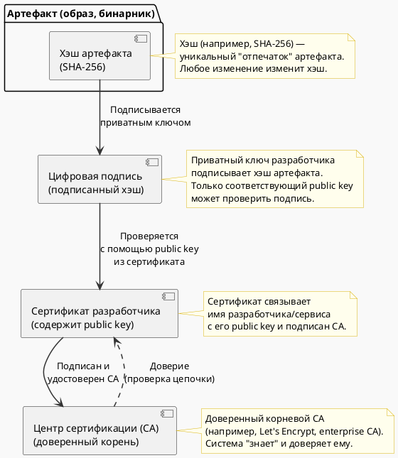

### 🌐 Цепочка доверия (Hash → Подпись → Сертификат → CA)

> Сценарий: "Цепочка доверия от хэша до доверенного CA с Cosign (Sigstore)"
>
> Как проверяется доверие?
>    1. Вычислить хэш артефакта
>    2. Проверить подпись с помощью public key из сертификата
>    3. Убедиться, что сертификат действителен и подписан доверенным CA
>    4. Если всё верно — артефакт подлинный и не изменялся

---

### 🔍 Что отображает схема?

1. **Хэш артефакта** — уникальный отпечаток (например, образа Docker).
2. **Цифровая подпись** — хэш, зашифрованный приватным ключом разработчика.
3. **Сертификат** — содержит public key, идентифицирует владельца и подписан CA.
4. **CA (Certificate Authority)** — источник доверия. Система доверяет CA → доверяет сертификату → может проверить подпись → подтвердить целостность и подлинность артефакта.

---

### 💡 Суть сценария:
> "Представьте, что вы получили обновление для критического сервиса.  
> Как вы можете быть уверены, что его не подменили?  
> Через **хэш** вы проверяете целостность.  
> Через **подпись и сертификат** — кто его выпустил.  
> Через **CA** — доверяете ли вы этому издателю.  
> Это и есть **цепочка доверия**."

---
