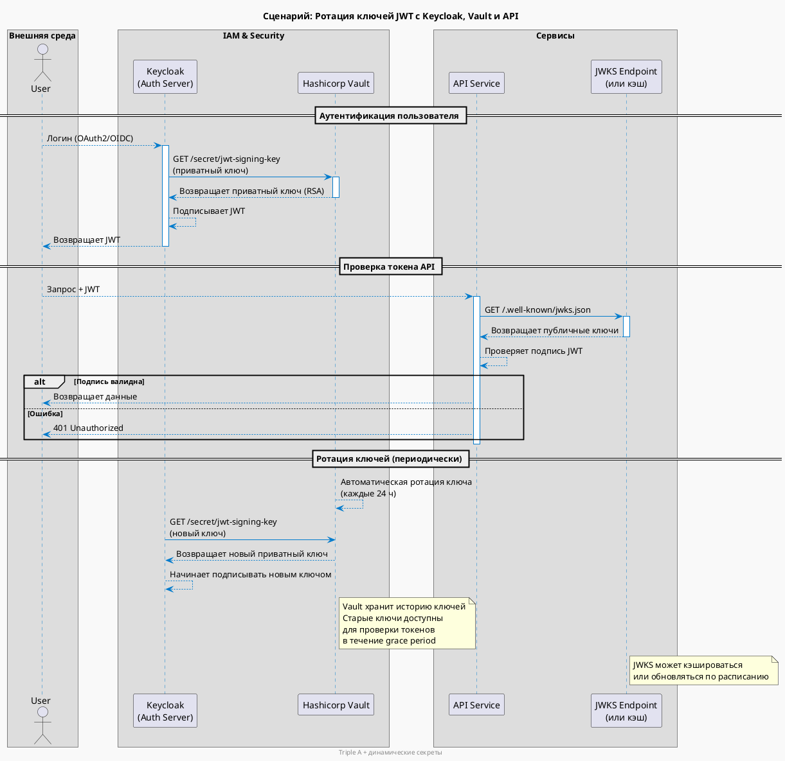

> ---
> 
> Приведён **подробный сценарий совместной работы** таких компонентов, как **Keycloak**, **Hashicorp Vault**, **Auth Server** и **API**, в рамках обеспечения **Triple A (Authentication, Authorization, Accounting)** и **автоматической ротации секретов**, используемых для **подписи JWT-токенов**.
>
> Такой сценарий актуален в современных архитектурах с микросервисами, где безопасность, аудит и динамическое управление секретами — критически важны.
>
> ---

---

## 🎯 Цель сценария
Обеспечить:
- **Безопасную аутентификацию и авторизацию** через Keycloak и JWT.
- **Динамическую ротацию ключей** для подписи токенов.
- **Централизованное хранение и управление секретами** через Hashicorp Vault.
- **Подотчётность (Accounting)** через логирование и аудит.
- **Высокую безопасность** за счёт использования **временных (rotating) ключей** вместо статических.

---

## 🧩 Участники сценария

| Компонент           | Роль                                                                                                               |
| ------------------- | ------------------------------------------------------------------------------------------------------------------ |
| **Keycloak**        | Identity Provider (IdP), управляет пользователями, выдаёт JWT                                                      |
| **Auth Server**     | Промежуточный сервер аутентификации (может быть частью Keycloak или отдельным сервисом), запрашивает ключи у Vault |
| **Hashicorp Vault** | Хранилище секретов с поддержкой динамических секретов и ротации ключей                                             |
| **API**             | Защищённый сервис, проверяющий JWT и его подпись                                                                   |
| **JWKS Endpoint**   | Эндпоинт, отдающий публичные ключи для проверки JWT                                                                |

---

## 📚 Сценарий: Ротация ключей JWT с использованием Vault

### 🔁 Этап 1: Инициализация и ротация ключей

1. **Vault** настроен на генерацию **RSA-ключей** (или ECDSA) для подписи JWT.
2. Vault предоставляет **динамический секрет** — приватный ключ, который автоматически ротируется (например, каждые 24 часа).
3. **Auth Server** (или Keycloak через кастомный SPI/адаптер) периодически запрашивает **актуальный приватный ключ** у Vault.
4. Auth Server использует этот ключ для **подписи JWT-токенов** при аутентификации пользователей.

> 🔐 Vault также хранит **публичный ключ**, который доступен через **JWKS-подобный эндпоинт** (или через API).

---

### 🔐 Этап 2: Аутентификация пользователя

1. Пользователь логинится в **Keycloak** (через форму, OAuth2, OIDC).
2. Keycloak (или Auth Server) формирует JWT и **подписывает его приватным ключом**, полученным из Vault.
3. Токен возвращается клиенту.

---

### 🔍 Этап 3: Проверка токена API

1. Клиент отправляет JWT в **API**.
2. API запрашивает **публичные ключи (JWKS)** — напрямую из Vault, из кэшированного эндпоинта или через Auth Server.
3. API проверяет подпись JWT с помощью публичного ключа.
4. Если подпись валидна — доступ разрешается.

> 🔄 API кэширует JWKS на короткое время (например, 5–15 мин), чтобы не перегружать Vault.

---

### 🔄 Этап 4: Ротация ключей

1. Vault **автоматически ротирует приватный ключ** по расписанию.
2. Новый ключ становится активным, старый остаётся в **grace period** (например, 24 часа), чтобы API мог проверять "старые" токены.
3. Auth Server получает новый ключ и начинает подписывать им новые токены.
4. Все системы постепенно переходят на новый ключ.

> 🛡 Это обеспечивает **бесшовную ротацию** без простоев.

---

### 📊 Этап 5: Accounting (учёт и аудит)

- **Vault** логирует каждый доступ к секрету (кто, когда, откуда).
- **Keycloak** логирует входы пользователей, выдачу токенов.
- **API** логирует запросы, включая `sub`, `iss`, `aud` из JWT.
- Все логи отправляются в **SIEM** (например, ELK, Splunk) для аудита.

---

## ✅ Обеспечение Triple A

| A | Как обеспечивается |
|---|---------------------|
| **Authentication** | Keycloak аутентифицирует пользователя, выдаёт JWT, подписанный ключом из Vault |
| **Authorization** | JWT содержит `roles`, `permissions` — API проверяет их для доступа к ресурсам |
| **Accounting** | Все действия логируются: входы, доступ к секретам, вызовы API |

---

## 🖼️ Диаграмма в PlantUML

---

## 💡 Преимущества такого подхода

- 🔁 **Автоматическая ротация ключей** — снижает риск компрометации.
- 🛡 **Zero static secrets** — приватные ключи не лежат в коде или конфигах.
- 📜 **Аудит всех операций** — кто получил ключ, кто вошёл, кто вызвал API.
- 🔄 **Гибкость** — можно использовать с любым OIDC-провайдером.
- 🌐 **Поддержка mTLS, service-to-service auth** — аналогичная схема может использоваться для сервисных аккаунтов.

---

## 🧩 Возможные расширения

- Использовать **Vault PKI** для генерации сертификатов сервисов.
- Интегрировать **Sigstore** или **Cosign** для подписи артефактов.
- Настроить **Keycloak SPI**, чтобы он напрямую работал с Vault.
- Использовать **JWT Auth Method в Vault** для аутентификации сервисов.

---

Если хотите, могу:
- адаптировать схему под **Kubernetes** (с Sidecar, Istio, etc),
- сделать **версию без Auth Server** (если Keycloak работает напрямую с Vault),
- или подготовить **Terraform-модуль** для развёртывания такой архитектуры.

Готов помочь с любыми доработками!