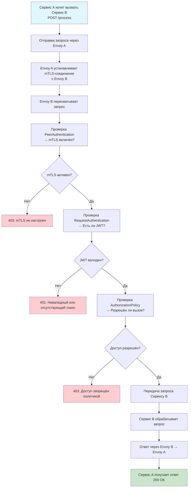
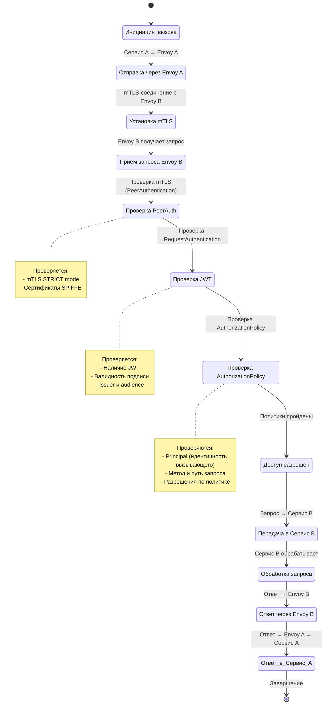

## 🔄 1. Flowchart: Цепочка действий при применении политик Istio



```
    note right of K
      Проверяются:
      - Principal (SPIFFE ID)
      - Метод (POST)
      - Путь (/process)
    end note

    note right of E
      Проверяется:
      - mTLS между sidecar'ами
    end note
```

---

## 📊 2. StateDiagram: Состояния запроса при прохождении через Istio



---

## 📌 Что показывают диаграммы?

### 🔁 Flowchart:
- **Цепочка действий** от момента вызова до получения ответа.
- **Участники**: сервисы, sidecar-прокси, Istio Control Plane.
- **Проверки**: mTLS, JWT, политики авторизации.
- **Результаты**: успех или ошибка (401, 403).

### 📊 StateDiagram:
- **Состояния** запроса при прохождении через Istio.
- **Переходы** между этапами проверки безопасности.
- **Контекст**: сетевой поток с применением политик.

---

## 🛠 Как использовать

Вы можете:
- Вставить диаграммы в **Obsidian**, **GitHub**, **Confluence**.
- Использовать как **учебный материал** по Istio.
- Добавить в **документацию** или **презентацию** по Service Mesh.

---

Если хотите, могу:
- объединить диаграммы в одну **интерактивную схему**,
- добавить **метрики и трассировки**,
- или создать **версию для печати**.

Готов помочь!