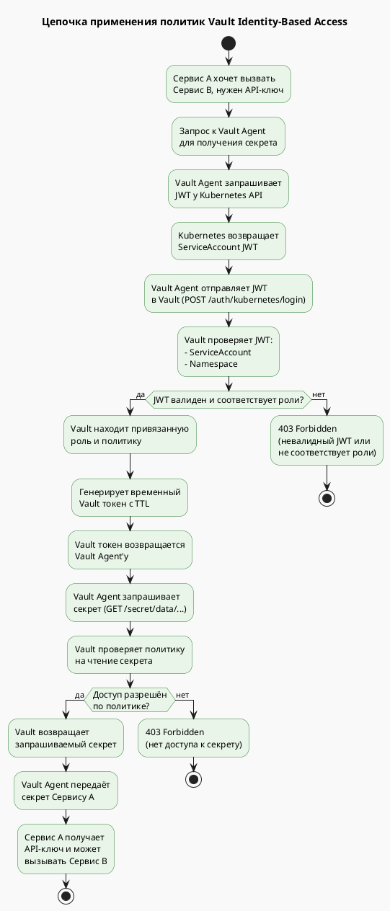
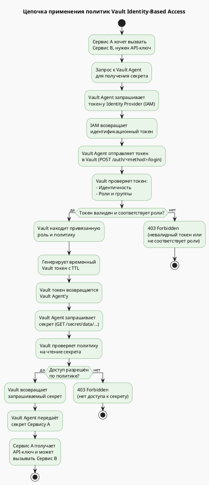
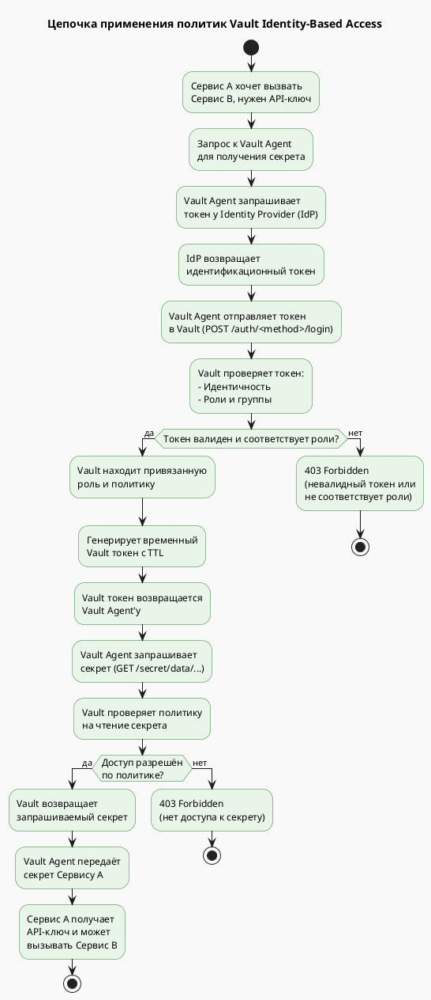

Отлично! Ниже приведена **диаграмма деятельности (activity diagram)** в формате **PlantUML**, которая показывает **цепочку действий при применении политик HashiCorp Vault Identity-Based Access**.

---

## 🎯 Сценарий

- **Сервис A** хочет получить **секрет** из Vault для вызова **Сервиса B**.
- Vault проверяет:
  - **Идентичность** через Kubernetes JWT,
  - **Роль** и **политику**,
  - **Разрешения** на доступ к секрету.

---

## 🖼️ PlantUML: Диаграмма деятельности для Vault Identity-Based Access



```
note right of "Vault проверяет JWT:\n- ServiceAccount\n- Namespace"
  Проверяется:
  - Подпись JWT
  - ServiceAccount: order-sa
  - Namespace: prod
  - Привязка к роли
end note

note right of "Vault проверяет политику\nна чтение секрета"
  Проверяется:
  - Наличие политики
  - Разрешение read на путь
  - TTL временного токена
end note

note right of "Генерирует временный\nVault токен с TTL"
  Токен:
  - Временный
  - Ограничен по времени жизни
  - Привязан к политикам
end note
```

---

## 📌 Что показывает диаграмма?

- **Последовательность шагов** при получении секрета через Vault.
- **Условные переходы** на каждом этапе проверки.
- **Результаты** — успешное получение секрета или одна из ошибок (403).
- **Пояснения** к ключевым проверкам и механизмам.

---

## 🛠 Как использовать

Вы можете:
- Вставить код в **PlantUML редактор** (например, [https://www.plantuml.com/plantuml](https://www.plantuml.com/plantuml)).
- Сгенерировать изображение и использовать в **презентации**, **документации** или **обучении**.
- Адаптировать под конкретные политики, роли или сценарии.

---

Если хотите, могу:
- создать **объединённую диаграмму Istio + Vault**,
- добавить **логирование и аудит** в диаграмму,
- или показать **вариант с другими Auth Methods** (AppRole, JWT, LDAP).

Готов помочь!

Отличный вопрос! Да, вы абсолютно правы — **в общем случае** на схеме **Vault Identity-Based Access** можно (и часто нужно) указывать **IAM** вместо **Kubernetes**, особенно если речь идёт о **более абстрактной схеме** или **универсальном подходе**.

---

## 🎯 Когда писать "Kubernetes", а когда "IAM"?

| Контекст | Что писать | Почему |
|---------|------------|--------|
| **Конкретный пример** с Kubernetes | ✅ Kubernetes | Показывает точную интеграцию |
| **Общая схема** или **обучающий материал** | ✅ IAM / Identity Provider | Более универсально |
| **Enterprise-среда** с множеством провайдеров | ✅ IAM (или перечислить: OIDC, LDAP, AWS IAM) | Показывает гибкость Vault |

---

## 🔄 Обновлённая схема: Vault Identity-Based Access (с IAM)

Вот **обновлённая версия диаграммы деятельности**, где вместо Kubernetes указан **IAM** как обобщённый **Identity Provider**:

---

### 🖼️ PlantUML: Диаграмма деятельности для Vault (с IAM)



```
note right of "Vault проверяет токен:\n- Идентичность\n- Роли и группы"
  Проверяется:
  - Подпись токена
  - Идентичность (user/service)
  - Привязка к роли
end note

note right of "Vault проверяет политику\nна чтение секрета"
  Проверяется:
  - Наличие политики
  - Разрешение read на путь
  - TTL временного токена
end note

note right of "Генерирует временный\nVault токен с TTL"
  Токен:
  - Временный
  - Ограничен по времени жизни
  - Привязан к политикам
end note
```

---

## 📌 Преимущества использования "IAM":

| Преимущество | Описание |
|-------------|----------|
| **Универсальность** | Подходит для AWS IAM, Azure AD, OIDC, LDAP |
| **Образовательная ценность** | Показывает общий принцип Vault Identity |
| **Гибкость** | Легко адаптируется под разные сценарии |

---

## 🔄 Альтернативные варианты подписей:

Если вы хотите быть точным, но универсальным:

- `Identity Provider (Kubernetes / IAM / OIDC)`
- `Auth Method: Kubernetes / AWS / JWT / LDAP`
- `Identity Source: IAM / OIDC Provider`

---

## ✅ Вывод

> ✅ **Да, правильно указать "IAM"** вместо "Kubernetes", если вы хотите показать **общий принцип** работы Vault Identity-Based Access.  
> ❗ Но если вы описываете **конкретный сценарий с Kubernetes** — лучше оставить как есть.

---

Если хотите, могу:
- создать **версию с конкретными Auth Methods** (AWS IAM, OIDC),
- показать **сравнение Kubernetes vs AWS IAM** в Vault,
- или объединить диаграммы **Istio + Vault (с IAM)**.

Готов помочь!

Абсолютно верно! ✅

**IdP (Identity Provider)** — это **корректный и универсальный термин**, который охватывает **все системы аутентификации**, включая:

- Kubernetes (через ServiceAccount JWT)
- AWS IAM
- Azure AD
- Google IAM
- Keycloak / Auth0 / Okta (OIDC)
- LDAP / Active Directory

---

## 🎯 Почему "IdP" лучше, чем "IAM"?

| Термин | Что означает | Универсальность | Когда использовать |
|--------|--------------|-----------------|-------------------|
| **IdP** | Identity Provider | ✅ Высокая | В общей схеме Vault |
| **IAM** | Identity and Access Management | ⚠️ Средняя | В контексте AWS, Azure, GCP |
| **Kubernetes** | Конкретная система | ❌ Низкая | Только в Kubernetes-сценариях |

---

## 🖼️ Обновлённая диаграмма с IdP

Вот исправленная версия диаграммы с использованием **IdP**:




```
note right of "Vault проверяет токен:\n- Идентичность\n- Роли и группы"
  Проверяется:
  - Подпись токена
  - Идентичность (user/service)
  - Привязка к роли
end note

note right of "IdP возвращает\nидентификационный токен"
  IdP может быть:
  - Kubernetes (JWT)
  - AWS IAM (STS)
  - OIDC (Keycloak, Auth0)
  - LDAP / AD
end note
```
---

## 📌 Вывод

> ✅ **Правильно использовать "IdP"** как универсальный термин в диаграммах Vault Identity-Based Access.  
> Это делает схему **более точной и применимой в разных контекстах**.

---

Если хотите, могу:
- создать **сравнительную таблицу IdP → Vault Auth Methods**,
- показать **реальные примеры** для Kubernetes, AWS, OIDC,
- или объединить диаграммы **Istio + Vault (с IdP)**.

Готов помочь!