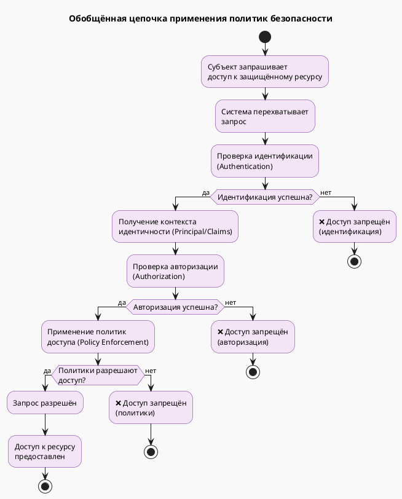

Отлично! Ниже приведена **обобщённая диаграмма деятельности (activity diagram)** в формате **PlantUML**, где элементы схемы **обобщены между условиями (ветвлениями)** для лучшего понимания общих принципов работы.

---

## 🎯 Общая логика обобщённой схемы

1. **Субъект** хочет получить доступ к ресурсу
2. **Система безопасности** проверяет:
   - **Идентификацию**
   - **Авторизацию**
   - **Политики доступа**
3. **Результат** — доступ разрешён или запрещён

---

## 🖼️ PlantUML: Обобщённая диаграмма деятельности



```
note right of "Проверка идентификации\n(Authentication)"
  Может включать:
  - Логин/пароль
  - Токены (JWT, OAuth)
  - Сертификаты
  - Биометрию
end note

note right of "Проверка авторизации\n(Authorization)"
  Может включать:
  - Роли (RBAC)
  - Группы
  - Атрибуты (ABAC)
  - Контекст запроса
end note

note right of "Применение политик\nдоступа (Policy Enforcement)"
  Может включать:
  - Правила доступа
  - Ограничения по времени
  - Гео-ограничения
  - Квоты и лимиты
end note
```

---

## 🔄 Применение к конкретным системам

### Для **Vault**:
- **Субъект** = Сервис A
- **Идентификация** = JWT от IdP
- **Авторизация** = Роль в Vault
- **Политики** = Vault Policy
- **Ресурс** = Секрет

### Для **Istio**:
- **Субъект** = Сервис A
- **Идентификация** = mTLS/SPIFFE
- **Авторизация** = RequestAuthentication (JWT)
- **Политики** = AuthorizationPolicy
- **Ресурс** = Сервис B

---

## 📌 Преимущества обобщённой схемы

| Преимущество | Описание |
|-------------|----------|
| **Универсальность** | Подходит для Vault, Istio, Keycloak, AWS и др. |
| **Понятность** | Показывает общую логику безопасности |
| **Образовательная ценность** | Легко объяснить студентам основные принципы |
| **Сравнение систем** | Упрощает сравнение Vault vs Istio vs другие |

---

## 🛠 Как использовать

Вы можете:
- Вставить код в **PlantUML редактор**
- Использовать как **учебный материал**
- Адаптировать под **конкретные системы** (добавляя детали в заметки)
- Добавить **метрики, логирование, аудит** как дополнительные шаги

---

Если хотите, могу:
- создать **версию с метриками и аудитом**,
- показать **реальные примеры для Vault и Istio** на основе этой схемы,
- или объединить всё в **комплексную презентацию**.

Готов помочь!