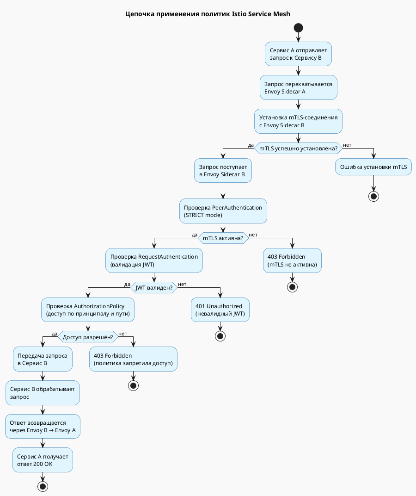

Отлично! Ниже приведена **диаграмма деятельности (activity diagram)** в формате **PlantUML**, которая показывает **цепочку действий при применении политик Istio Service Mesh**.

---

## 🎯 Сценарий

- **Сервис A** вызывает **Сервис B**.
- Istio проверяет:
  - **mTLS**,
  - **JWT**,
  - **AuthorizationPolicy**.

---

## 🖼️ PlantUML: Диаграмма деятельности (Activity Diagram) для Istio



> ---
> ---
> ---
> ---
> ---
> ---
> ---
> ---
> ---
> ---


```
note right of "Проверка PeerAuthentication\n(STRICT mode)"
  Проверяется:
  - Требование mTLS
  - Действительность сертификатов
end note

note right of "Проверка RequestAuthentication\n(валидация JWT)"
  Проверяется:
  - Наличие JWT
  - Валидность подписи
  - Issuer и audience
end note

note right of "Проверка AuthorizationPolicy\n(доступ по принципалу и пути)"
  Проверяется:
  - SPIFFE ID вызывающего
  - Метод и путь запроса
  - Соответствие политике
end note

```

---

## 📌 Что показывает диаграмма?

- **Последовательность проверок** при вызове между сервисами.
- **Условные переходы** (ветвления) на каждом этапе безопасности.
- **Результаты** — успешный вызов или одна из ошибок (401, 403).
- **Пояснения** к ключевым проверкам.

---

## 🛠 Как использовать

Вы можете:
- Вставить код в **PlantUML редактор** (например, [https://www.plantuml.com/plantuml](https://www.plantuml.com/plantuml)).
- Сгенерировать изображение и использовать в **презентации**, **документации** или **обучении**.
- Адаптировать под конкретные политики или требования.

---

Если хотите, могу:
- создать **аналогичную диаграмму для Vault**,
- объединить обе диаграммы в **одну комплексную**,
- или добавить **метрики, логирование, трассировку**.

Готов помочь!