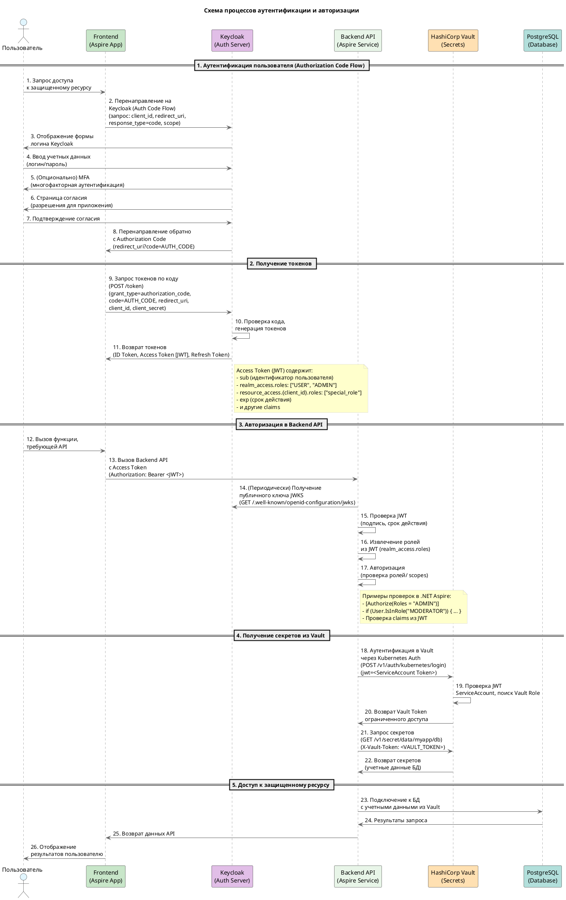

Хорошо, вот схема процессов аутентификации и авторизации для вашего стека (.NET Aspire, Keycloak, Vault):

**Пояснение:**

Эта диаграмма последовательности (sequence diagram) иллюстрирует сквозной процесс аутентификации и авторизации:

1.  **Аутентификация пользователя (Authorization Code Flow)**:
    *   Пользователь пытается получить доступ к функциональности Frontend.
    *   Frontend перенаправляет пользователя на Keycloak.
    *   Keycloak аутентифицирует пользователя (логин/пароль + опционально MFA).
    *   Пользователь дает согласие на предоставление доступа приложению.
    *   Keycloak возвращает Frontend **Authorization Code**.

2.  **Получение токенов**:
    *   Frontend обменивает **Authorization Code** на токены (ID Token, Access Token, Refresh Token) напрямую с Keycloak.
    *   **Access Token** является **JWT**, содержащим информацию о пользователе, включая его **роли**.

3.  **Авторизация в Backend API**:
    *   Frontend вызывает Backend API, передавая **Access Token (JWT)** в заголовке `Authorization`.
    *   Backend API (используя `AddJwtBearer`) периодически получает **публичный ключ** от Keycloak для проверки подписи JWT.
    *   Backend **проверяет JWT** (подпись, срок действия) и **извлекает роли**.
    *   Приложение выполняет **авторизационную логику**, проверяя наличие необходимых ролей или scopes у пользователя.

4.  **Получение секретов из Vault**:
    *   Backend API, для своей работы (например, подключения к БД), должен получить секреты.
    *   Он **аутентифицируется в Vault** с помощью **Kubernetes ServiceAccount Token** (механизм `kubernetes` auth).
    *   Vault проверяет токен и выдает **Vault Token** с ограниченными правами.
    *   Backend использует Vault Token для **запроса секретов** (например, учетных данных БД).

5.  **Доступ к защищенному ресурсу**:
    *   Backend использует полученные из Vault **учетные данные** для безопасного подключения к **PostgreSQL** и выполнения запросов.
    *   Результаты возвращаются пользователю через Frontend.

Эта схема показывает полный цикл: от входа пользователя в систему до получения защищенных данных из БД, с использованием Keycloak для аутентификации/авторизации и Vault для управления секретами, что соответствует теме "Безопасность и управление доступом".
