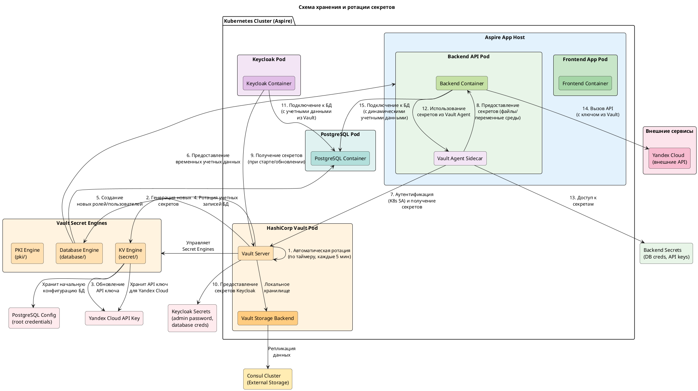

Схема хранения и ротации секретов для вашего стека (.NET Aspire, HashiCorp Vault, Keycloak, PostgreSQL):



```
note bottom of vault_server
Vault автоматически
генерирует новые
значения для секретов
в KV engine по
расписанию.
end note

note bottom of db_engine
Database Engine
динамически создает
временные учетные
записи в PostgreSQL
с ограниченными
правами и сроком
действия.
end note

note right of vault_agent
Vault Agent Sidecar:
- Аутентифицируется в Vault
с помощью ServiceAccount
Pod'а Backend API.
- Получает актуальные
секреты.
- Предоставляет их
приложению через
файлы или сокет.
end note

note bottom of kv_engine
Хранение статических секретов:
- secret/myapp/yandex-cloud/api-key
- secret/myapp/config/sensitive-settings
end note

note bottom of db_engine
Динамические учетные записи БД:
- database/config/postgresql
- database/roles/myapp-backend
- database/creds/myapp-backend (генерируются)
end note

note bottom of pki_engine
Сертификаты:
- pki/roles/myapp-service
- pki/issue/myapp-service (генерируются)
end note


```


**Пояснение:**

Эта диаграмма иллюстрирует, как организовано **хранение и ротация секретов** в вашей системе:

1.  **HashiCorp Vault** является центральным хранилищем секретов. Он запущен в Kubernetes как Pod и использует внешний **Consul** в качестве надежного **Storage Backend** для хранения зашифрованных данных.
2.  **Secret Engines** в Vault:
    *   **KV Engine (`secret/`)**: Хранит **статические секреты**. В вашем случае это API-ключ для **Yandex Cloud** и, возможно, начальные учетные данные для **PostgreSQL** (которые Vault будет использовать для настройки динамической генерации).
    *   **Database Engine (`database/`)**: Управляет **динамическими учетными записями** для **PostgreSQL**. Vault имеет начальные привилегии (из KV) для создания новых ролей/пользователей в БД.
    *   **PKI Engine (`pki/`)**: (Может использоваться) для генерации внутренних TLS-сертификатов.
3.  **Ротация секретов**:
    *   **Статические секреты (KV)**: Vault настроен на **автоматическую ротацию** каждые 5 минут. Он генерирует новое значение (например, для API-ключа Yandex Cloud) и обновляет его в хранилище KV.
    *   **Динамические учетные записи (Database)**: Vault автоматически **ротирует учетные записи** для Backend API. При следующем запросе секрета Backend API получит **новые временные учетные данные** с ограниченным временем жизни (TTL). Vault сам управляет созданием и удалением этих учетных записей в PostgreSQL.
4.  **Распространение секретов**:
    *   **Для Backend API**: Используется **Vault Agent Sidecar**. Этот контейнер в Pod'е Backend API аутентифицируется в Vault с помощью **Kubernetes ServiceAccount** Pod'а. Он получает актуальные секреты (как статические из KV, так и динамические из Database Engine) и предоставляет их основному контейнеру приложения, например, через файлы в общей файловой системе или переменные среды. Это самый простой и безопасный способ для приложения получать секреты.
    *   **Для Keycloak**: При запуске или обновлении Keycloak получает свои секреты (например, пароль администратора, учетные данные для подключения к своей БД) напрямую от Vault (через API или init-container). Эти секреты могут ротироваться отдельно.
5.  **Использование секретов**:
    *   **Backend API** использует полученные от Vault Agent учетные данные для подключения к **PostgreSQL** (динамические) и для вызова **API Yandex Cloud** (статический ключ из KV).
    *   **Keycloak** использует свои секреты для своей внутренней работы и подключения к своей БД.

Эта схема показывает, как Vault централизованно управляет секретами, автоматически их ротирует и безопасно доставляет их потребителям, что соответствует современным практикам безопасности.