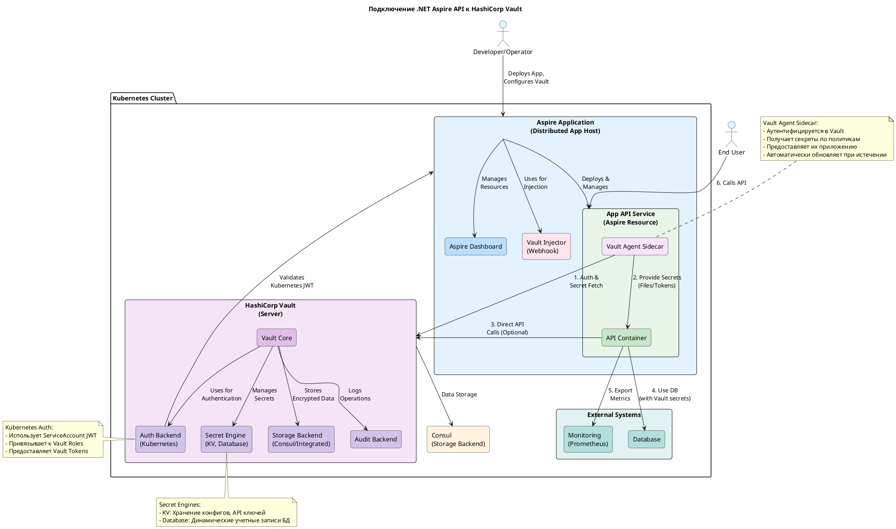

**Пояснение ключевых элементов:**

1.  **Aspire Application (Distributed App Host):** Оркестратор, запускающий ваше распределенное приложение.
2.  **App API Service:** Сервис Aspire, представляющий ваше API-приложение. В Kubernetes это обычно Pod.
3.  **API Container:** Контейнер с вашим .NET API приложением.
4.  **Vault Agent Sidecar:** Отдельный контейнер в том же Pod'е, который взаимодействует с Vault от имени вашего приложения. Это рекомендуемый подход для автоматического получения и обновления секретов.
5.  **Vault Injector (Webhook):** Компонент Vault (чаще всего это самостоятельный injector, интегрированный с Kubernetes), который автоматически добавляет Vault Agent Sidecar в Pod на основе аннотаций.
6.  **HashiCorp Vault:** Центральный сервер Vault.
    *   **Auth Backend (Kubernetes):** Метод аутентификации, позволяющий Pod'ам Kubernetes аутентифицироваться с помощью их ServiceAccount JWT.
    *   **Secret Engine:** Движки для генерации и хранения секретов (например, KV для статических секретов, Database для динамических учетных записей БД).
7.  **Поток данных:**
    *   Vault Agent (1) аутентифицируется в Vault и получает секреты.
    *   Vault Agent (2) предоставляет секреты API-приложению (например, через файл в общей директории или через localhost API).
    *   API-приложение (3) может также напрямую вызывать Vault API (дополнительный/альтернативный способ).
    *   API-приложение (4) использует полученные секреты для подключения к БД.
    *   API-приложение (5) экспортирует метрики для мониторинга.
    *   Пользователь (6) вызывает API.
    *   Vault Auth (7) проверяет JWT от Pod'а для аутентификации Vault Agent.

Эта диаграмма демонстрирует типичную и безопасную интеграцию .NET Aspire приложения с HashiCorp Vault в Kubernetes-среде.