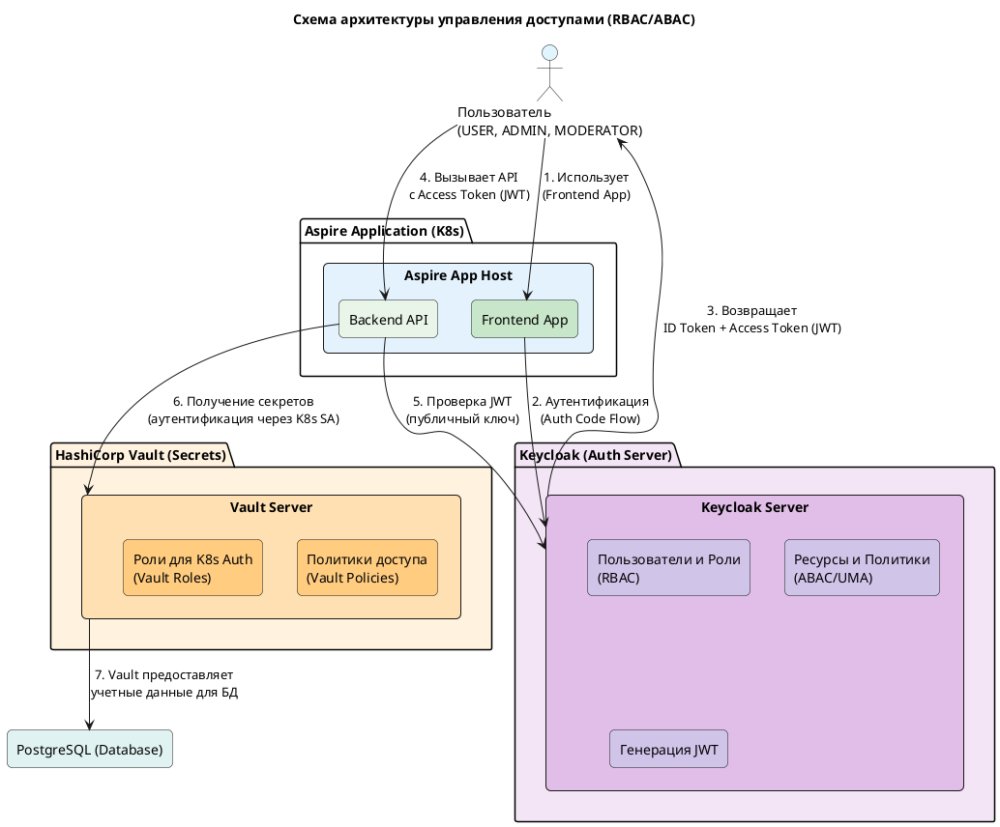

Хорошо, вот схема архитектуры управления доступами с RBAC/ABAC для вашего стека (.NET Aspire, Keycloak, Vault):



```
note right of rbac
RBAC в Keycloak:
- Роли: USER, ADMIN, MODERATOR
- Роли добавляются в JWT
end note

note right of abac
ABAC/UMA в Keycloak:
- Ресурсы (например, "report")
- Политики (например, "только владелец")
- Scope-based permissions
end note

note right of jwt_generator
JWT содержит:
- Стандартные claims (sub, iss, exp...)
- Роли (realm-level, client-level)
- Атрибуты пользователя (если настроены)
end note

note right of vault_policies
Vault Policies:
- Определяют права доступа к путям
- Пример: "path 'secret/data/myapp/db' { capabilities = [\"read\"] }"
end note

note right of vault_roles
Vault K8s Auth Roles:
- Привязывают K8s ServiceAccounts к Vault Policies
- Пример: "bound_service_account_names: ['backend-sa'] -> policy: 'backend-policy'"
end note

note top of backend
.NET Aspire Backend:
- Использует AddJwtBearer для проверки JWT
- Полагается на роли из JWT для авторизации
- Получает секреты (DB creds) из Vault
end note
```

**Пояснение:**

1.  **Пользователь** взаимодействует с **Frontend Application**.
2.  **Frontend** перенаправляет пользователя в **Keycloak** для **аутентификации** (Authorization Code Flow).
3.  **Keycloak** аутентифицирует пользователя и, на основе **RBAC** (роли `USER`, `ADMIN`, `MODERATOR`) и, при необходимости, **ABAC/UMA** (политики доступа к ресурсам), формирует **JWT (Access Token)**. Этот токен содержит информацию о пользователе и его ролях/атрибутах.
4.  Пользователь использует **Frontend**, который делает вызовы в **Backend API**, передавая **JWT**.
5.  **Backend API** (используя `AddJwtBearer`) **проверяет подпись JWT** с помощью публичного ключа Keycloak. Он **доверяет информации внутри JWT** (ролям, атрибутам).
6.  Для получения секретов (например, учетных данных для PostgreSQL) **Backend API** аутентифицируется в **HashiCorp Vault**. Это обычно происходит через **Kubernetes ServiceAccount** (механизм `kubernetes` auth в Vault). Vault проверяет ServiceAccount и, согласно своим **политикам (Policies)** и **ролям (Roles)**, предоставляет необходимые секреты.
7.  **Backend API** использует полученные из Vault **учетные данные** для безопасного подключения к **PostgreSQL**.

Эта схема демонстрирует, как RBAC/ABAC реализуются в Keycloak, как информация о доступе передается через JWT и как система в целом управляет доступом как к API, так и к внутренним секретам (через Vault).