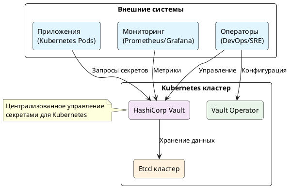
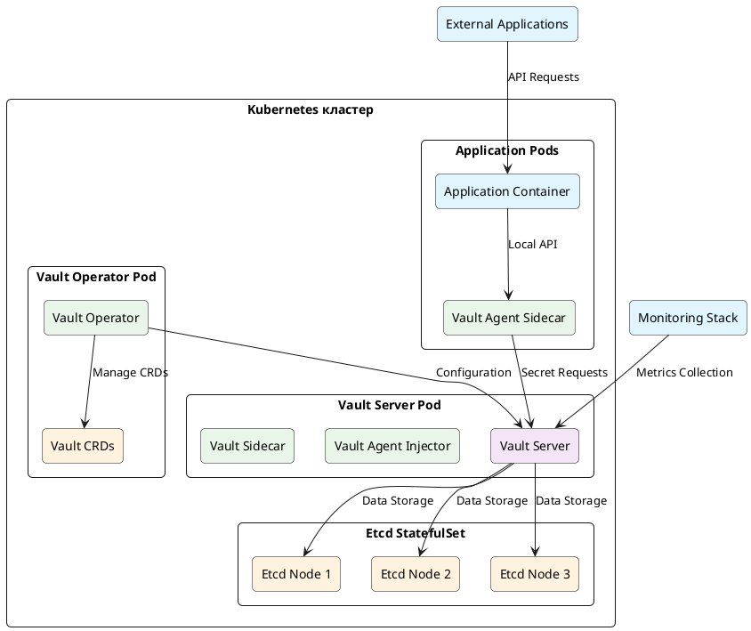
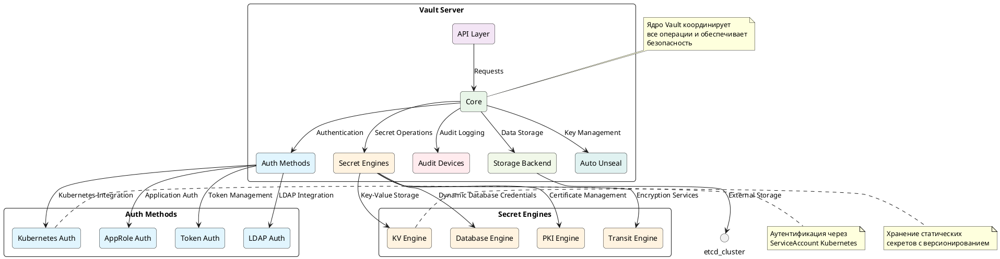

## 🗺️ **C4 Model для HashiCorp Vault в Kubernetes**

### **Уровень 1: Контекст (Context)**



### **Уровень 2: Контейнеры (Containers)**



### **Уровень 3: Компоненты (Components)**



## 🏗️ **Архитектурные особенности реализации**

### **1. Типовая конфигурация Vault в Kubernetes:**

```yaml
# Vault Helm Chart values.yaml
server:
  image:
    repository: "hashicorp/vault"
    tag: "1.15.0"
  
  authDelegator:
    enabled: true
  
  ha:
    enabled: true
    replicas: 3
    raft:
      enabled: true
      setNodeId: true
  
  # Kubernetes Auth Method
  authMethods:
    kubernetes:
      enabled: true
      config:
        kubernetes_host: "https://kubernetes.default.svc"
  
  # Audit Backend
  audit:
    - type: file
      path: "/vault/logs/audit.log"
    - type: syslog
      tag: "vault"

# Storage Backend
storage:
  etcd:
    address: "https://etcd-client:2379"
    ha_enabled: "true"
```

### **2. Интеграция с приложениями:**

```yaml
# Application Pod с Vault Agent Sidecar
apiVersion: v1
kind: Pod
metadata:
  name: my-app
  annotations:
    vault.hashicorp.com/agent-inject: "true"
    vault.hashicorp.com/role: "my-app-role"
    vault.hashicorp.com/agent-inject-secret-database-config: "database/creds/my-app"
spec:
  containers:
  - name: my-app
    image: my-app:latest
    volumeMounts:
    - name: vault-secrets
      mountPath: "/vault/secrets"
      readOnly: true
```

### **3. Политики безопасности:**

```hcl
# Пример Vault Policy
path "secret/data/my-app/*" {
  capabilities = ["read"]
}

path "database/creds/my-app" {
  capabilities = ["read"]
}

path "pki/issue/my-app" {
  capabilities = ["create", "update"]
}
```

Эта архитектура соответствует лучшим практикам использования HashiCorp Vault в Kubernetes и охватывает ключевые аспекты.