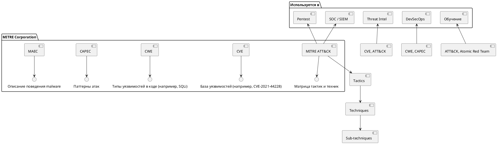

**MITRE** — это ключевая организация в мире **кибербезопасности**, чьи разработки используются **по всему миру**: от правительства США до крупнейших IT-компаний и служб ИБ.

---

## 🔐 Что такое MITRE?

**MITRE** (произносится *«май-тр»*) — это **некоммерческая исследовательская организация**, изначально созданная при поддержке правительства США.

> 📌 **Полное название**: *The MITRE Corporation*  
> 📍 **Год основания**: 1958  
> 🏢 **Штаб-квартира**: Бедфорд, Массачусетс, США

Изначально создана для управления **воздушной обороной**, но со временем стала центром **научных исследований в IT, авиации, здравоохранении и кибербезопасности**.

---

## 🌐 Чем известна MITRE?

Хотя MITRE работает в разных сферах, для **DevOps, SRE, ИБ и пентестеров** она известна **в первую очередь** благодаря:

### 🔹 **MITRE ATT&CK® Framework**
> Самая важная разработка MITRE в области кибербезопасности.

#### 📌 Что такое **ATT&CK**?
**ATT&CK** — это **матрица тактик и техник кибератак**, основанная на реальных наблюдениях за атаками (real-world observations).

- **ATT&CK** = **Adversarial Tactics, Techniques, and Common Knowledge**
- Это **систематизированная база знаний** о том, **как злоумышленники атакуют системы**.

---

## 🧩 Структура MITRE ATT&CK

### 1. **Тактики (Tactics)** — «Зачем?»
Это **цели** атакующего на каждом этапе атаки.

| Тактика                    | Цель                                |
| -------------------------- | ----------------------------------- |
| `Reconnaissance`           | Сбор информации                     |
| `Resource Development`     | Подготовка инфраструктуры           |
| `Initial Access`           | Первичный доступ (фишинг, эксплойт) |
| `Execution`                | Запуск кода                         |
| `Persistence`              | Сохранение доступа                  |
| `Privilege Escalation`     | Повышение привилегий                |
| `Defense Evasion`          | Уклонение от защиты                 |
| `Credential Access`        | Кража учётных данных                |
| `Discovery`                | Исследование сети                   |
| `Lateral Movement`         | Движение по сети                    |
| `Collection`               | Сбор данных                         |
| `Command and Control (C2)` | Управление ботнетом                 |
| `Exfiltration`             | Утечка данных                       |
| `Impact`                   | Воздействие (шифрование, удаление)  |

---

### 2. **Техники (Techniques)** — «Как?»
Каждая тактика состоит из **конкретных техник**.

> Например, в тактике **Initial Access**:
- `Phishing: Spearphishing via Email` (T1566.001)
- `Exploit Public-Facing Application` (T1190)
- `Valid Accounts` (T1078)

> В **Credential Access**:
- `Brute Force` (T1110)
- `OS Credential Dumping` (T1003)
- `Input Capture` (T1056)

---

### 3. **Подтехники (Sub-techniques)** — ещё детальнее
Например:
- `T1003.001` — OS Credential Dumping: LSASS Memory

---

## 🌍 Где используется MITRE ATT&CK?

| Область                        | Применение                                                  |
| ------------------------------ | ----------------------------------------------------------- |
| **Пентест и Red Team**         | Планирование атак, моделирование угроз                      |
| **Blue Team / SOC**            | Обнаружение атак, настройка SIEM, создание детектов         |
| **Threat Intelligence**        | Классификация угроз (например, APT29 использует T1059)      |
| **DevSecOps**                  | Интеграция в CI/CD, анализ уязвимостей                      |
| **Автоматизация безопасности** | Создание правил в Splunk, Sentinel, Wazuh, Elastic Security |
| **Обучение**                   | Тренировочные платформы (например, Atomic Red Team)         |

---

## 🧪 Другие важные проекты MITRE

Помимо ATT&CK, MITRE разработала или поддерживает:

| Проект                                                            | Описание                                                                                                                              |
| ----------------------------------------------------------------- | ------------------------------------------------------------------------------------------------------------------------------------- |
| **CVE® (Common Vulnerabilities and Exposures)**                   | Стандартная база уязвимостей (например, CVE-2021-44228 — Log4Shell). MITRE — один из официальных **CVE Numbering Authorities (CNA)**. |
| **CWE™ (Common Weakness Enumeration)**                            | Классификация типов уязвимостей в коде (например, CWE-79 — XSS, CWE-89 — SQLi).                                                       |
| **CAPEC™ (Common Attack Pattern Enumeration and Classification)** | Каталог паттернов атак.                                                                                                               |
| **MAEC™ (Malware Attribute Enumeration and Characterization)**    | Стандарт описания поведения вредоносного ПО.                                                                                          |
| **ATT&CK for Cloud, ICS, Mobile, OT**                             | Расширения ATT&CK для облачных, промышленных и мобильных систем.                                                                      |

---

## 🎯 Почему MITRE важна для DevOps и DevSecOps?

Потому что:
- Позволяет **понимать, как атакуют Kubernetes, CI/CD, облака**.
- Помогает **строить детекты** в логах, метриках, трейсах.
- Даёт **язык для коммуникации** между Dev, Sec и Ops.
- Позволяет **оценить зрелость защиты** (например, через MITRE D3FEND или ATT&CK Navigator).

> 💡 Пример:  
> Вы видите в логах `kubectl exec` в продакшен-под — это может быть техника **T1059.004 — Command and Scripting Interpreter: Unix Shell**.  
> А если это делает сервисный аккаунт с избыточными правами — возможно, **Privilege Escalation (T1610)**.

---

## 🖼️ MITRE: Экосистема кибербезопасности

> "MITRE Corporation" некоммерческая организация
> Работает с правительством, ИБ, IT
> Создала стандарты, используемые по всему миру

---

## 💬 Цитата

> **"Если вы говорите о кибератаках, но не используете MITRE ATT&CK — вы говорите на диалекте. ATT&CK — это общий язык безопасности."**

---

## ✅ Вывод

> **MITRE** — это **не хакерская группа**, а **научно-исследовательская организация**, которая:
> - Создала **ATT&CK** — главную карту атакующих тактик,
> - Поддерживает **CVE и CWE** — основу анализа уязвимостей,
> - Формирует **стандарты и язык информационной безопасности**.

Для любого специалиста по DevOps, SRE, ИБ — **понимание MITRE ATT&CK — обязательный навык**.

---
