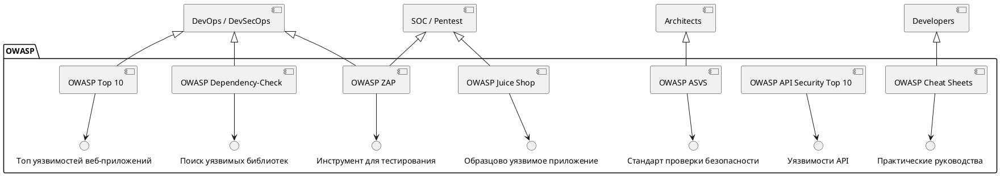

**OWASP** — это одна из **самых важных и влиятельных организаций** в мире **веб-безопасности и информационной безопасности**. Её рекомендации, инструменты и стандарты используются **миллионами разработчиков, тестировщиков и специалистов по ИБ** по всему миру.

---

## 🔐 Что такое OWASP?

**OWASP** расшифровывается как **Open Web Application Security Project**  
(Проект открытой веб-безопасности)

> 📌 **Это некоммерческая, независимая, глобальная организация**, посвящённая **улучшению безопасности программного обеспечения**.

- 🌍 Основана в **2001 году**
- 🏢 Штаб-квартира: США, но работает **глобально**
- 🆓 Вся продукция — **открытая и бесплатная**
- 👥 Участники — волонтёры: разработчики, тестировщики, архитекторы, ИБ-специалисты

> 🔗 Официальный сайт: [https://owasp.org](https://owasp.org)

---

## 🎯 Главная миссия OWASP

> **"Make software security visible, so that individuals and organizations can make informed decisions."**  
> *(«Сделать безопасность ПО видимой, чтобы люди и организации могли принимать осознанные решения»)*

---

## 🌟 Самые известные проекты OWASP

### 1. **OWASP Top 10** — **самое известное**!
> 📌 **ТОП-10 самых критичных уязвимостей в веб-приложениях**

- Обновляется каждые 2–3 года (последняя версия — **OWASP Top 10:2021**).
- Используется как **стандарт** в индустрии, аудитах, требованиях заказчиков.

#### Примеры из Top 10:2021:
| Код          | Уязвимость                                       |
| ------------ | ------------------------------------------------ |
| **A01:2021** | Broken Access Control                            |
| **A02:2021** | Cryptographic Failures                           |
| **A03:2021** | Injection (включая SQLi, XSS, Command Injection) |
| **A04:2021** | Insecure Design                                  |
| **A05:2021** | Security Misconfiguration                        |
| **A06:2021** | Vulnerable and Outdated Components               |
| **A07:2021** | Identification and Authentication Failures       |
| **A08:2021** | Software and Data Integrity Failures             |
| **A09:2021** | Security Logging and Monitoring Failures         |
| **A10:2021** | Server-Side Request Forgery (SSRF)               |

> 💡 Это **не просто список** — это руководство с примерами, тестами и рекомендациями по устранению.

---

### 2. **OWASP API Security Top 10**
> Уязвимости в **API (REST, GraphQL, gRPC)**

Актуален в эпоху микросервисов и serverless.

Примеры:
- `API1:2019` Broken Object Level Authorization
- `API5:2019` Broken Function Level Authorization
- `API7:2019` Security Misconfiguration

---

### 3. **OWASP ASVS (Application Security Verification Standard)**
> 📏 **Стандарт проверки безопасности приложений**

Используется для:
- аудита,
- тестирования,
- сертификации,
- требований к безопасности в контрактах.

Три уровня проверки: базовый, стандарт, премиум.

---

### 4. **OWASP ZAP (Zed Attack Proxy)**
> 🛠 **Бесплатный инструмент для тестирования веб-безопасности**

- Автоматическое сканирование уязвимостей,
- Работает как proxy,
- Интегрируется в CI/CD,
- Поддерживает API, формы, JWT и т.д.

> 🔗 [https://www.zaproxy.org](https://www.zaproxy.org)

---

### 5. **OWASP Juice Shop**
> 🍹 **Образцовый уязвимый веб-приложение для обучения**

- Полностью нарушает все правила безопасности,
- Используется для CTF, тренингов, пентестов,
- Поддерживает все уязвимости из Top 10.

> 🔗 [https://juice-shop.herokuapp.com](https://juice-shop.herokuapp.com)

---

### 6. **OWASP Dependency-Check**
> 🔍 Инструмент для поиска **уязвимых зависимостей** в проектах

Работает с:
- Java (Maven, Gradle),
- .NET,
- Node.js,
- Python и др.

Интегрируется в CI/CD.

---

### 7. **OWASP Cheat Sheets**
> 📚 Короткие, практичные руководства по безопасности

Примеры:
- **Authentication Cheat Sheet**
- **Session Management Cheat Sheet**
- **TLS Cipher String Cheat Sheet**
- **Secure Headers Cheat Sheet**

Отлично подходит для DevOps и разработчиков.

---

## 🧩 Почему OWASP важна для DevOps и DevSecOps?

| Причина                | Пояснение                                                             |
| ---------------------- | --------------------------------------------------------------------- |
| **Стандартизация**     | OWASP Top 10 — общий язык для Dev, Sec, QA                            |
| **Интеграция в CI/CD** | Инструменты вроде ZAP, Dependency-Check можно запускать автоматически |
| **Обучение**           | Juice Shop, Cheat Sheets — идеальны для тренировок                    |
| **Risk Assessment**    | Помогает оценить, какие уязвимости критичны, а какие — нет            |
| **Compliance**         | Требуется в банковской, медицинской, государственной сферах           |

---

## 🖼️ OWASP: Экосистема безопасности

> "OWASP" некоммерческая, открытая, глобальная инициатива
> Цель: Сделать безопасность ПО доступной

---

## 💬 Цитата

> **"Если вы разрабатываете веб-приложение и не проверили его по OWASP Top 10 — вы не закончили работу."**

---

## ✅ Вывод

> **OWASP** — это **не просто организация**, а **движение за безопасное ПО**.  
> Она даёт:
> - **стандарты** (Top 10, ASVS),
> - **инструменты** (ZAP, Dependency-Check),
> - **обучение** (Juice Shop, Cheat Sheets),
> - и **язык** для общения о безопасности.

Для любого специалиста в IT — **знание OWASP обязательно**.

---
