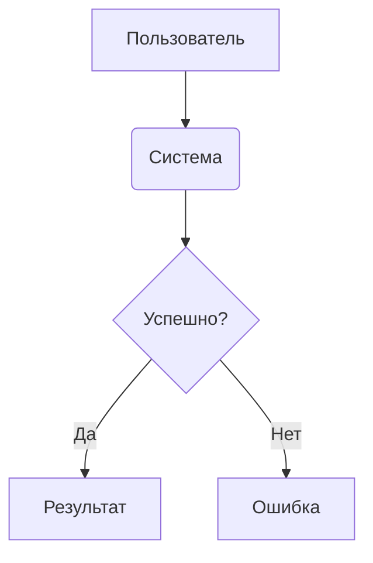
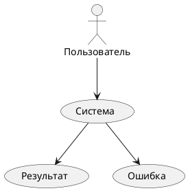
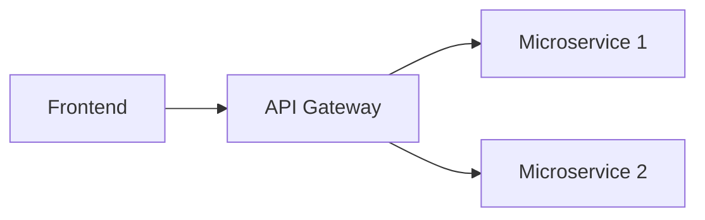
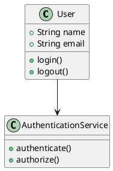

## 🎯 **Основные различия**

| Характеристика | **Mermaid** | **PlantUML** |
|----------------|-------------|--------------|
| **Год создания** | 2014 | 2009 |
| **Язык реализации** | JavaScript | Java |
| **Основная цель** | Простые диаграммы для документации | Мощное моделирование UML |
| **Сложность синтаксиса** | Простой, интуитивный | Более сложный, но гибкий |

---

## 📝 **Синтаксис**

### **Mermaid** - Простой и читаемый:


### **PlantUML** - Более формальный:


---

## 🎨 **Визуальные возможности**

### **Mermaid:**
✅ **Преимущества:**
- Современный дизайн по умолчанию
- Хорошая интеграция с Markdown
- Поддержка тем
- Адаптивные диаграммы
- Встроенная поддержка в GitHub, VS Code

❌ **Ограничения:**
- Ограниченное количество типов диаграмм
- Меньше настроек стиля
- Нет поддержки сложных UML

### **PlantUML:**
✅ **Преимущества:**
- Все типы UML диаграмм
- Расширенные возможности стилизации
- Поддержка множества форматов вывода
- Мощные возможности настройки
- Интеграция с IDE

❌ **Ограничения:**
- Требует Java runtime
- Более сложный синтаксис
- Менее интуитивный для новичков

---

## 📚 **Поддерживаемые типы диаграмм**

### **Mermaid поддерживает:**
- Flowcharts (Блок-схемы)
- Sequence diagrams (Диаграммы последовательности)
- Class diagrams (Диаграммы классов)
- State diagrams (Диаграммы состояний)
- ER diagrams (Диаграммы сущностей)
- Gantt charts (Диаграммы Ганта)
- Pie charts (Круговые диаграммы)
- Git graphs (Графы Git)

### **PlantUML поддерживает:**
- Все типы UML диаграмм
- Activity diagrams
- Use case diagrams
- Component diagrams
- Deployment diagrams
- Timing diagrams
- Wireframe/Salt
- Ditaa диаграммы
- Mind maps
- WBS (Work Breakdown Structure)
- И много других форматов

---

## ⚡ **Производительность и интеграция**

### **Mermaid:**
- **Клиентская отрисовка** (JavaScript)
- **Быстрая загрузка**
- **Отличная интеграция с:**
  - GitHub (встроена)
  - VS Code (расширения)
  - Obsidian
  - Confluence
  - Docusaurus

### **PlantUML:**
- **Серверная отрисовка** (Java)
- **Требует установки**
- **Интеграция с:**
  - IntelliJ IDEA
  - Eclipse
  - VS Code (плагины)
  - Confluence
  - Jenkins

---

## 🛠️ **Примеры использования**

### **Mermaid - идеален для:**
```markdown
# Документация проекта

## Архитектура


```

### **PlantUML - идеален для:**


---

## 📊 **Когда что использовать**

### **Выбирай Mermaid, если:**
- 📝 Нужны простые диаграммы для документации
- 🚀 Хочешь минимальную настройку
- 📱 Работаешь с Markdown
- 🌐 Публикуешь на GitHub
- 👥 Команда не знакома с UML

### **Выбирай PlantUML, если:**
- 🎯 Нужны профессиональные UML диаграммы
- ⚙️ Требуется детальная настройка
- 🏢 Работаешь в enterprise среде
- 📐 Нужны формальные диаграммы для архитектуры
- 🔧 Есть опыт работы с UML

---

## 📈 **Статистика популярности**

| Метрика | Mermaid | PlantUML |
|---------|---------|----------|
| GitHub Stars | 60K+ | 7K+ |
| NPM Downloads | 5M+/мес | - |
| Stack Overflow | Высокая активность | Средняя активность |
| Документация | Отличная | Хорошая |
| Сообщество | Быстро растущее | Устоявшееся |

---

## 🎯 **Вывод**

**Mermaid** - современное, простое решение для **документации и базовых диаграмм**  
**PlantUML** - мощный инструмент для **профессионального моделирования и UML**

Выбор зависит от ваших задач, уровня сложности и требований к формальности диаграмм.