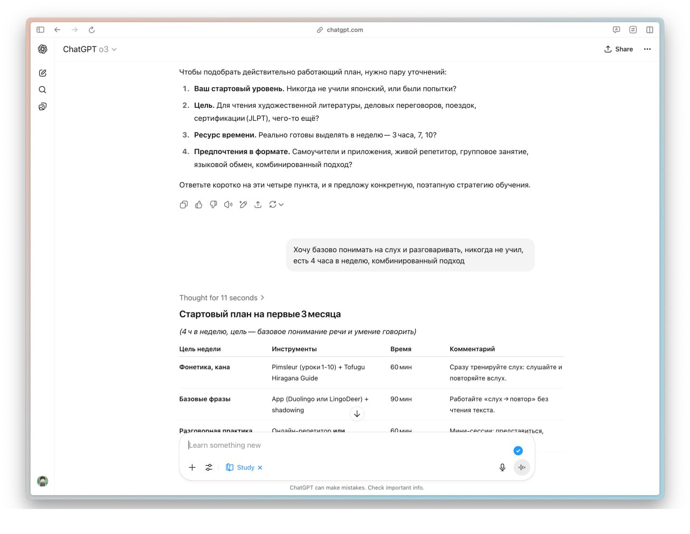

29.07.2025

ChatGPT теперь генерирует целые курсы без сложных промтов — в чат-боте появилась (https://openai.com/index/chatgpt-study-mode/) функция Study and Learn.

Нейронку можно прервратить в карманного репетитора, который придумает программу обучения по любому предмету. Если задать вопрос в этом режиме, бот поможет найти ответ самостоятельно.

Доступ откроют всем пользователям уже сегодня.

